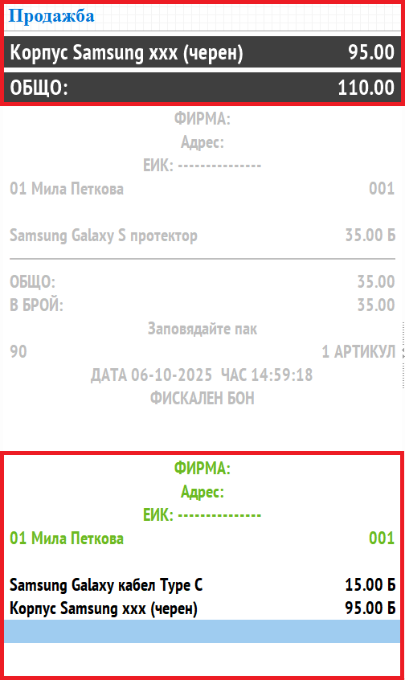

```{only} html
[Нагоре](../000-index)
```
# **Основен екран**

**Dreem POS** предлага интуитивен потребителски интерфейс. Операциите са опростени и без излишни стъпки. За всяка от тях са реализирани бутони и/или клавишни комбинации за бърз достъп.  

{ class=align-center w=15cm }

По подразбиране основният екран на системата е оцветен в сиво. Това сигнализира, че текущият тип документ е **Продажба**. При промяна на типа основният екран ще се оцвети в различен цвят:  

- **сив** – продажба на контрагент, настроен за клиент на дребно;  
- **син** – продажба на избран контрагент с клиентска карта;  
- **зелен** – издаване на фактура;  
- **червен** – сторно бележка;  

## **Характеристики на основния екран**

1) **Текущ документ** 

В първото поле се изписва тип на документа, който се обработва в момента.  
Следват две оцветени в черно полета. В тях се показва информация за последно маркиран продукт и за обща стойност на документа до момента.  

{ class=align-center w=15cm }

В долната част на списъка се показва съдържанието на текущо обработвания документ. Всеки от маркираните продукти се намира на отделен ред с количество, цена и % отстъпка.  

> Последният ред от списъка е нов ред за добавяне на продукти и количества. Той може също да служи за въвеждане на суми или търсене по име на стока.  

Редовете в неприключените документи се оцветяват различно в определени случаи:  

- **син** - В син цвят се оцветява редът, който е маркиран в момента.  
- **жълт** - В жълт цвят е оцветен новият ред за добавяне на продукт, когато не е маркиран.  
- **червен** - В червен цвят са редовете с продукти, които не са налични в склада на обекта.  

2) **Списък с приключени продажби**  

Всяка успешно приключена продажба се измества нагоре в списъка, стоящ в лявата част на екрана.  
Валидираните документи се оцветяват в сив цвят. Те са недостъпни за редактиране.  

{ class=align-center w=15cm }

3) **Функционални бутони**  

В раздел **Начало** са достъпни бутони с основни функции на **Dreem POS**.  
За всеки бутон е показана и клавишната комбинация, на която отговаря.   

{ class=align-center w=15cm }

В секция **Продукти** се визуализират бутони за директно добавяне на избрани продукти в нова продажба.  
Бутоните се групират по категории продукти. Настройката може да се извърши в бекофис системата **Dreem ERP** от меню **Номенклатури || Медия каталог**.  

{ class=align-center w=15cm }

4) **Тотали за оператора**  

Полетата в тази секция показват на оператора тотали с дължима и платена сума.  

{ class=align-center w=15cm }

- **Общо** - Полето показва общата стойност на документа.  
- **Платено** - Полето се обзавежда след приключване на продажбата с платената сума. Показаните стойности при смесено плащане са във вид: сума платено с карта + сума платено в брой.   
- **Ресто** - Полето показва дължимото ресто. Обзавежда се, когато при плащане операторът е въвел получена от клиента сума, надвишаваща общо дължимата.  


5) **Бутони за бърз достъп**  

{ class=align-center w=15cm }

   - **Продукти** - Бутонът отваря форма **Избор на продукт**. Тя съдържа списък с достъпните продукти за добавяне или търсене на номенклатури.  

   - **Функции** - Отваря форма **Функции** за опционален избор на действие от:  
      - *1. Тип документ*  
      - *2. Управление принтер*    
      - *3. Настройки*  
      - *4. Други функции*  
      - *5. Регистрация на присъствие*  
      - *6. Заключване терминал*  
      - *0. Изход*  

   - **Плащане** - Отваря форма с полета за попълване на получените от клиента суми според метода на плащане.   

   - **Запис** - Отваря форма **Избор на маса**.  

6) **Клавиатура**  

В края на основния екран има вградена екранна клавиатура. Тя е удобна за ползване с тъчскрийн монитори или когато по някаква причина липсва физическа клавиатура.  

> Екранна клавиатура е интегрирана и в други форми на системата.  