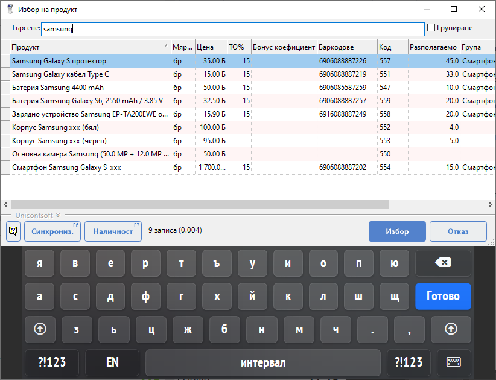
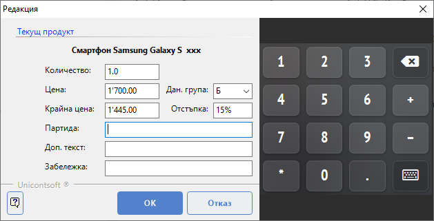
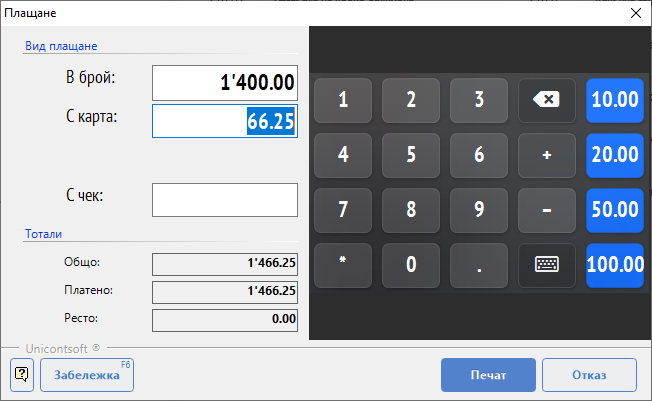

```{only} html
[Нагоре](../000-index)
```

# Продажба

Валидирането на стандартна продажба за клиент на дребно включва въвеждане на стоки с избраните количества и регистриране на плащане. В процеса може да се наложи редактиране, изтриване на съдържание, анулиране на документ или друго.  
Системата осигурява лесно управление на тези операции.  

## **Добавяне на стоки**

**Dreem POS** идентифицира продуктите по код, баркод и наименование. Визуализират се единствено продуктите, участващи в ценовата листа за клиенти на дребно.   
Формата **Избор на продукт** може да бъде отворена чрез клавиш [**+**] или от бутон **Продукти**.  

{ class=align-center w=15cm }

Продукт се добавя от новия ред, разположен винаги като последен в продажбата.   
Най-лесният начин за добавяне на стоки в продажба е чрез маркиране с баркод скенер. При сканиране на баркод системата известява със звуков сигнал дали продуктът е открит или баркодът не е разпознат. При проблем с разчитане на баркод може да се въведе част от име или код за търсене на продукта.   

## **Промяна на количество**

Задаване на количество е възможно както по време на добавяне на продукт, така и за вече въведени продукти.  
По подразбиране системата добавя всеки продукт с количество **1** (едно).  

При работа с баркод четец количеството трябва да се въведе на новия ред преди маркиране на продукта със скенера.   
При маркиране с код/име количеството се отделя със символ звезда от кода/името (2*1201) и се потвърждава с клавиш [**+**] или [**Enter**]. 

За промяна на количество на вече въведени стоки се използват стрелки нагоре/надолу за навигиране до съответния ред. С клавиш [**+**] количеството се увеличава, а с клавиш [**-**] се намалява.  
Количеството може да бъде променяно и чрез редакция на ред.  

## **Редакция на ред**

**Dreem POS** позволява редакция на количество, цена, отстъпка, данъчна група и партида на продукт.  
Чрез стрелки нагоре/надолу се избира ред и с клавиш [**F4**] се отваря форма **Редакция** за маркирания продукт.   

{ class=align-center }

Тук могат да бъдат добавени също допълнителен текст и забележка на реда. 

## **Търговска отстъпка**

**Dreem POS** дава възможност да се приложи отстъпка за един продукт, за няколко продукта или за целия документ.  

Добавяне на отстъпка за вече въведен продукт се извършва с маркиране на реда и клавиш [**F4**] за редакция. Това позволява отстъпките по продукти да бъдат различни.  

За прилагане на обща отстъпка за цялата продажба се използва клавишна комбинация [**Ctrl + D**]. Системата попълва избраната отстъпка за всички редове.   

## **Изтриване на ред**

Ред от продажбата може да бъде изтри с маркиране и клавиш [**Delete**]. За навигиране до него се използват стрелки нагоре/надолу.

## **Отлагане на продажба**

**Dreem POS** позволява текуща продажба да бъде отложена чрез клавиш [**F6**]. На екран се отваря нова продажба, докато отложената остава в списък с изчакващи. След приключване на новата продажба системата автоматично зарежда на екран отложената.  

Системата позволява отлагане на повече от една продажба. В тези случаи оформя списък с всички незавършени документи.  
Списъкът за избор на продажба за приключване се извежда отново с клавиш [**F6**].     

## **Отказване на текуща продажба**

Продажба може да бъде отказана единствено преди да бъде приключена. Текуща продажба се анулира чрез позициониране на празен нов ред и клавиш [**Esc**].  

> При анулиране на документ не се отпечатва касова бележка на фискалния принтер.

## **Плащане**

Продажба може да бъде приключена с един или с няколко вида плащане. За целта трябва да се отвори форма **Плащане**. Това може да стане от нов празен ред с клавиш [**Enter**] или от бутон **Плащане**.  

В секция *Вид плащане* системата показва отделни полета с позволените типове плащания.  
Различните видове плащания трябва да бъдат предварително настроени от **Функции || Настройки || Настройки база данни**.  

В секция *Тотали* се визуализират обща стойност на продажбата, платена сума и остатък за връщане (ресто).  

{ class=align-center }

Плащане се регистрира с маркиране на полето, съответстващо на избрания метод на плащане. Системата автоматично го попълва със стойност на продажбата. При смесено плащане сумите се разпределят по видове ръчно в съответните полета.  

```{tip}
При плащане в брой може да се въведе точно получена сума в поле *В брой*.  
Системата автоматично ще изчисли дължимо ресто.  
```

Операцията се потвърждава от бутон **Печат**. С това системата приключва продажбата и фискалното устройство разпечатва касов бон. 

## **Отваряне на чекмедже**

След отпечатване на касова бележка системата автоматично отваря чекмеджето с банкноти.  
Възможно е и ръчно отваряне на чекмеджето с клавиша за стрелка надясно [**->**] на празен нов ред.

## **Дубликат на касов бон**

Различни причини могат да наложат печат на дубликат - некоректно отпечатан бон (напр. при край на касова лента), повреда при откъсване на лентата и други. **Dreem POS** позволява да се отпечата дубликат на последната касова бележка от клавиш [**F7**].

> Често фискалните принтери позволяват само един дубликат на последната бележка.  
При невъзможност за издаване на дубликат системата издава служебен бон. Той включва същото съдържание на продажбата, взето като справка от КЛЕН.
