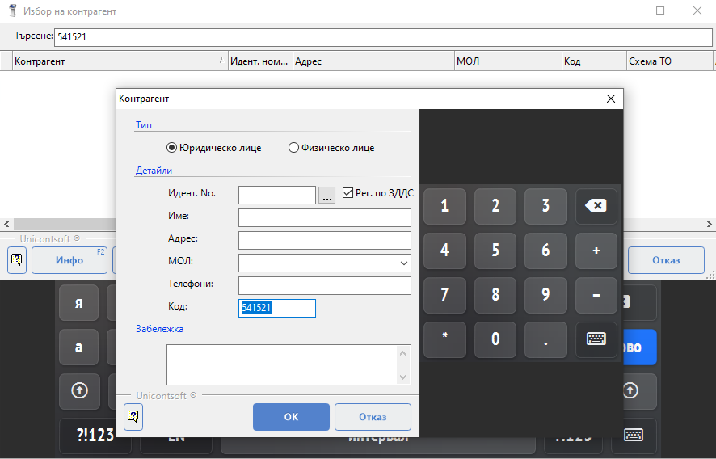

```{only} html
[Нагоре](../000-index)
```

# **Нов контрагент**

При регистриране на продажба с клиентска карта или фактура **Dreem POS** изисква в документа да бъде избран контрагент.  
Форма със списък контрагенти се отваря при смяна на типа документ с клавиш [**F2**] за **Продажба с клиентска карта** и с [**F3**] за **Фактура**.  

Системата отваря списък с въведените към момента контрагенти.  
Когато контрагентът не е въведен в списъка, **Dreem POS** позволява добавянето му чрез бутон **Нов**.  

Във форма **Контрагент** могат да се попълнят следните реквизити на контрагента:  
- *Идент No.* - идентификационен номер (БУЛСТАТ), ДДС номер или *ЕГН* за физ. лица;  
- *Име* - наименование на организация или имена на физ. лице;  
- *Адрес* - адрес на контрагента;  
- *МОЛ* - имена на материално отговорно лице;  
- *Телефони* - телефонни номера за контакт;  
- *Код* - код на контрагент или номер на клиентска карта;  
- *Забележка* - поле за попълване на свободен текст с допълнителна информация за контрагента;  

С клавиш [**Enter**] или с бутон [**Ok**] настройките се потвърждават и формата автоматично се затваря.  

{ class=align-center w=15cm }

```{tip}
Идентификационния номер автоматично се попълва от номера, който последно е бил търсен в списъка с контрагенти. 
```

**Dreem POS** автоматично ще попълни новодобавения контрагент в текущия документ.  
