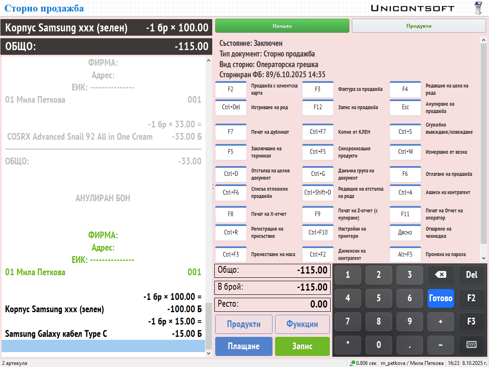

```{only} html
[Нагоре](../000-index)
```

# **Сторно бележка**

Операциите по връщане или замяна на стока трябва да бъдат отразени в системата. С това наличностите на стоки в склада на обекта се актуализират. 

За издаване на сторно бележка е необходимо в **Dreem POS** да се посочи продукт (респ. документ), за който се отнася връщането. Отправна точка за намирането му може да бъде търсене по номер на касов бон или търсене по продукт. Избраният метод определя и реда на създаване на сторниращия документ.     

## **Търсене по номер на касов бон**

При този вариант сторно бележка се създава от форма [**Функции**].  
Тя се отваря чрез клавиш [**/**] или от функционалния бутон в основния екран.  

{ class=align-center w=15cm }

В секция *Избор на действие* трябва да се избере опцията *Тип документ*. На следваща стъпка се маркира един от двата типа документи за връщане:  

- *Сторно операторска грешка* - Използва се при грешно валидирана от оператора продажба (напр. сгрешен начин на плащане).  
**Dreem POS** генерира сторниращ документ за цялата продажба.  
При приключване на сторно документа сумите по видове плащания трябва да се попълнят, както са били попълнени в сгрешения ФБ.  
Сторно фискален бон се отпечатва **в брой** за цялата сума.

- *Сторно връщане/рекламация (с възстановяване на платената от клиента сума)* - Използва се при връщане на един или няколко продукта от клиент, при отказ от получаване на доставка с наложен платеж и пр.  
За този тип сторниращ документ **Dreem POS** позволява връщане/рекламация както на един/няколко продукта, така и на цялата продажба.  
При приключване на документа в съответните полета по видове плащания се попълват сумите, както ще бъдат върнати на клиента.  
Сторно фискален бон се отпечатва единствено за сумата, която се връща на клиента **в брой**.  

{ class=align-center }

Изборът на *Тип документ* се потвърждава с бутон [**Ok**].  

Системата отваря списък с продажби. От поле *Търсене* с номер на фискалния бон може да бъде избрана продажбата за сторниране.  

{ class=align-center w=15cm }

Основният екран се оцветява в розово при успешно променен тип на документа със **Сторно продажба**.  Визуализира се информация за вид сторно и за фискален бон, към който се отнася.  

{ class=align-center w=15cm }

Сторниращият документ се приключва от бутон [**Плащане**]. В полета по видове плащания се попълват съответните суми.  

## **Търсене по продукт**

Друг вариант за създаване на сторно бележка е чрез маркиране на върнатия продукт в нова продажба. Той е бърз и удобен при рекламация на един вид продукт.  

> При този вариант **Dreem POS** автоматично създава документа с тип *Сторно връщане/рекламация*.  

На новия ред в продажбата се въвежда върнато количество с отрицателен знак (напр. -2). След това продуктът се въвежда или ръчно по код/име (-2*557), или чрез сканиране на баркод. Редът се потвърждава с клавиш [**+**] или [**Enter**].  

Системата отваря форма **Избор на документ**. Тя съдържа списък с продажбите, в които маркираната стока участва. Избира се документ с номера на фискалния бон, за който се създава сторно. Номерата се визуализират в колона **Бележка No.**.  

Желаният документ се маркира и изборът се потвърждава с бутон [**Избор**] или с двоен клик на мишката.  

{ class=align-center w=15cm }

За добавяне на дняколко върнати продукта се използва клавиш [**+**].  
Могат да се избират само стоки от редовете на избраната продажба.  

Основният екран се оцветява в розово при успешно променен тип на документа със **Сторно продажба**.  Визуализира се информация за вид сторно и за фискален бон, към който се отнася.  

{ class=align-center w=15cm }

Сторниращият документ се приключва от бутон [**Плащане**].  
В съответните полета по видове плащания се попълват сумите, както ще бъдат върнати на клиента.  

> **Dreem POS** ще отпечата сторно ФБ единствено за сумата, която се връща на клиента **в брой**.  
