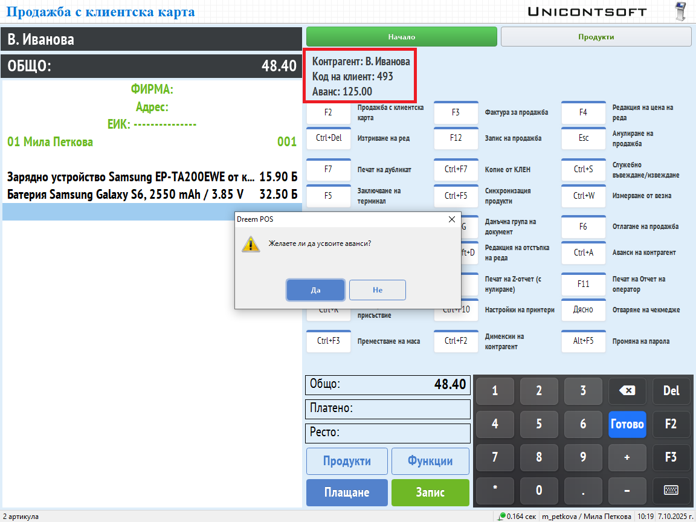
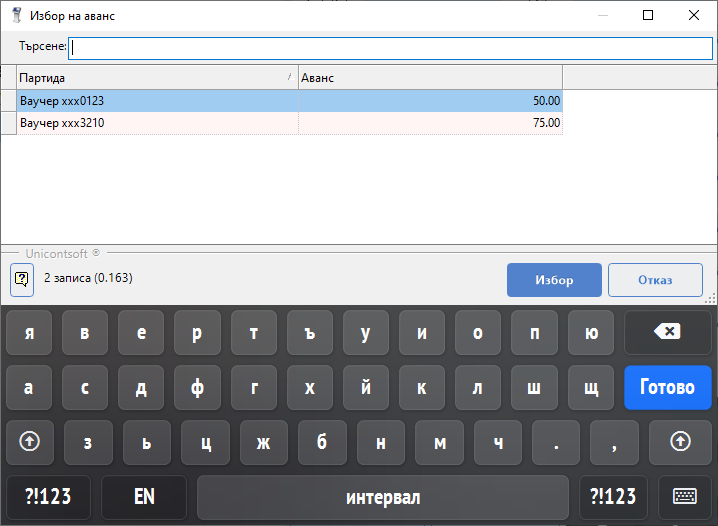
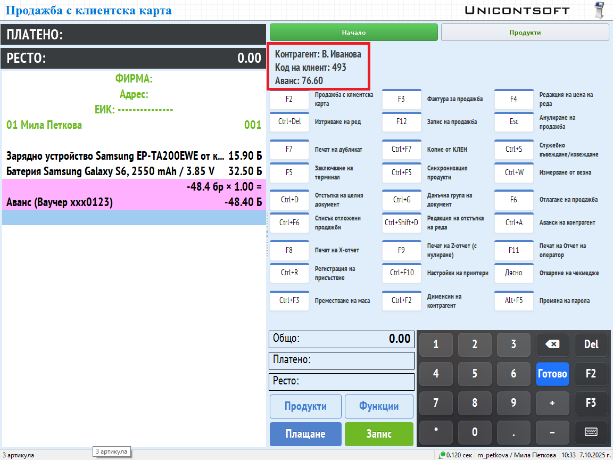
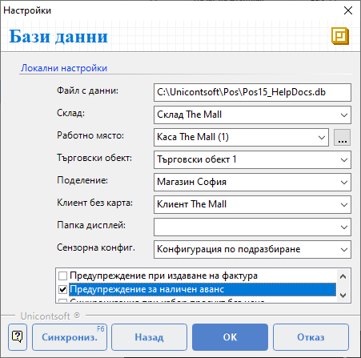
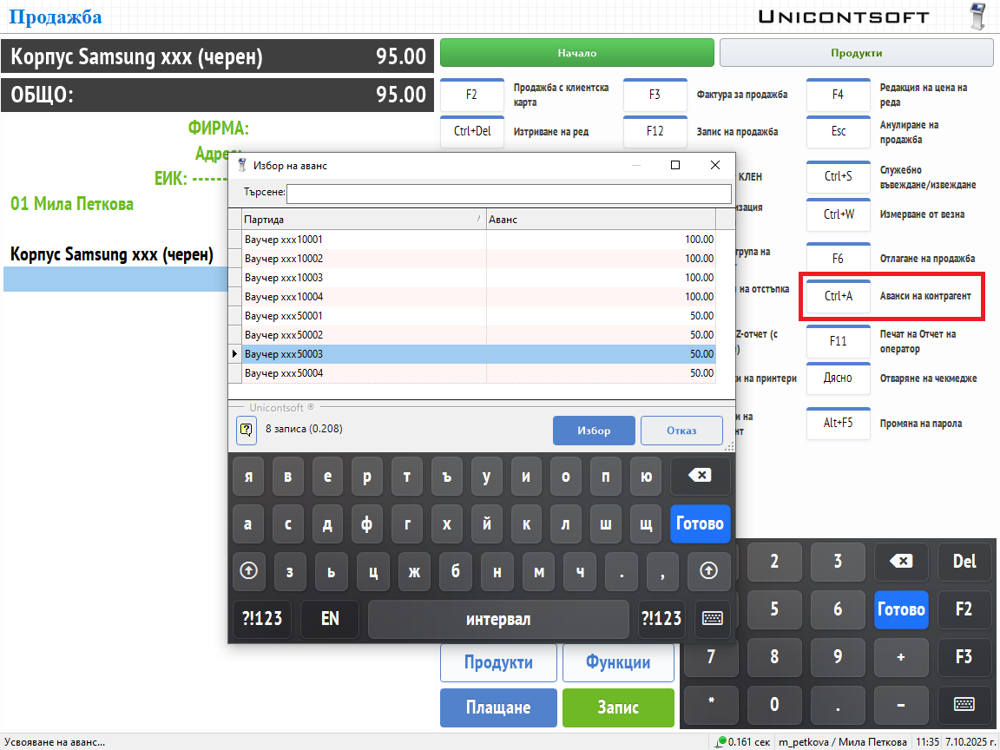
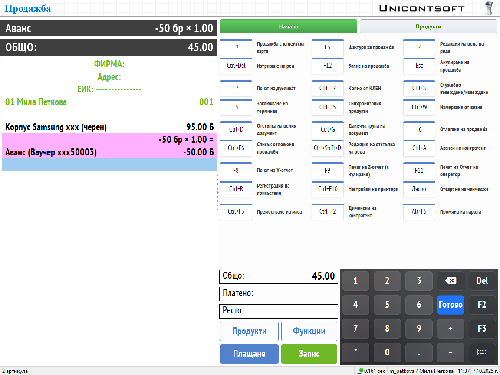

```{only} html
[Нагоре](../000-index)
```

# **Предплатен ваучер**

**Dreem POS** дава възможност за работа с ваучери за подарък. Чрез тях притежателят на ваучер има правото да получи стоки и/или услуги за размера на предплатената стойност.  

Ваучерите се издават предварително от бекофис системата **Dreem ERP** чрез схема за [аванси](../../erp/002-docs/002-trade-system/001-orders-sales-purchase-documents/008-advances.md). В последствие могат да се усвоят наведнъж или на части при валидиране на продажба.   

## **Продажба на регистриран контрагент**

За успешно идентифициране на клиент той трябва да бъде регистриран (въведен) като [контрагент в системата](003-new-cp.md). Това дава възможност предплатеният ваучер (аванс) да бъде създаден поименно. В този случай документът с усвояването на ваучера (аванса) следва същият ред като [продажба с клиентска карта](004-cp-sales.md#продажба-с-клиентска-карта).  

> Системата показва обща сума на неусвоените аванси в данните на контрагента.  

При преминаване към плащане **Dreem POS** извежда предложение за усвояване на аванс преди приключване на продажбата.  
Усвояването в текущата продажба може да бъде отказано.  

{ class=align-center w=15cm }

Ако усвояването бъде потвърдено, системата отваря форма **Избор на аванс**. Тя съдържа списък с всички партиди и остатъци за усвояване по аванси.  

> Форма **Избор на аванс** може да бъде отворена и ръчно чрез клавишна комбинация [**Ctrl + A**] или съответстващия ѝ бутон на основния екран.   

{ class=align-center w=15cm }

Избраният ред се маркира и се потвърждава с бутон **Избор**. Това прилага предплатения ваучер (аванс) в редовете на текущия документ и продажбата може да бъде приключена.  

Системата показва преизчисления остатък с неусвоени аванси в данните на контрагента.  

{ class=align-center w=15cm }

> Ако стойността на продажбата надвишава сумата на ваучера, **Dreem POS** ще изчисли остатък за доплащане от клиента.  

## **Продажба на нерегистриран клиент**

**Dreem POS** позволява издаване и усвояване на предплатени ваучери (аванси) на избрания контрагент за клиент на дребно.  
Когато се използва тази схема, опцията *Предупреждение за наличен аванс* трябв да бъде деактивирана. Тя е достъпна от **Функции || Настройки || Настройки бази данни**.  

{ class=align-center }

Документът с усвояването на ваучер следва същият ред като стандартна [продажба](002-pos-sales-doc.md).  

Предплатеният ваучер трябва да се добави преди регистриране на плащане и приключване на продажбата. Тези ваучери са достъпни във
форма **Избор на аванс**. Тя може да бъде отворена чрез клавишна комбинация [**Ctrl + A**] или съответстващия ѝ бутон на основния екран. 

{ class=align-center w=15cm }

Предплатените ваучери трябва да са регистрирани с определен код като партида на аванс. По този код те могат да бъдат намерени и избрани в продажба.  

{ class=align-center w=15cm }

```{tip}
Препоръчително е предплатените ваучери за нерегистрирани контрагенти да се усвояват изцяло в един документ.  
```