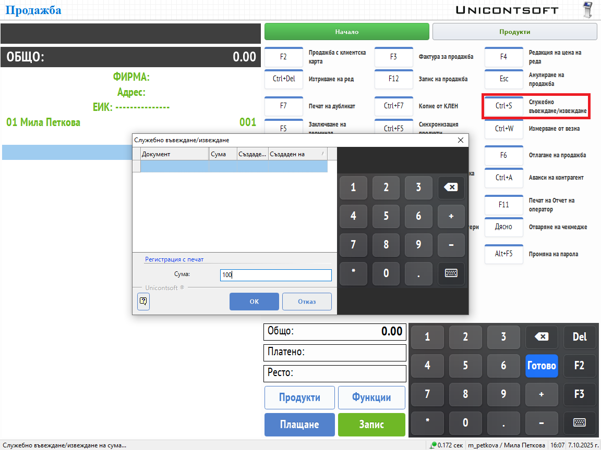

```{only} html
[Нагоре](../000-index)
```

# **Служебно въвеждане и извеждане на суми**

Обикновено в началото на работния ден касата стартира с определена парична наличност. Тя трябва да се отрази чрез служебно въведена сума.  
**Dreem POS** позволява регистриране на служебни въвеждания и извеждания по всяко време на деня. Това гарантира, че касовата наличност е винаги актуална.

> Тези операции се записват във фискалната памет на устройството и се визуализират във всички отчети.  

Чрез клавишна комбинация [**Ctrl+S**] системата извежда диалог

{ class=align-center w=15cm }

В поле **Сума** трябва да се запише:  

- **При служебно въвеждане** - За въвеждане на сума в касата стойността се изписва с положителен знак.  
- **При служебно извеждане** - За извеждане на сума от касата стойността се изписва с отрицателен знак.