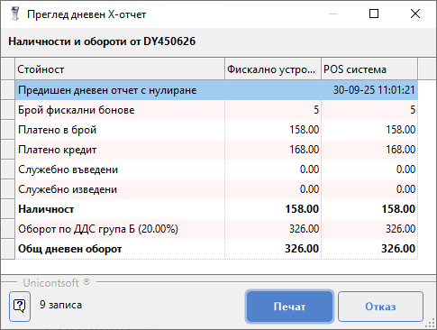
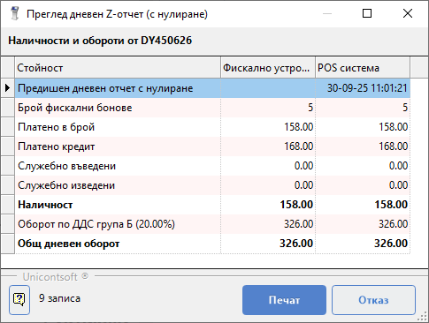
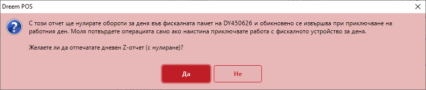
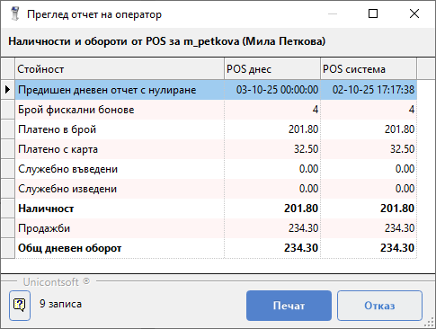
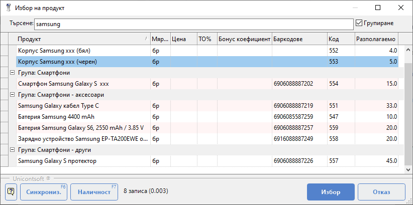
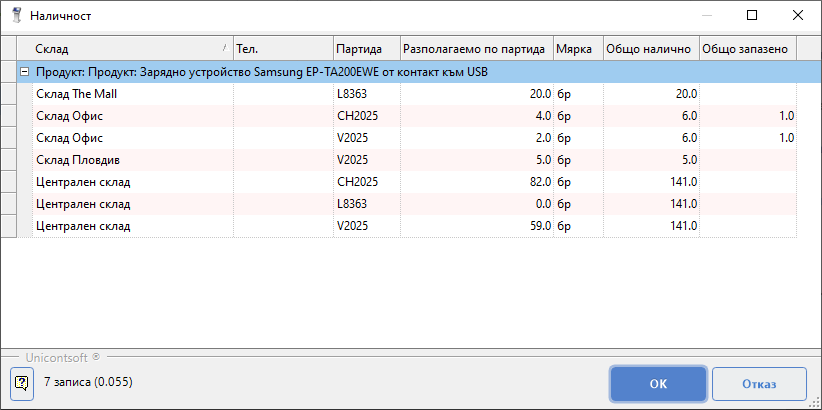

```{only} html
[Нагоре](../000-index)
```

# Справки

**Dreem POS** генерира всички видове отчети, които фискалното устройство поддържа. С това системата осигурява ефективно организиране на касова книга за всяко фискално устройство.  
В допълнение **Dreem POS** дава възможност и за някои потребителски справки.   

## **X отчет**

**X отчет** е стандартен дневен отчет на фискално устройство **без нулиране**.  
Опцията е достъпна чрез клавиш [**F8**] или от бутон [**Функции**] и избор на опция **Управление принтер**.  Системата отваря справката за преглед на екран.     

{ class=align-center }

С бутон [**Печат**] се потвърждава разпечатването на *Дневен X-отчет*.  
Чрез бутон [**Отказ**] разпечатването може да бъде отхвърлено.  

## **Z отчет**

**Z отчет** е стандартен дневен отчет на фискално устройство **с нулиране**. Използва се в края на деня за приключване на касовата книга.  
Опцията е достъпна чрез клавиш [**F9**] или от бутон [**Функции**] и избор на опция **Управление принтер**. Системата отваря справката за преглед на екран.    

{ class=align-center }

С бутон [**Печат**] се потвърждава разпечатването на *Дневен Z-отчет*.  
Чрез бутон [**Отказ**] разпечатването може да бъде отхвърлено.  

Системата извежда предупредително съобщение и изисква потвърждаване на операцията.   

{ class=align-center w=15cm }

При действително приключване на работа с фискалното устройство се избира бутон [**Да**]. С това оборотите за деня във фискалната памет се нулират.  

## **Отчет на оператор**

**Отчет на оператор** показва обороти по видове плащания и типове документи за текущия потребител. Справката е удобна за отчитане на отделните оператори.  
Опцията е достъпна чрез клавиш [**F11**] или от бутон [**Функции**] и избор на опция **Управление принтер**.  

{ class=align-center }

## **Периодичен отчет по дата на запис**

Справката **Периодичен отчет по дата на запис** е достъпна от бутон [**Функции**] и избор на опция **Управление принтер**.  
**Dreem POS** дава възможност за избор на начална и крайна дата на периодичния отчет, както и опциите *Детайлен* и *КЛЕН*.  

## **Справка за наличност на стока**

Бърза справка за текуща наличност на стока в склада на обекта е достъпна в колона **Разполагаемо кол.** от списъка с продукти.  

{ class=align-center w=15cm }

**Dreem POS** дава възможност за преглед на наличности и в други обекти/складове. 
Информацията е достъпна отново в списък с продукти. Маркират се един или няколко продукта (клавиш [**Ctrl**] + ляв бутон на мишката). Чрез бутон [**Наличност**] или с клавиш [**F7**] се извежда форма с наличности по партиди за всички обекти/складове.  

{ class=align-center w=15cm }

```{toctree}
:maxdepth: 1
:glob:

*
```