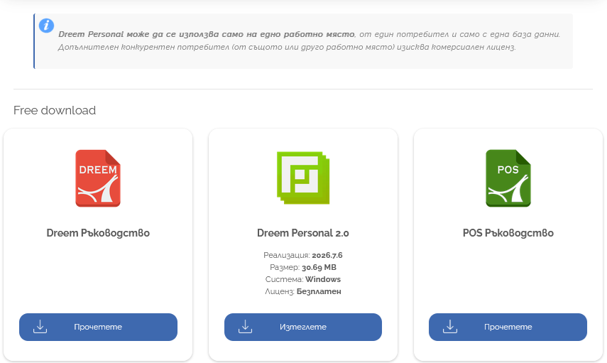
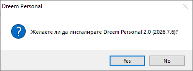
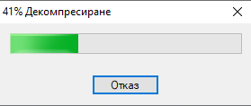
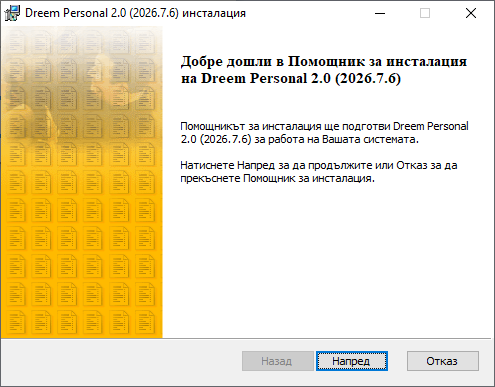
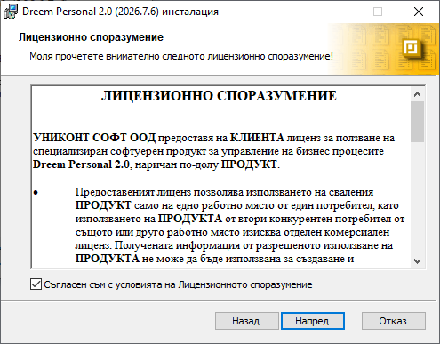
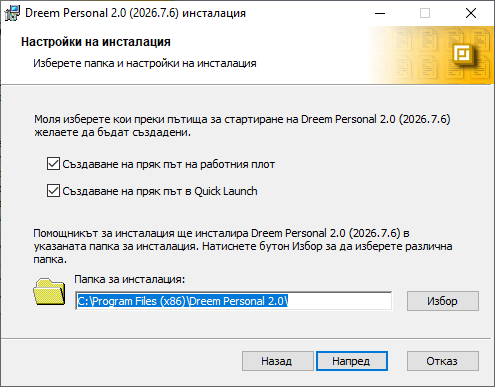
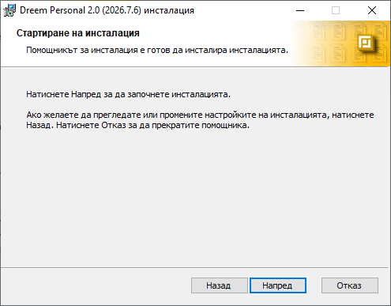
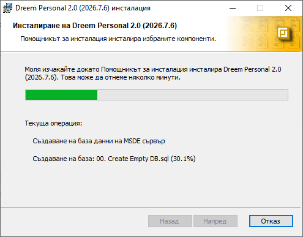
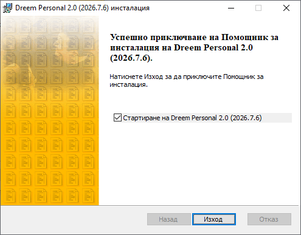

```{only} html
[Нагоре](../000-index)
```

# **Инсталиране**

Инсталацията на **Dreem Personal** се поддържа при следните параметри:  
- Операционна система *Windows XP*, *Windows Vista*, *Windows 7*, *Windows 8*, *Windows 8.1*, *Windows 10*    
- Предварително инсталиран *Internet Explorer* версия 5.0 или по-нова  
- Потребител с административни права, който да конфигурира системни компоненти на Windows успешно    
- 100MB свободно място за копиране на изпълнимите файловете на **Dreem Personal**    

> Ако някое от условията не е изпълнено, инсталацията ще предупреди и ще откаже модификация.    

**Dreem Personal** сe инсталира след изтегляне на пакетираната дистрибуция от нашия [Център за изтегляне](https://www.unicontsoft.com/download/).  

{ class=align-center w=15cm }

Към инсталация се преминава с бутон [**СЪГЛАСЯВАМ СЕ**].  

{ class=align-center w=15cm }

Стартира се изпълнимият файл **DreemPrs20.exe** и инсталацията се потвърждава с бутон [**Yes**].  

{ class=align-center }

Автоматично започва разпакетиране на файловете на дистрибуцията.  

{ class=align-center }

Отваря се помощник за инсталация на **Dreem Personal**.  

На този етап се прави проверка за версията на операционната система, на *Internet Explorer* и дали текущият потребител има административни права в системата.   

> На всяка от стъпките с бутон [**Напред**] се преминава към следващ етап на инсталацията.  
Процесът може да бъде прекъснат с бутон [**Отказ**].  

{ class=align-center }

За продължаване с инсталацията се поставя отметка при *Съгласен съм с условията на Лицензионното споразумение*.  

{ class=align-center }

На тази стъпка има възможност за създаване на преки пътища до **Dreem Personal**:  

- *Създаване на пряк път на работния плот*  
- *Създаване на пряк път в Quick Launch*    

Опциите са маркирани по подразбиране.  

Чрез бутон [**Избор**] в поле *Папка за инсталация* се указва папката, в която ще се копират файловете на **Dreem Personal**.   
По подразбиране инсталацията предлага *C:\Program Files\Dreem Personal 2.0* на устройството, на което е инсталирана операционната система.  

{ class=align-center }

Следва финалният етап на инсталацията.  

{ class=align-center }

> По време на процеса се копират файлове, записват се стойности в системния регистър, инсталират се системни компоненти, извършват се настройки на сървър и базата с данни на **Dreem Personal**.  

Цялата процедура може да отнеме няколко минути, през които инсталацията показва текуща операция и прогрес.  

{ class=align-center }

Помощникът извежда опция за автоматично стартиране на **Dreem Personal** след бутон [**Изход**].  

{ class=align-center }

**Dreem Personal** може да бъде стартиран също от иконата на работния плот, в *Quick Launch* или от меню *Start » Programs » Dreem Personal 2.0*.
