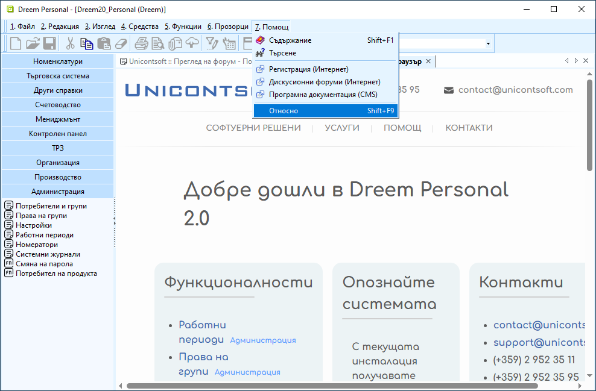
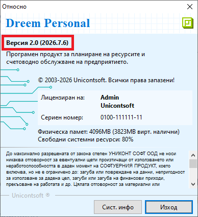
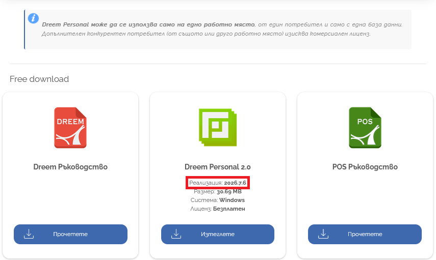

```{only} html
[Нагоре](../000-index)
```

# **Актуализиране**

Актуализирането на базата данни на **Dreem Personal** гарантира достъп до най-новите системни подобрения.   

> Строго препоръчваме [създаването на архив](002-db-backup) преди започване на актуализацията.  

Информация за текущата версия (реализация) на **Dreem Personal** е достъпна от меню **Помощ » Относно**.  

{ class=align-center w=15cm }

Системата извежда форма с дата на реализацията на текущата база. 

{ class=align-center }

Проверка за налични актуализации може да се направи, като се съпоставят реализацията от системата с тази от [Център за изтегляне](https://www.unicontsoft.com/download/).  

{ class=align-center w=15cm }

За обновяване на **Dreem Personal** е необходимо изтегляне на по-нова пакетирана дистрибуция.  

> Актуализирането на базата се поддържа при условията и следва стъпките на [инсталиране на **Dreem Personal**](001-installing).   

