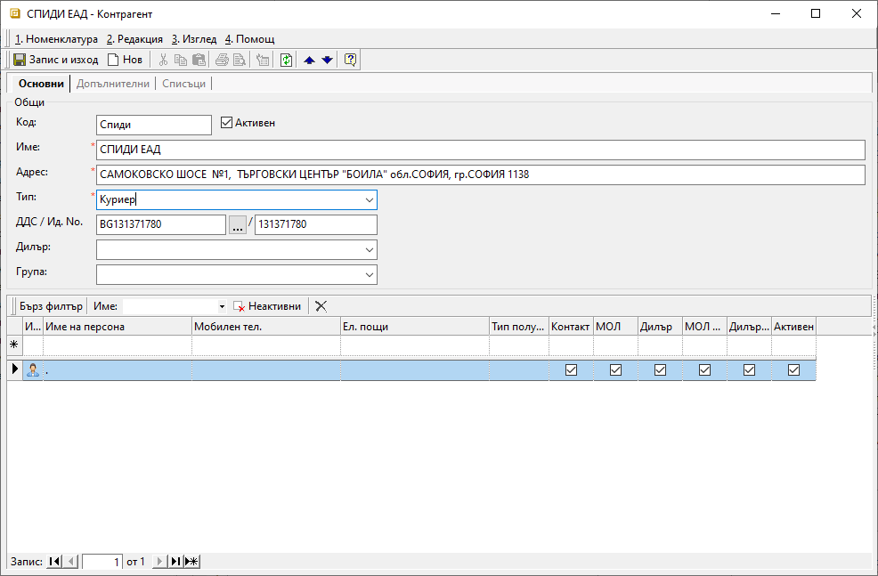

```{only} html
[Нагоре](000-index)
```

# Контрагенти

В системата под **Контрагенти** се разбират всички доставчици и клиенти, юридически и физически лица, складове, банки и 
държавни институции. Няма отделна номенклатура за доставчиците и клиентите, но за да се разграничават се използват 
*Категории контрагенти*.

Нов контрагент се създава по следния начин:

 1) От модул **Номенклатури >> Контрагенти** чрез натискане на десен бутон на мишката върху списъка с контрагенти, 
    трябва да изберете **Нов контрагент**. Отваря се празна форма **Контрагент** за въвеждане на данни.

    { align=center }
 
 2) Въведете:
 
    В секция **Основни**:
    - **Наименование** – въвеждате наименованието на контрагента;
    - **Адрес** – записвате адресa на контрагента;
    - **Тип** – от какъв тип е контрагентът – избирате юридическо или физическо лице. Типовете контрагенти се въвеждат
      предварително в системата от **Номенклатури >> Референтни номенклатури >> Търговска система >> Типове
      контрагенти**.
    - **ДДС No** – записвате ДДС номера на контрагента. Реквизитът е задължителен само в случаите, когато контрагента
      е данъчно регистриран;
    - **Ид No** – Идентификационен номер. Записвате идентификационния номер (булстат) на контрагента;
    - **Категория** – от бутона с трите точки избирате към коя категория принадлежи контрагентът;
    
    В секция Списъци:
    - **Персони** – попълвате името на персоната, която е материално отговорно лице;
  
 3) **Запис и изход**
 