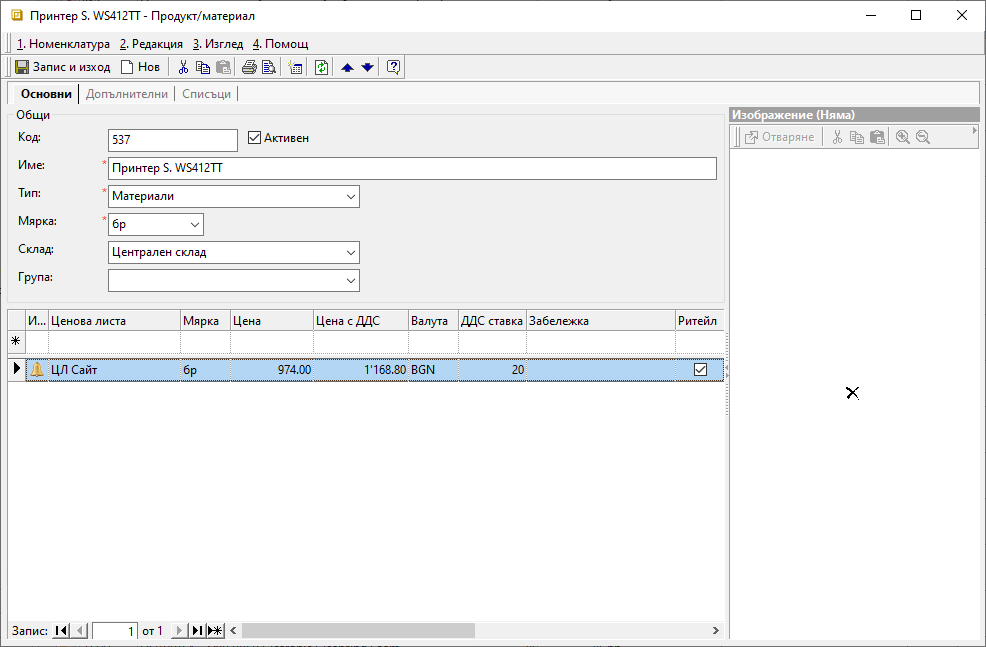

```{only} html
[Нагоре](000-index)
```

# Продукти

В номенклатура **Продукти** се включват всички стоки, продукти, материали, услуги и други артикули, с които работите.  
За цялостното функциониране на **Продукти** е необходимо предварително да бъдат настроени свързаните с тях референтни номенклатури - като **Тип**, **Мярка**, **Фасети на мерки**, **Потребителски дименсии** и други.  

Нов продукт се създава по следния начин:

 1) В меню **Номенклатури || Продукти и материали** с десен бутон на
    мишката върху списъка с продукти се избира **Нов продукт**.
    
 2) Отваря се форма *Продукт/материал*, където се въвеждат следните данни:
 
    { class=align-center }

    В панел **Основни**:
    - **Код** – попълва се код на продукта;
    - **Име** – попълва се желаното наименование (задължителен реквизит);
    - **Тип** – от предварително настроен списък се избира какъв е типът на продукта (задължителна настройка);  
    **Тип на продукта** е референтна номенклатура, свързана пряко с настройките на **Автоматичен осчетоводител**, според която системата генерира счетоводните записвания по продукт.  
    - **Мярка** – от списък се избира основната мярка на продукта (задължителна настройка);  
    В тази мерна единица системата ще обработва количествата на продукта в склада. Основната мерна единица не трябва да се променя, след като вече е приложена за продукта във валидирани складови документи.
    - **Склад** – избира се склад, който системата третира като склад по подразбиране.  
    - **Група** - от предварително настроен списък с дименсии се избира група продукти;
    - **Ценова листа** - от списъка с ценови листи могат да се коригират, изтриват и добавят данни с ценови условия;
    Нови ценови листи, в които продуктът ще участва, се включват чрез реда за добавяне на нов запис. 
    - **Изображение** - визуализация на изображение от прикачен файл (панел **Списъци**);

    В панел **Допълнителни**:
    - **Дименсии** – избират се всички дименсии (категории), към които принадлежи продуктът;
    Реквизитите с дименсии са променливи, като зависят от индивидуалните настройки в базата. Достъпни за настройка са предварително настроените списъци с дименсии за продукти, създадени от **Номенклатури || Потребителски дименсии**.
    - **Счетоводно отчитане по признаци** – при утвърдителна настройка *Да*, този продукт автоматично се прехвърля в списък с счетоводни признаци;
    - **Счетоводно отчитане по количество** – при настройка *Да* счетоводното отчитане на продукта е по количество;
    - **Забележка** – поле вдясно на формата за свободно въвеждане на коментар, допълнителни характеристики и пр.;  

    В този панел има възможност за множество други настройки, свързани с данъци и такси, интрастат, партиди и дата на годност, центрове на себестойност, трансформиране при фактуриране, отпечатване и други.  
    
    В панел **Списъци**:
    - **Фасети на мерки** - настройват се съотношения между основната мерна единица на продукта и всички останали мерни единици, които ще се прилагат за него в системата;
    - **Мин/Макс количества** - настройват се минимално и/или максимално допустими количества за продукта в един или няколко склада;
    - **Съставни продукти** - ;
    - **Амбалаж** - ;
    - **Баркодове** - въвеждат се наличните баркодове отделно за всяка мерна единица;
    - **Вендор кодове/имена** - настройка с код и/или име на продукта, с които продуктът се идентифицира при клиент/доставчик;
    - **Прикачени файлове** - добавяне на файлове с различен формат, съдържащи например изображения, инструкции, гаранционни условияи други.
    - **Производство и придобиване: Нова рецепта** - функция за създаване на една или множество рецепти за продукта;
    - В групи **Контрол**, **Търговска система**, **Счетоводна система**, **Организация** и **Производство** са достъпни всички генерирани в системата документи, включващи избрания продукт;


 3)  **Запис и изход**  

___
Свързани статии:

[Как да създадем Продукт?](https://www.unicontsoft.com/cms/node/13)  
[Как да настроим Тип на продукт?](https://www.unicontsoft.com/cms/node/104)  
[Как да настроим Склад по подразбиране?](https://www.unicontsoft.com/cms/node/103)  
[Как да създадем продукт тип Услуга?](https://www.unicontsoft.com/cms/node/99)  
[Как да въведем различни Мерки и отношения между тях?](https://www.unicontsoft.com/cms/node/101)  
[Как да въведем Минимални и максимални количества за продукт по складове?](https://www.unicontsoft.com/cms/node/218)  
[Как да въведем Баркодове?](https://www.unicontsoft.com/cms/node/102)  
[Как да въведем Гаранционен срок?](https://www.unicontsoft.com/cms/node/113)  
[Как да въведем настройка за Трансформация на продукт при фактуриране?](https://www.unicontsoft.com/cms/node/105)  
[Как да въведем настройка за Амбалаж?](https://www.unicontsoft.com/cms/node/187)  