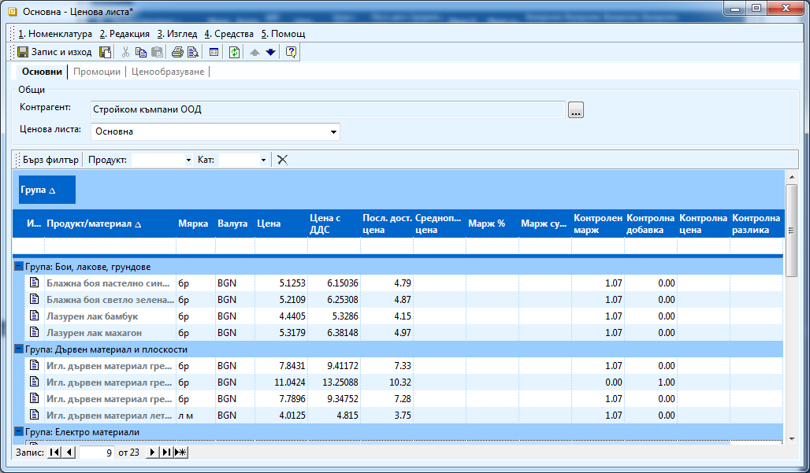
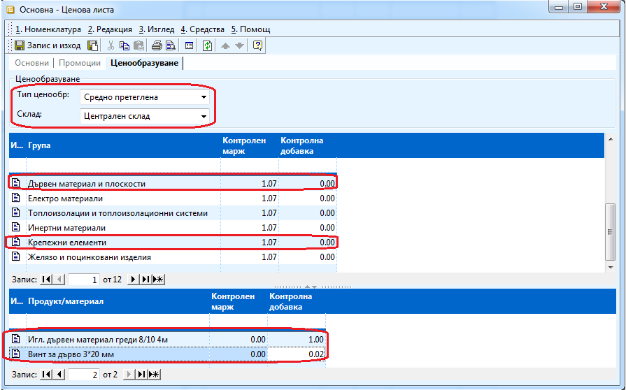

```{only} html
[Нагоре](000-index)
```

# Ценови листи

Ценовите листи се използват при създаване на документи за покупка и продажба, като
системата автоматично въвежда цената и изчислява задължението по съответния документ.
Ръководство за работа с програмен продукт „Dreem Enterprise”

Ценовите листи са удобни, тъй като на практика чрез тях се задават шаблони за цени по избрани продукти. Към всеки контрагент може да бъде закачен даден шаблон (Ценова листа) и при въвеждане на документ за продажба, системата автоматично да взима цената на избрания продукт за съответния контрагент.

Ценовите листи към доставчици могат да се водят и автоматично от системата, тъй като тя
запазва последната доставна цена при всяка покупка от всеки контрагент.

Ценовите листи към клиенти, трябва да бъдат настроени, за да може системата
автоматично да дава цена при продажба на стока на даден клиент. Важно за клиентските ценови листи е, че при въвеждане контрагента в Ценовата листа трябва да бъде потребителят на продукта. По този начин системата разбира, че тази листа е предназначена за клиенти (използва се при продажби).

Процесът на създаване на ценова листа е следният:

 1) Типовете ценови листи се въвеждат предварително от **Номенклатури >> Референтни
номенклатури >> Типове ценови листи**.

 2) За да създадете нова **Ценова листа**, трябва да изберете група функции **Номенклатури >>
Ценови листи**. Чрез натискане на десен бутон на мишката върху списъка с ценови листи,
избирате **Нова ценова листа**. Отваря се празна форма **Ценова листа** за въвеждане на данни, в
която трябва да попълните:

    { align=center w=15cm }

    В секция **Основни**:
    - **Контрагент** — натискате бутона с трите точки срещу поле Контрагент. Отваря се
Форма за избор - Контрагенти. Маркирате контрагента с мишката и след това натискате бутон
Избор. По подразбиране за всяка клиентска ценова листа системата автоматично дефинира
контрагента да бъде потребителя на системата (в примера Стройком къмпани ООД).
    - **Ценова листа** – от падащия списък трябва да изберете типа на ценовата листа, която
ще въвеждате. Типовете ценови листи се дефинират предварително от Номенклатури >>
Референтни номенклатури >> Типове ценови листи.
В редовете на ценовата листа:
    - **Продукт/Материал** - в натискате бутона с трите точки в края на полето. Отваря се
Форма за избор - Продукти и материали. Маркирате продукт с мишката и бутон Избор го
добавя в списъка. От падащия прозорец избирате Мярка и след това записвате желаната стойност
в полето Цена или Цена с ДДС. Системата автоматично изчислява другата цена, в зависимост от
това коя сте въвели.
    В секция **Ценообразуване**:
    - **Тип ценообразуване** – трябва да окажете по какъв начин искате да ценообразувате
продуктите в тази ценова листа – по среднопретеглена цена на склад или спрямо доставните цени;
    - **Склад** – ако изберете да ценообразувате по среднопретеглена цена, в това поле
трябва да посочите за кой склад ще се отнася ценовата листа;
    - **Група и продукт/материал** – можете да задавате процент надбавка върху цяла
група продукти или върху отделни продукти като дадена група в поле Група в редовете на
формата или отделен продукт в поле Продукт/материал.
    - **Контролен марж** - за избрана група или продукт/материал трябва да посочите с
колко процента над доставната или среднопретеглената цена искате да продавате. Контролният
марж се образува като към 1 прибавим процента надбавка. Например ако искате да продавате с
20% отгоре, попълвате 1,2.

    ```{tip}
    В случая в примера сме избрали да ценообразуваме по среднопретеглената цена на Централен склад като сме задали, че искаме да продаваме с 0,07% над доставната цена.
    ```

    Ако за един продукт сте дефинирали различен контролен марж за него и групата, към която
принадлежи, по – голяма тежест винаги има процента, който сте задали за самия продукт.

    { align=center w=15cm }

    ```{tip}
    В случая показан на картинката при ценообразуването на Игл. дървен материал греди 8/10 4м и Винт за дърво 3*20 мм във формулата ще се вземе контролната добавка, въпреки че сме задали контролен марж за групите, към които принадлежат тези материали.
    ```

 3) Записвате или опреснявате ценовата листа.

 4) В секция **Основни** в поле **Контролна цена** трябва вече да се показва новата цена, в
зависимост от метода на ценообразуване, който сте избрали. Ако искате да работите с нея,
маркирайте редовете, натиснете десен бутон и избирате **Ценообразуване**. Ако работите със
средно претеглена цена и не се показва, натиснете бутон
от лентата с инструменти.

 5) **Запис и Изход** — бутон в лентата с инструменти. Записва въведените промени и излиза от
формата.

 6) За да работи коректно системата и автоматично да записва цените, трябва да прикачите
въведената ценова листа към избран контрагент. За целта отивате в **Номенклатури >>
Контрагенти** и отваряте избрания контрагент.

 7) В панел **Основни** от падащия прозорец на реквизита **Ценова листа по подразбиране**,
избирате въведената ценова листа.

 8) В документ за продажба, когато избирате продуктите чрез бутон
можете да изберете за
всеки един от продуктите коя ценова листа ще ползвате.
    - Всеки контрагент може да има само една Ценова листа по подразбиране.
    - Един и същ продукт може да участва в една ценова листа, но трябва да е с различни
мерни единици.
    - Валутни ценови листи също могат да се въвеждат, като се избира съответната валута
