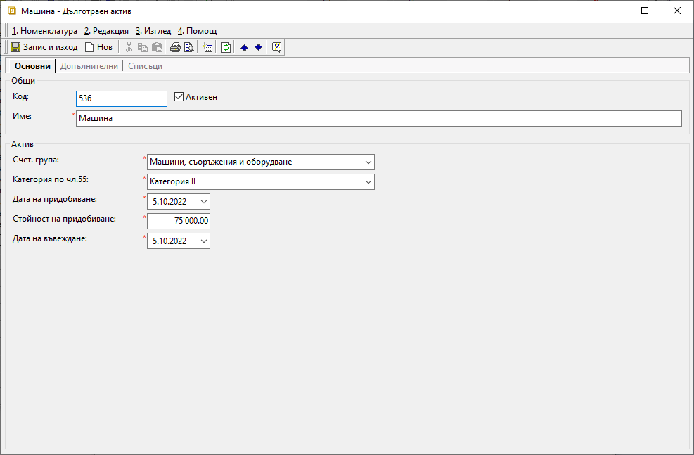
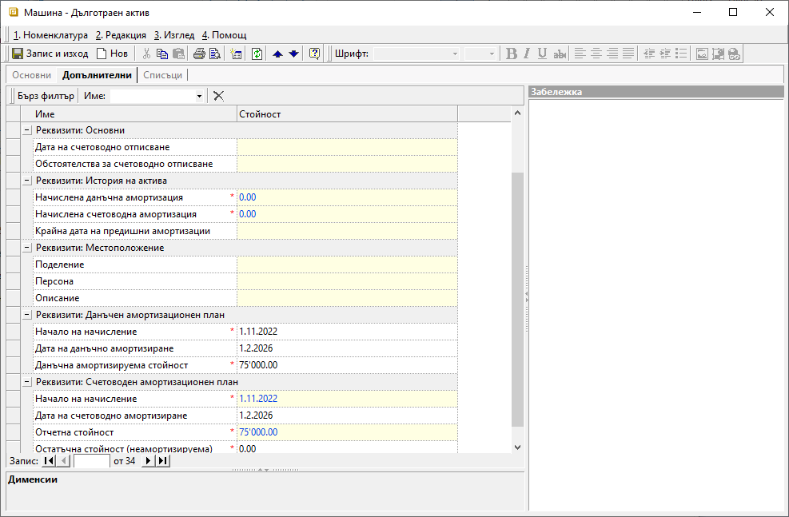
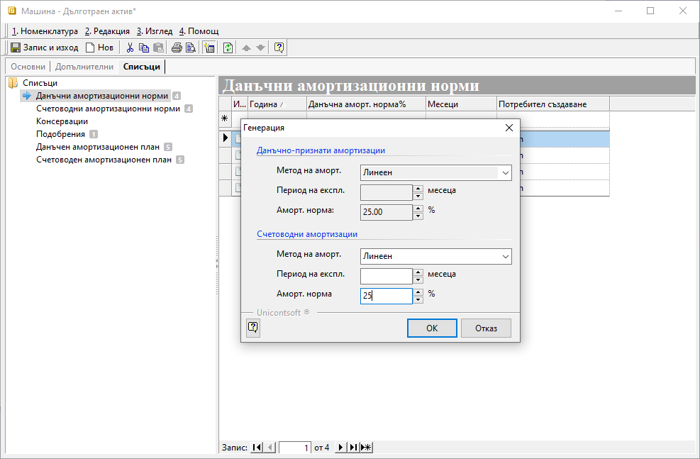

```{only} html
[Нагоре](000-index)
```

# Създаване на ДМА

Системата поддържа функционалност, която позволява ефективното управление на ДА на фирмата. Чрез **Номенклатури || Дълготрайни активи** може да заведете всички ДА в системата и да генерирате данъчен и счетоводен амортизационен план за всеки от тях.  
Амортизациите на ДА могат да бъдат осчетоводени автоматично чрез инструмент за генерация. 

За въвеждането на дълготрайни активи трябва предварително да са настроени групите ДА, с които ще работите, от **Номенклатури || Референтни номенклатури || Дълготрайни активи: Групи ДА**.  

Процесът по създаване на нов дълготраен актив е следният:  

1) В **Номенклатури || Дълготрайни активи** чрез десен бутон на мишката (Ctrl+N)  и **Нов ДА** се отваря форма за въвеждане на актив.

2) В раздел **Основни** се попълват следните полета:
 - **Код** - по желание се попълва код на ДА;
- **Име** – поле с наименование на ДА (задължителна настройка);
- **Счет. група** - от падащия списък се избира съответната категория, която е предварително въведена.
- **Категория по чл. 55** - в полето се избира съответната категория от системно заложен в **Референтни номенклатури** списък;  
- **Датата на придобиване** – попълва се с датата на придобиване на актива - обикновено с дата на фактурата за покупка;
- **Стойност на придобиване** – попълва се стойността на ДА (Амортизируема стойност);
- **Дата на въвеждане** - попълва се дата на въвеждане на ДА в експлоатация;  
    На база тази дата се определя от кой месец да започне начислението на счетоводните амортизации.

{ class=align-center }

3) Раздел **Допълнителни**:

- **Дата на счетоводно отписване** – полето се попълва с дата, на която активът е отписан поради продажба, бракуване или др.
- **Обстоятелства за счетоводно отписване** – в полето се попълват обстоятелства за счетоводно отпусване, които ще се отпечатат в амортизационен план.  
История на актива се попълва, ако въвеждате активи, които са
закупени преди време и амортизацията им трябва да се продължи.
Например активите, които прехвърляте от предишни програми.  
- **Начислена данъчна амортизация** - попълва се, когато има начислени данъчни амортизации преди активът да е въведен в системата. Използва се при изчисляване на амортизационен план.
- **Начислена счетоводна амортизация** – използва се при изчисляване на амортизационен план, когато активът има начислени счетоводни амортизации преди въвеждането му в системата.
- **Крайна дата на предишни амортизации** - попълва се крайната дата на начислените амортицазии и се използва при изчисляване на амортизационен план;  
Ако полето остане празно или датата е по-малка от *Начало на начисление*, стойностите се интерпретират като начална амортизация.

Полетата, свързани с *Местоположение* на ДА - **Поделение**, **Персона** и **Описание**, не са задължителни. Използват се за отбелязване она детайли относно местоположението на актива.  

{ class=align-center }

В секция **Данъчен амортизационен план** полетата са заключени за корекции. 

- **Начало на начисление** - показва от кой месец да започне начислението на данъчните амортизации. Използва се при изчисляване на данъчен амортизационен план. 
- **Дата на данъчно амортизиране** - изчислява се от системата и служи за попълване на съответната информация в амортизационните планове. 
- **Данъчна амортизируема стойност** - информацията се използва при изчисляване на данъчен амортизационен план.

В секция **Счетоводен амортизационен план** се попълват с полета:  
- **Начало начисление** - определя от кой месец да започне начислението на счетоводните амортизации, т.е. първият ден от месеца, следващ месеца на въвеждане на актива. (задължителна настройка);
- **Дата на счетоводно амортизиране** - полето се изчислява от системата и е заключено за редакция;  
- **Отчетна стойност** - в общия случай това е стойността на придобиване на ДА (задължителна настройка);  
- **Остатъчна стойност (неамортизируема)** - изчислява се от системата и се използва в счетоводния амортизационен план. 
Използва се при изчисляване на счетоводен амортизационен план.
4) В раздел **Списъци** се настройват:  

- **Данъчни амортизационни норми** и **Счетоводни амортизационни норми** - Задължително трябва да се обзаведат, за да се дефинира срок на амортизация и амортизационната норма на съответния актив.

    Това става чрез бутон *Генериране* от лентата с инструменти, който отваря форма с настройки,в която се попълват:   
    - **Метод на аморт.** – избира се метод, по който се амортизират активите;  
    - **Период на експл**. – попълва се предполагаемият срок за практическо използване на актива (в месеци);  
    - **Аморт. норма** – съотношение между амортизационната сума, приета за сто, и полезния срок за ползване на актива в брой години. 

{ class=align-center }

> Достатъчно е да се попълни само едно от двете - или период на експлоатация, или амортизационна норма. 
    
След потвърждаване на избора с *Ок* системата генерира **Данъчен амортизационен план** и **Счетоводен амортизационен план**.  


- **Консервации и Подобрения**

Тези секции се използват, ако временно е преустановено използването на актива поради определени причини - **Консервиране**, или при направени някакви подобрения на актива - **Подобрения** . 

- **Данъчен амортизационен план** и **Счетоводен амортизационен план**

В тези секции справките се генерират автоматично от системата, след като се настроят амортизационен период/норма и метод на амортизация.  
При редактиране на настройките за метод и период/норма, системата актуализира амортизационните планове спрямо направените промени.  

5) **Запис и изход**  

_____  
Свързани статии:

[Как да въведем Дълготраен актив?](https://www.unicontsoft.com/cms/node/100)  
[Дълготрайни активи](https://docs.unicontsoft.com/blog/20240423-fixed-assets.html)