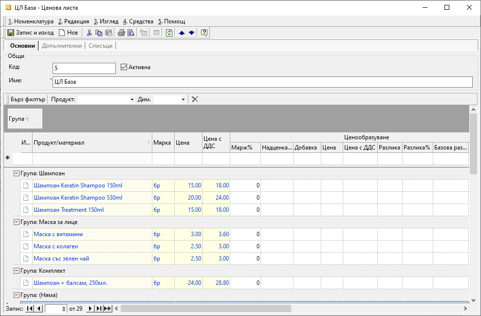
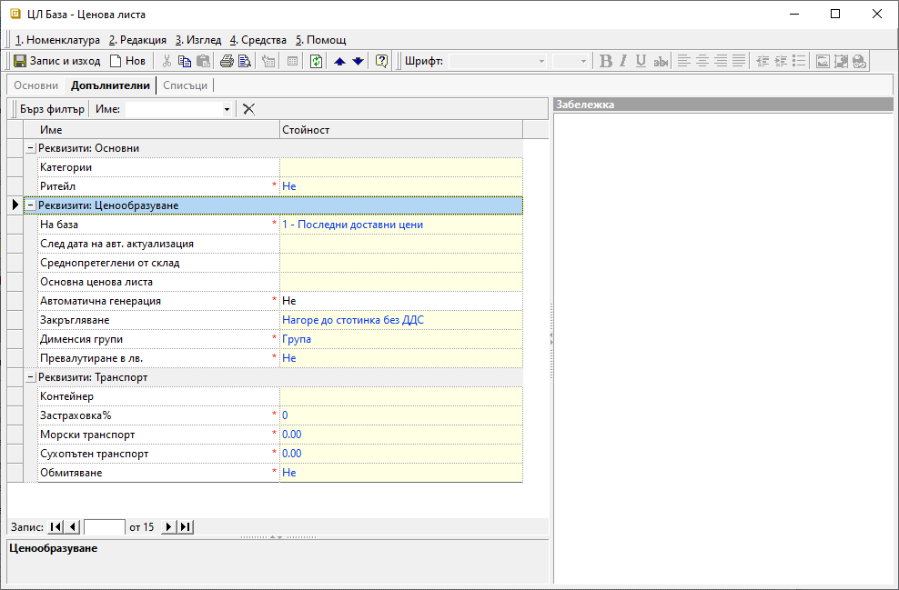
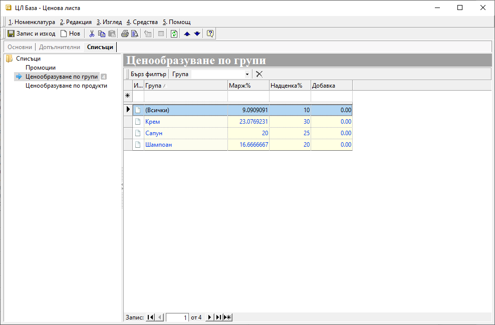

```{only} html
[Нагоре](000-index)
```

# Ценови листи

Ценовите листи представляват шаблони с цени за избрани продукти, които се прилагат в документи за покупка и продажба. Системата автоматично въвежда цената и изчислява задължението по съответния документ. Такъв шаблон (Ценова листа) може да бъде настроен към всеки контрагент, така че при продажба системата автоматично да прилага цени.

Системата позволява настройка и прилагане и на валутни ценови листи. Стъпките в процеса на създаване на такава ЦЛ са същите, като единствената особеност е различните валута и курс.

Ценовите листи са разделени на:

**Доставни ценови листи** се водят автоматично от системата - тя запазва последната доставна цена след всяка валидирана покупка по контрагент.

**Клиентски ценови листи** трябва да бъдат настроени, за да може системата автоматично да предлага цени в продажбата при избор на контрагент. 

Процесът на създаване на ценова листа е следният:

 1) За създаване на нова **Ценова листа** се избира група функции **Номенклатури || Ценови листи**. 
 Чрез десен бутон на мишката върху списъка вдясно се избира **Нова ценова листа**. Отваря се форма **Ценова листа** за въвеждане на данни.  

 2) В раздел **Основни** се настройват:
    - **Име** – в свободен текст се изписва наименование (задължителен реквизит);  
    - **Продукт/Материал** - от реда за добавяне на нов запис може ръчно да се въведат продукти и материали. 
    - **Мярка** - избор на мерна единица;
    В една ценова листа може да се добавят цени за един и същ продукт, но за различни мерни единици.
    - **Цена**/**Цена с ДДС** -  след въвеждане на една от двете цени системата автоматично ще изчисли другата.

    { class=align-center w=15cm }

3) В раздел **Допълнителни** се настройват:  
    - **Ритейл** - указва кои цени - с или без ДДС, да са водещи при формиране на тотали в документите за продажба (задължителна настройка);
    - **На база** – в полето се избира метод на ценообразуване и спрямо него в последствие се изисква настройка на различни реквизити;
    - **След дата на авт. актуализация** - полето се настройва при база *Последни доставни цени*, като задава начална дата за филтър на покупки, от които се актуализира последна доставна цена.  
    - **Среднопретеглени от склад** - настройка при база *Среднопретеглени цени*, с която се указва склад, от който се взимат среднопретеглените цени.
    - **Основна ценова листа** - полето се попълва при база *Основна ценова листа*, като се избира родителска ценова листа, от която се взимат базовите цени.  
    - **Автоматична генерация** - опция, която се активира, когато в списъка в раздел Основни няма записи; 
    Разрешава или забранява автоматичната генерация на цени при модификация на родителска ценовата листа, при приключване на складови документи или покупка.  
    - **Закръгляване** - поле за избор на начин на закръгляване на цени от Референтни номенклатури | Закръглявания на цени, което се използва при ръчно или автоматично ценообразуване.  
    - **Дименсия групи** - поле за избор на дименсия, по която да се настройва *Ценообразуване по групи* в раздел **Списъци**.
    - **Превалутиране в лв.** - разрешава или забранява конвертиране на валутни цени (от покупки) в национална валута при ценообразуване.  

    { class=align-center w=15cm }

4) В раздел **Списъци** се настройват:
    - **Промоции** – Добавяне на готови ценови листи с намаления и ограничена валидност;    
    - **Ценообразуване по групи** - От списъка вдясно се избират групи с отстъпка, като се обзавеждат колони:   
        - *Група* - избира се дименсия, като отстъпката може да се настрои общо за всички или за отделни групи;
        - *Марж %* - попълва се стойност на желания процент марж;
        - *Надценка* - попълва се стойност на желаната надценка;
        - *Добавка* - може да се настрои точна сума, която да се добави в цената;
    - **Ценообразуване по продукти** - От списъка се посочват продукти, за които ще има различни надценка и/или добавка, като се обзавеждат колони:   
        - *Продукт/материал* - избира се дименсия, като отстъпката може да се настрои общо за всички или за отделни групи;
        - *Мярка* - посочва се мерната единица, която се отнася за реда; 
    Когато се правят настройки за повече от една мерна единица, трябва всяка една да е на отделен ред.   
        - *Марж %* - поле с марж в проценти;
    Може да се изчисли автоматично от системата след настройка на полето с надценка;
        - *Надценка* - попълва се стойност на желаната надценка в проценти;
        - *Добавка* - може да се настрои точна сума, която да се добави в цената;

    { class=align-center w=15cm }  

> Ако за един продукт са дефинирани **Марж**, **Надценка** и/или **Добавка**, различни за него и групата, към която принадлежи, с по–голяма тежест винаги е настройката по продукт.

 5) **Запис и Изход** — бутон в лентата с инструменти. Съхранява въведените настройки и излиза от формата.

___
Свързани статии:

[Как да създадем Ценова листа?](https://www.unicontsoft.com/cms/node/14)  
[Как да свържем Ценова листа с контрагент?](https://www.unicontsoft.com/cms/node/67)  
[Ценови листи и схеми с търговски отстъпки](https://docs.unicontsoft.com/blog/20240522-price-lists-and-discount-schemes.html)