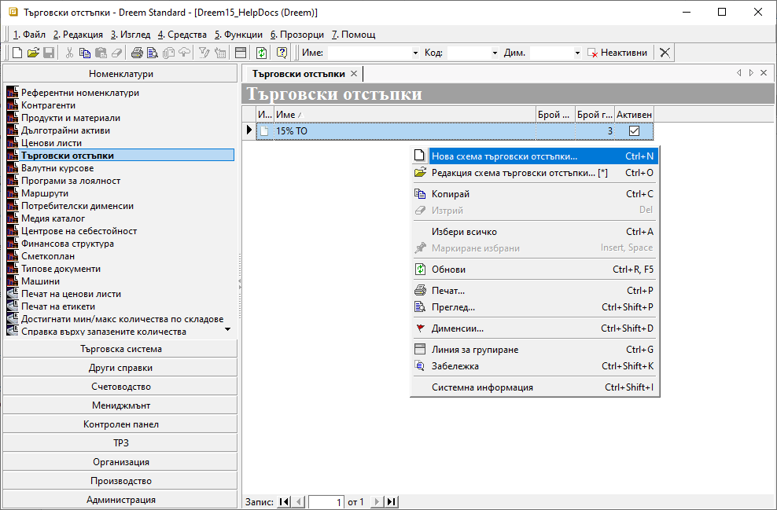
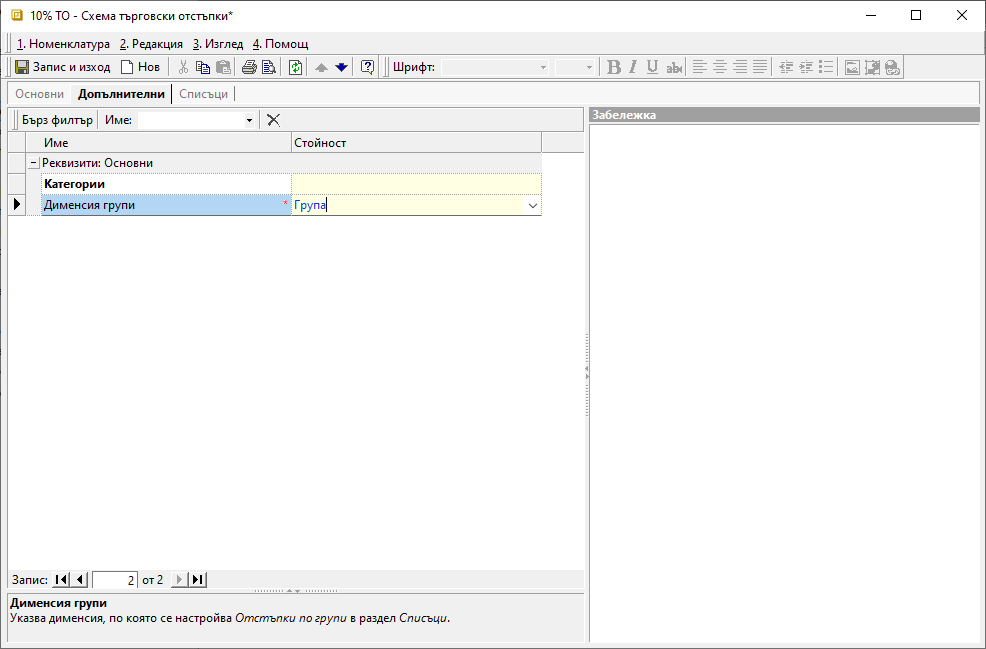
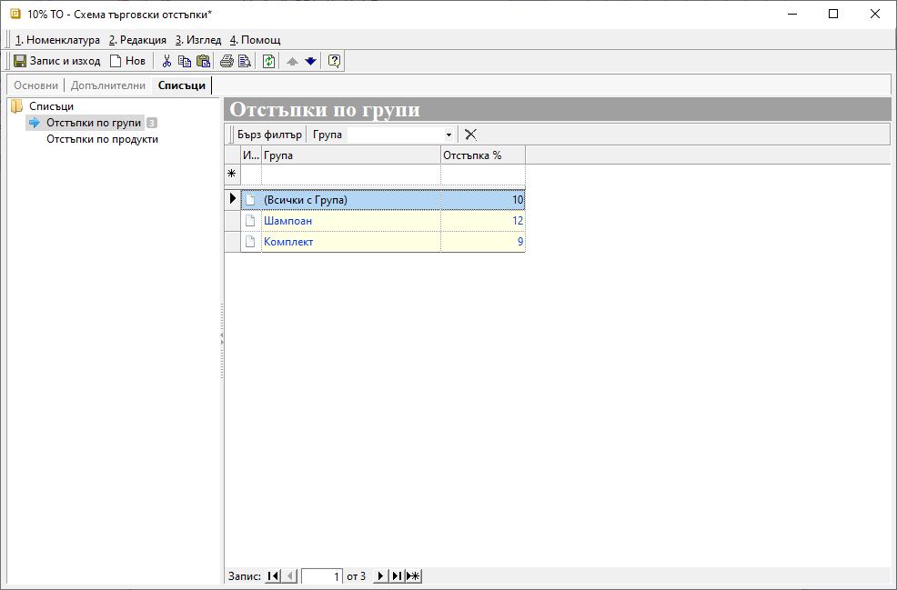

```{only} html
[Нагоре](000-index)
```

# Търговски отстъпки

Схемата с търговски отстъпки представлява шаблон с настроени намаления от цената, който може да се прилага в документи за заявки, покупка и продажба. 
Отстъпките се настройват в проценти общо за цяла група/и, както и индивидуално за продукт.  

Може да създадете множество схеми с ТО в системата, които да прилагате ръчно, или да обвържете с настройките на избрани контрагенти.

Процесът на създаване на схеми с търговски отстъпки е следният:

 1) За създаване на нова схема с отстъпка се отваря група функции **Номенклатури || Търговски отстъпки**. Чрез десен бутон на мишката върху списъка вдясно се избира **Нова схема търговски отстъпки**. Отваря се форма за въвеждане на данни **Ценова листа**, в
която се попълват няколко реквизита:

{ class=align-center }

2) В панел **Основни** се настройват:
    - **Код** — кодът може да се попълни ръчно или системата да даде пореден номер при запис на номенклатурата;
    - **Име** – в свободен текст се изписва наименование на схемата с ТО (задължителна настройка);
    - **Активен** - чрез поставяне/премахване на отметка схемата с ТО се активира/деактивира;

3) В панел **Допълнителни** се настройват:
- **Категории** - Използва при настройка за сигурност и ограничаване на достъпа до ценови листи; 
- **Дименсия групи** - Избира се дименсията, по която в раздел **Списъци** ще се настройват *Отстъпки по групи*(задължителна настройка);

{ class=align-center }

4) В панел **Списъци** се настройват:
- **Отстъпки по групи** - От списъка вдясно се избират групи с отстъпка, като се обзавеждат колони:   
    - *Група* - избира се дименсия, като отстъпката може да се настрои общо за всички или за отделни групи;
    - *Отстъпка %* - стойност на желаите проценти намаление;
- **Отстъпки по продукти** - От списъка се посочват продукти, за които ще има специфична отстъпка. Те се явяват изключения от настройките за групи. 
Попълват се колони:
    - *Продукт/материал* - избира се конкретен продукт, за който има индивидуална отстъпка, различна от тази по групи;
    - *Отстъпка %* - стойност на желаите проценти намаление;

{ class=align-center }

> При използване на схема с ТО в документ, системата прилага с приоритет настроените отстъпки по продукти. Ако не открие такива, прилага отстъпките по групи.
___
Свързани статии:

[Как да създадем схема с ТО%?](https://www.unicontsoft.com/cms/node/15)  
[Как да свържем Схема с ТО% с контрагент?](https://www.unicontsoft.com/cms/node/67)