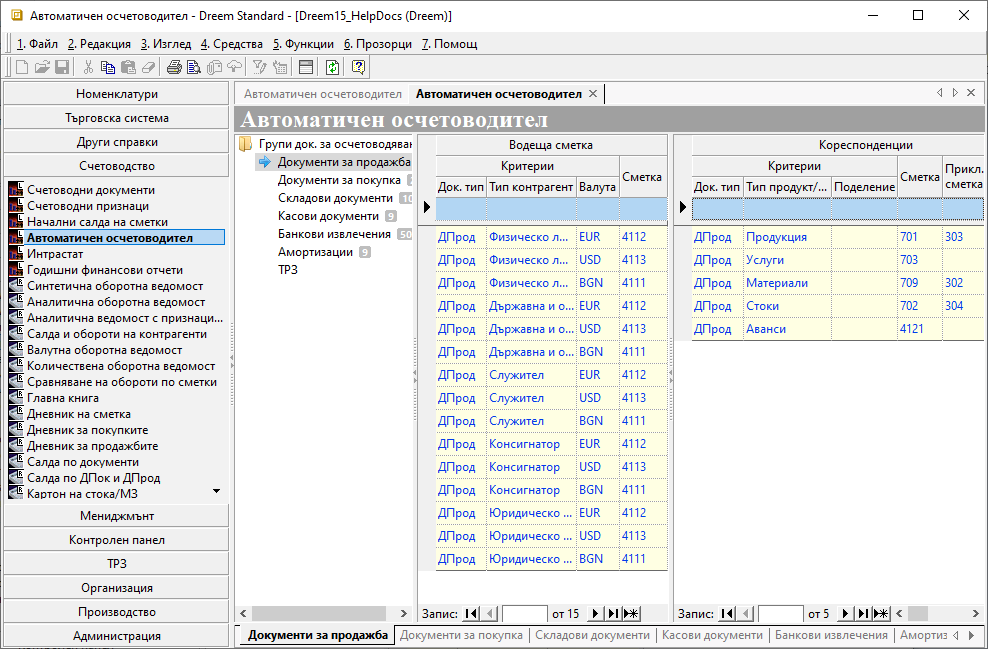

```{only} html
[Нагоре](000-index)
```

# Автоматичен осчетоводител

Системата разполага с функционалност **Автоматичен осчетоводител**, чрез която рутинните счетоводни операции могат да се извършват автоматично. Така, заедно с валидирането на документите в **Търговска система**, може да се генерира и счетоводен запис/и.  

Системата трябва да се конфигурира според счетоводната политика и индивидуалния сметкоплан на всяка фирма. Първият етап в настройките е правилното дефиниране на следните референтни номенклатури:    
- **Типове контрагенти**  
- **Типове продукти и материали**   
- **Основания за плащане**  

На следващ етап се настройва **Автоматичен осчетоводител**, където посочвате как да се осчетоводява всеки един документ от **Търговска система**, на който ще правите счетоводен запис. Настройките на документи са обособени в отделни групи, както следва:  
- **Документи за продажба**   
- **Документи за покупка**  
- **Складови документи**  
- **Касови документи**  
- **Банкови извлечения**  
- **Амортизации**  
- **ТРЗ**   

Процесът по настройка на автоматичните контировки е следният:  

1) Избира се група функции **Счетоводство || Автоматичен осчетоводител**. След като се маркира съответната група документи за осчетоводяване, вдясно се отваря списък с настройки.  
За всяка една от тези групи документи задължително се правят настройки във **Водеща сметка** и в **Кореспонденции**.  
  

{ class=align-center }

**Документи за продажба**:

2) За **Водеща сметка** трябва да се настроят полета:   

- **Док. тип** - поле, в което се избира тип на документа от възможните за избраната група документи;  
В случая на **Документи за продажба** това са всички настроени в системата данъчни документи при продажба: фактури, дебитни и кредитни известия, отчети за извършени продажби, митнически декларации за износ, квитанции и др.  

- **Тип Контрагент** - в това поле се посочва за кой от предварително въведените типове контрагенти се настройва текущият ред;  

- **Валута** - поле с възможност за избор на различна валута за всеки ред с настройки;  

- **Сметка** - в това поле се избира водещата сметка за избрания на реда тип документ;  
Системата предлага под формата на падащ списък настроеният **Сметкоплан**.    

3) В **Кореспонденции** се настройват следните полета:  

- **Док. тип** - поле за избор на типа документ, за който ще се отнася текущият ред с настройки;   

- **Тип Продукт/Материал** - в полето от опционалното меню се избира тип на продукта, за който се настройва текущият ред;  

- **Поделение** - в полето може да се избере поделение на потребителя на продукта от списъка с текущо активните;   

- **Сметка**   - в това поле се настройва кореспондираща сметка за избрания **Тип продукт/материал**;  

- **Прикл. сметка** - възможност да се избере приключителна сметка на всеки ред за група **Документи за продажба**;  
Тази настройка работи при генериране на приключителна статия от самия счетоводен документ.


> Настройките за всички **Групи док. за осчетоводяване** са аналогични, като единствено колоните в списъците варират според избраната група.  

4) Запис - Бутон в лентата с инструменти, записващ промените в **Автоматичен осчетоводител**.  
___
Свързани статии:

[Как да настроим Автоматичен осчетоводител за всички групи документи?]