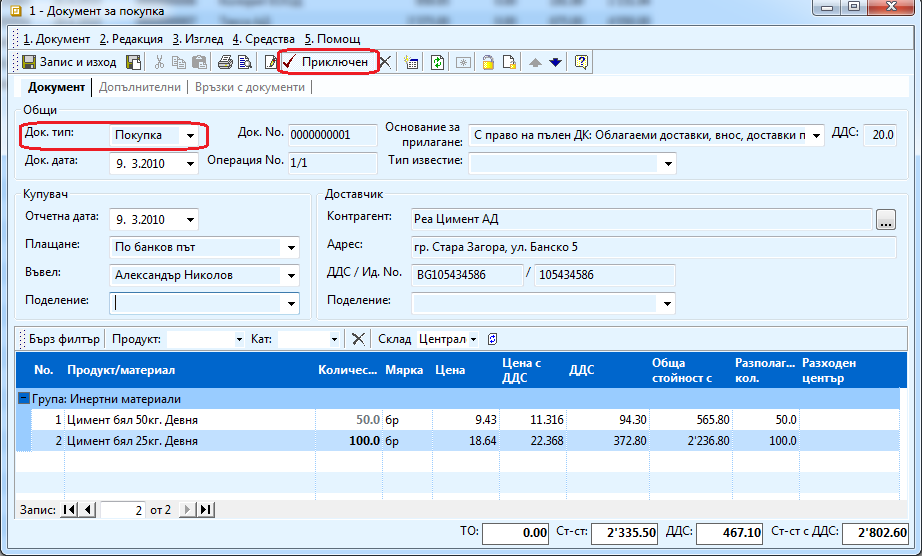
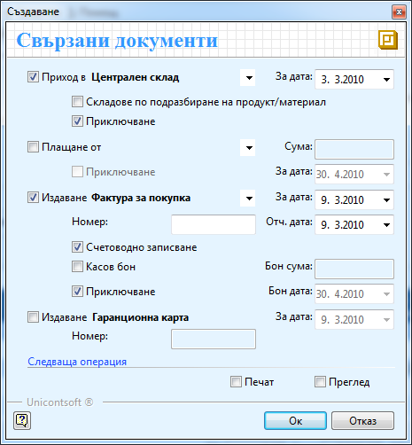

```{only} html
[Нагоре](000-index)
```

# Създаване на документ за покупка

Документ за покупка се създава при сключване на сделка и на практика
представлява вътрешно-фирмен документ, чрез който се дефинира
договорка между Купувача и Продавача (доставчика). Със
създаването на документа, системата приема следното:

1. Извършена е покупка на описаната стока в документа.

1. Възниква задължение към доставчика.

1. Стоката не е приета в склада. 

1. Няма получена фактура.

Това са четири операции, които могат да бъдат извършвани от различни
звена в дадена организация, но могат и едновременно. Затова
системата позволява при валидиране (приключване) на документа,
да бъдат генерирани останалите документи по сделката, а именно:

 - **РКО** — разходен касов ордер. Погасява възникналото задължение към доставчика.

 - **ПСД** — приходен складов документ. Приема стоката от доставчика и увеличава наличността в склада.

 - **ФПок** — фактура за покупка. Генерира се фактура за покупка на база документа за покупка.

В системата при стартиране на повече от документите се отваря прозорец,
чийто първоначален изглед е във вида на справка. Целта е да се улесни
потребителя, тъй като много често той търси информация за определен
документ, преди да извърши нов запис. За да намерите информация за
стар документ трябва да се зададе период във филтъра. За по – голямо
бързодействие е наличен бърз филтър в лентата с инструменти, което
работи върху документите филтрирани от основния филтър.

Процесът на създаване на покупка е следният:

1. За да създадете документ за покупка от **Търговска система \>\> Документи за покупка \>\>** натискате на десен бутон на мишката върху списъка с документи и избирате **Нов документ**. Отваря се празна форма **Документ за покупка** за въвеждане на данни. В нея трябва да попълните:

    В секция **Общи**:

    - **Док. тип** – избирате *Покупка* (по подразбиране това е избрано);

    - **Док. дата –** попълвате датата на документа;

    - **Док. No** — в полето записвате номера на документа, с който пристига стоката;

    - **Основание за прилагане** – оставяте *С право на пълен ДК*, ако покупката е обложена с ДДС 20 %. От падащи списък можете да промените основанието, ако покупката е необлагаема или процента е различен. Основанията за прилагане трябва да въведете предварително от **Референтни номенклатури \>\> Счетоводство \>\> Основания на прилагане**.

    В секция **Купувач**:

    - **Плащане** – избирате: *в брой* – ако покупката е била платена в брой или *По банков път* – ако сте платили по банков път;

    - **Въвел** — от падащия прозорец избирате персона, която въвежда документа. 

    В секция **Доставчик**:

    - **Контрагент** — избирате бутона с трите точки срещу поле **Контрагент** в секцията **Доставчик**. Отваря се Форма за избор - **Контрагенти**. Маркирате контрагент с мишката и след това натискате бутон **Избор**. Контрагентите трябва да бъдат предварително въведени. 

    Останалите полета получават автоматично стойности в зависимост от
избрания контрагент.

    В редовете на документа задължително трябва да попълните:

    - **Продукт/Материал** — позиционирате мишката върху поле **Продукт/Материал** в реда за добавяне на нови записи. Натискате бутона с трите точки в края на полето. Отваря се Форма за избор - **Продукти и материали**. Маркирате продукт с мишката и бутон **Избор** го добавя в списъка. 

    - **Количество** — в полето записвате полученото количество по документ.

    - **Цена** — в полето записвате единичната цена без ДДС по получения документ.

    { align=center w=15cm }

1. След като попълните задължителната информация в документа, трябва да изберете бутон **Приключен** в лентата с инструменти. По този начини документа се валидира документа и извежда форма **Генериране - Свързани документи**. Чрез тази форма могат да бъдат генерирани автоматично останалите операции: **ПСД** - приходен складов документ, **РКО** - разходен касов ордер и **ФПок** - фактура за покупка.

    { align=center }

    - **Генериране на Складови документи** — поставяте отметка, ако стоката е пристигнала в склада и трябва да я заприходите. Чрез опция **Приключване** системата автоматично валидира документа. Можете и да промените датата на документа, ако е необходимо.

    - **Генериране на документ за плащане** — ако стоката ще бъде платена на място през каса, маркираме тази опцията и **Приключване**, за да може системата автоматично да валидира документа.

    - **Генериране на фактура No** — избирате тази опция, ако имате фактура към покупката и записвате номера и датата в съответните полета. За да генерирате счетоводно записване по тази фактура, маркирате опцията **Счетоводно записване** и ако сте създали касов ордер, маркирате и **Плащане през каса за сумата от** (Последната операция ще бъде изпълнена коректно, само ако автоматичния осчетоводител е настроен). Маркирате опцията **Приключване**, за да може системата автоматично да валидира документа.

    - **Генериране на гаранц. Карта N** – можете да маркирате тази опция, ако при съответната покупка са ви издали гаранционна карта и искате да пазите тази информация в системата.

    - **Следваща операция – Печат и Преглед** – слагате отметки, ако искате да разгледате и/или отпечатате документа за покупка. 

1. След като маркирате избраните опции, натискате бутон **Ок** за изпълнението им. Системата генерира свързаните документи и валидира (приключва) **Документа за покупка**.

1. **Запис и Изход** — бутон в лентата с инструменти. Записва документа и излиза от формата.
