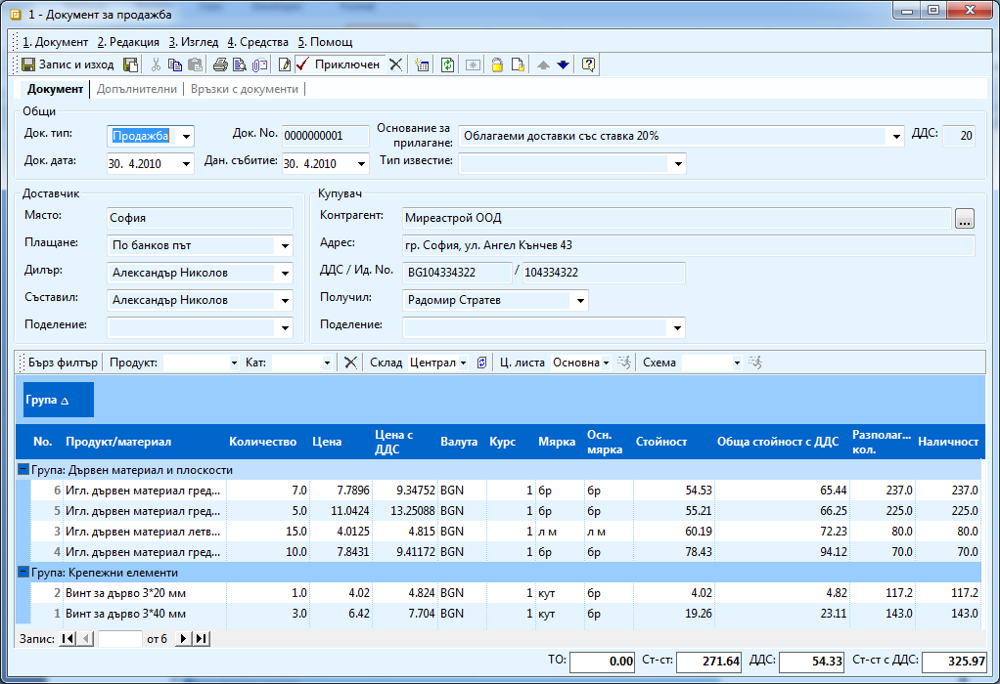
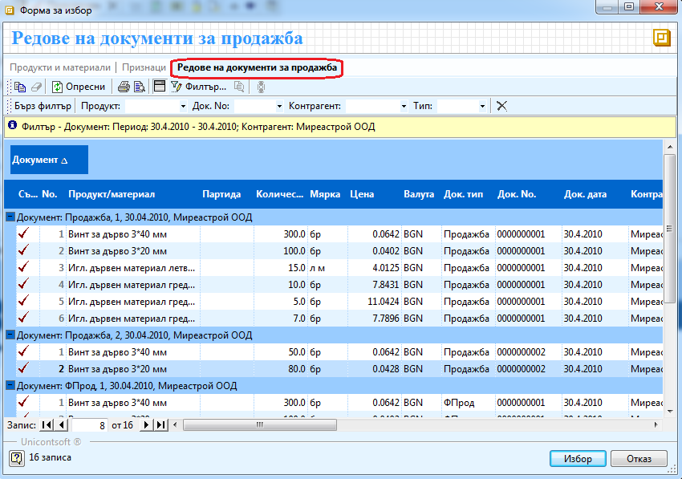
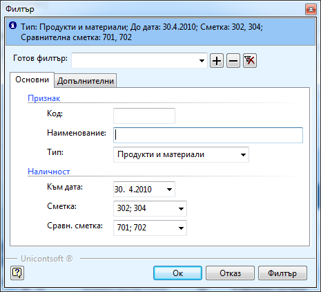
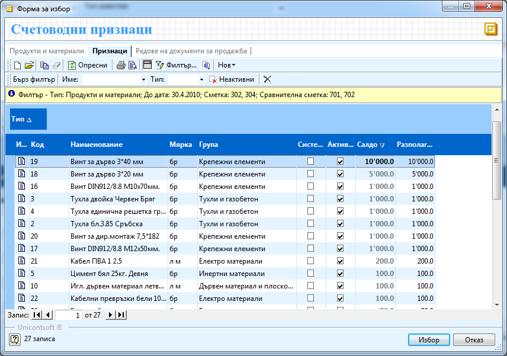
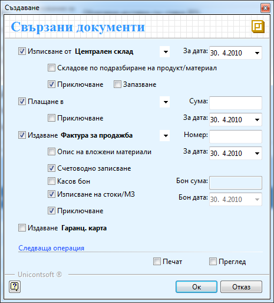

```{only} html
[Нагоре](000-index)
```

# Създаване на документ за продажба

Документ за продажба се създава при сключване на сделка и на практика
представлява вътрешно-фирмен документ, чрез който се дефинира
договорка между **Продавача (в случая потребителя на продукта) и
Купувача (клиента)**. Със създаването на документа, системата приема
следното:

1. Извършена е продажба на описаната стока в документа.

1. Възниква вземане от клиента.

1. Стоката не е изписана от склада.

1. Няма издадена фактура.

Това са четири операции, които могат да бъдат извършвани от различни
звена в дадена организация, но могат и едновременно. Затова
системата позволява при валидиране (приключване) на документа,
да бъдат генерирани всички останали документи по сделката, а именно:

 - **ПКО** — приходен касов ордер. Погасява възникналото вземане от клиента.

 - **РСД** — разходен складов документ. Издължава стоката на клиента и намалява наличността в склада.

 - **ФПрод** — фактура за продажба. Генерира се фактура за продажба на база документа за продажба.

Процесът на създаване на продажба е следният:

1. За да създадете документ за продажба от **Търговска система \>\> Документи за продажба** с натискане на десен бутон на мишката върху списъка с документи, изберете **Нов документ**. Отваря се празна форма за въвеждане на данни **Документ за продажба**.

    { align=center w=15cm }

1. Попълвате следните данни:

    В секция **Общи**:

    - **Док. тип** – избирате продажба (по подразбиране това е избрано);

    - **Док. дата** – попълвате датата на документа

    - **Основание за прилагане** – оставяте „Облагаеми доставки със ставка 20%”, ако продажбата се облага с ДДС 20 %. От падащи списък можете да промените основанието, ако продажбата е необлагаема или процента е различен. Основанията за прилагане трябва да въведете предварително от **Референтни номенклатури \>\> Счетоводство \>\> Основания на прилагане**.

    В секция **Доставчик**:

    - **Място** – попълвате града, къде се намира фирмата ви. Попълва се по подразбиране с града, който е зададен в **Администрация \>\> Настройки \>\> Стойности по подразбиране \>\> Населено място**.

    - **Плащане** – избирате *В брой* – ако плащането ще е в брой или *По банков път* – ако клиентът ще плати чрез банка;

    Останалите полета можете да ги оставите със стойностите им по подразбиране.

    В секция **Купувач**:

    - **Контрагент** - избирате бутона с трите точки срещу полето **Контрагент**. Отваря се Форма за избор - **Контрагенти**. Маркираме контрагент с мишката и след това бутон **Избор**. Контрагентите трябва да бъдат предварително въведени.

    Останалите полета получават автоматично стойности в зависимост от избрания контрагент.

    В редовете на продажбата попълвате:

    - **Продукт/Материал** — позиционирате мишката върху поле **Продукт/Материал** в реда за добавяне на нови записи. Натискате бутона с трите точки в края на полето. Отваря се Форма за избор - **Продукти и материали**. 

    В нея можете да видите наличностите във всеки склад като в поле
**Склад** от лентата с инструменти изберете съответния склад. По
този начин в поле **Разполагаемо количество** се виждат наличностите
само за съответния склад.

    Ако искате да вземете конкретна цена за съответните продукти от
определена ценова листа, в поле **Ц. листа** трябва да посочите
листата, по която искате да ценообразувате.

    В секция **Редове на документи за продажба** могат да се видят всички
документи издавани на този клиент за посочен период както и подробна
информация за продадените продукти, количествата, цени и т.н. Това е
удобно да се използва, ако искате да видите последните продажни цени
към този клиент.

    { align=center w=15cm }

    В секция **Признаци** можете да видите счетоводната наличност на склада.
За целта трябва да попълните филтъра по следния начин:

    { align=center }

    В справката, която се появява в колона **Салдо** се вижда разполагаемото
количество на материала в счетоводния склад. В колона **Разполагаемо**
се вижда разликата между наличното количество и фактурираното, но все
още не изписано количество.

    { align=center w=15cm }

    Маркирате продукт с мишката и бутон **Избор** го добавя в списъка.
Продуктите трябва да бъдат предварително въведени.

    - **Количество** — в полето записвате, количеството което ще продавате на клиента;

    - **Цена с ДДС** — в полето записвате единичната цена с ДДС на продаваната стока.

1. След като сте попълнили всички необходими полета, натиснете бутон **Приключен** от лентата с инструменти. По този начин документа се валидира и се извежда форма **Генериране - Свързани документи**. Чрез тази форма могат да бъдат генерирани автоматично всички останали операции: **РСД** - разходен складов документ, **ПКО** - приходен касов ордер и **ФПрод** - фактура за продажба.

1. В **Свързани документи** имате следните опции:

    - **Генериране на Складови документи** — ако стоката е изписана или трябва да се изпише от склада и съответно да се намали наличността и, маркирате опцията **Генериране на Складови документи** и опцията **Приключване**, за да може системата автоматично да валидира документа. В поле **Склад** избирате склада, от който ще изписвате стоките.

    - **Генериране на Документ за плащане** — ако стоката ще бъде платена на място през каса, маркирате опцията **Генериране на Документ за плащане** и опцията **Приключване**, за да може системата автоматично да валидира документа.

    - **Генериране на Фактура** — за да генерирате фактура по тази продажба, маркирате опцията **Генериране на Фактура** и опцията **Приключване**, за да може системата автоматично да валидира документа. Към тази фактура можете да генерирате счетоводно записване в **Счетоводната система** като маркирате опция **Счетоводно записване**. Ако сте избрали да генерирате **Касов ордер** по тази продажба, би трябвало да генерирате и счетоводно записване за плащане през каса към тази фактура. За целта маркирате опция **Плащане през каса за сумата от**. Отметка в **Изписване на стоки/МЗ** поставяте, за да изпишете стоките от счетоводния склад.

    { align=center }

1. Можете да прегледате и отпечатате документа за продажба, както и всички свързаните с него документи като поставите отметки съответно в полетата **Печат** и **Преглед**.

1. След като маркирате избраните опции, натискате бутона **Ок** за изпълнението им. Системата генерира свързаните документи и валидира (приключва) **Документа за продажба**.

1. **Запис и Изход** — бутон в лентата с инструменти. Записва документа и излиза от формата.
