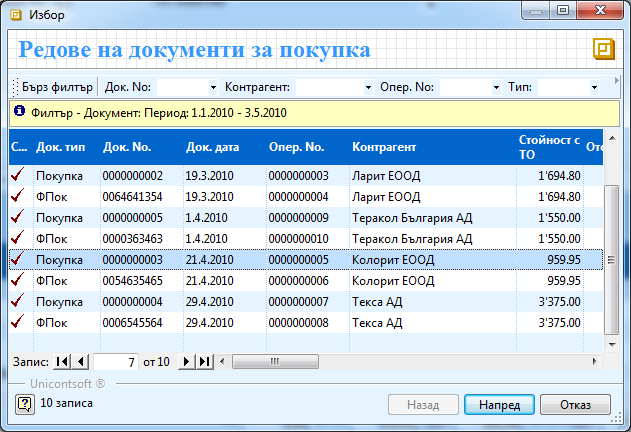
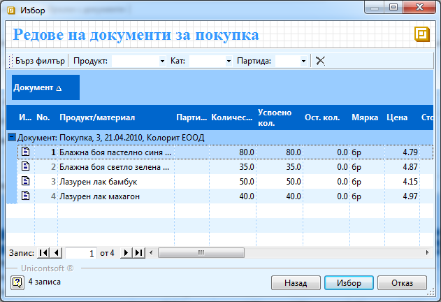
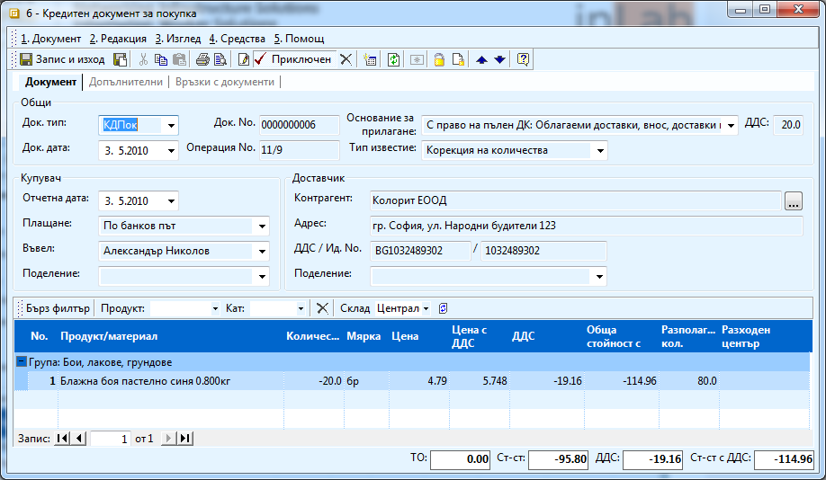
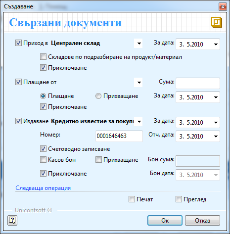
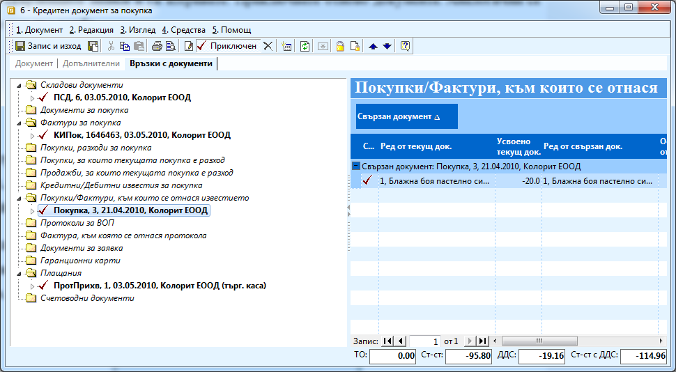

```{only} html
[Нагоре](000-index)
```

# Кредитен документ/Кредитно известие

Кредитните документи аналогично на документите за покупки и продажби са
два – един вътрешно – фирмен (Кредитен документ), който се свързва към
Документ за покупка/продажба и един данъчен (Кредитно известие), който
се свързва към фактурата. Кредитен документ/Кредитно известие се издава
за връщане на стока или за намаляване на цена и поради тази причина
винаги изисква връзка с Продажба/ Фактура. Съществува и трети вид
Кредитен документ/ Кредитно известие – бонус оборот. То се издава като
бонус за създадения оборот и не изисква връзка с Продажба/Фактура.

Процесът на създаване на кредитен документ е следният:

1. За да създадете кредитен документ трябва да намирате покупката/продажбата, към която е кредитното и да я отворите. За целта от менюто с инструменти избирате **Средства \>\> Генериране на кредитен документ/известие**. Появява се прозорец **Редове за документи за покупка**, където е маркирана покупката. Избирате я (ако не е маркирана, трябва да я потърсите – вероятно проблема е във филтъра) и натискате бутон **Напред**. От списъка с продукти избирате тези, които са включени в кредитното и натискате бутон **Избор**.

    { align=center w=15cm }

    { align=center w=15cm }

    Създава се кредитен документ за покупка. В него попълвате:

    - **Док. тип** – КДПок (избран е по подразбиране);

    - **Док. номер** – номера на кредитното известие;

    - **Док. дата** – датата на документа;

    - **Основание на прилагане** – избирате същото основание като това във фактурата;

    - **Тип известие** - *корекция на количества* – ако известието е, за да се върнат продукти; *корекция на цена*- ако е за промяна на цената на закупени продукти.

    { align=center w=15cm }

    В редовете на документа променяте съответно количеството или цената.
След като сме посочили типа на известието, програмата автоматично
поставя минус в количеството или цената.

    Приключваме известието като избирате:

    { align=center }

    - **Приход в –** маркирате тази опция, ако типът на известието е *Корекция на количества*, за да върнете материалите в склада. Избирате склада, в който да влязат продуктите и посочвате датата, на която са физически върнати.

    - **Плащане от** – избирате прихващане, за да прихванете сумата на кредитното от сумата, дължима по покупката/продажбата и попълвате датата с датата на кредитното.

    - **Издаване Кредитно известие за покупка/ продажба** – попълвате номер и дата (ако сте ги попълнили в кредитния документ, системата ще ти вземе автоматично от вече попълнените). Слагате отметка на **Счетоводно записване** и **Прихващане**, за да осчетоводите автоматично документа и да се прихванат счетоводно двата документа и плащанията по тях. 

    - И на трите места слагаме отметка на **Приключване**, ако няма да правите редакции по документите. 

1. След като маркирате избраните опции, натискате бутона **Ок** за изпълнението им. Системата генерира свързаните документи и валидира (приключва) Кредитния документ. Свързаните документи са два: кредитно известие и Протокол за прихващане (ПротПрихв). Чрез него прихващате сумата на кредитния документ от покупката.

1. **Запис и Изход** — бутон в лентата с инструменти. Записва документа и излиза от формата.

За да развържете или свържете двата документа (КДПок и Покупка или КИПок
и Фактурата – аналогично), трябва да върнете съответния документ в
състояние на редакция и в секция **Връзки с документи** да
изберете **Покупки/Фактури** за които се отнася известието.
Маркирате свързващите записи и ги изтривате. Приключвате отново
документа. Аналогични са операциите при продажба.

{ align=center w=15cm }