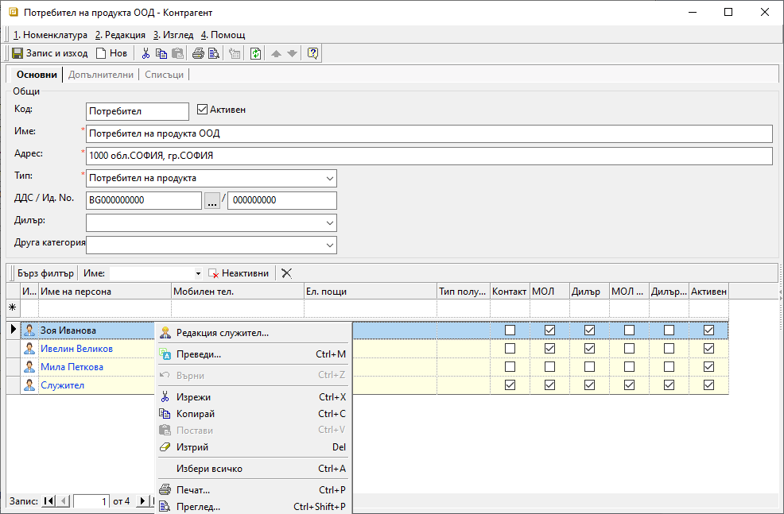
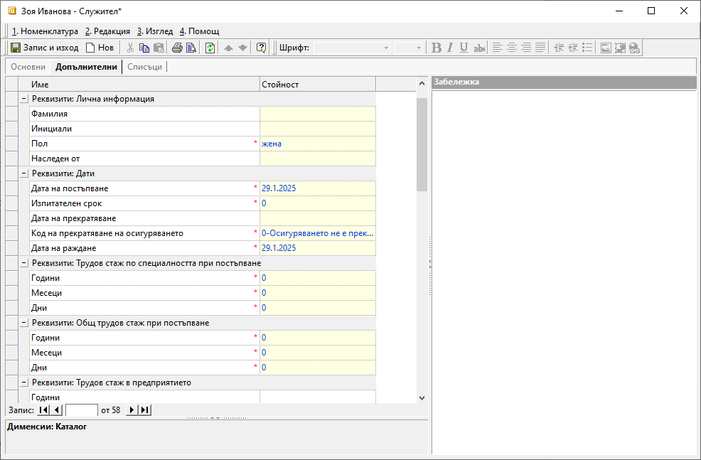

```{only} html
[Нагоре](000-index)
```

# Номенклатура Служители

Настройката на служители е задължителна за обработката на документи в модул ТРЗ. Служителите трябва бъдат създадени предварително, за да може да се въведеждат РПВ, документи за отпуск и болнични.  

Процесът по добавяне на нов служител е следният:  

1) Избира се група функции **Номенклатури || Контрагенти**. Отваря се форма за редакция на контрагента от тип **Потребител на продукта** и служителите се въвеждат на отделни редове в списъка с персони.  

2) Чрез десен бутон на мишката върху избрана персона и **Редакция служител** се отваря форма за редакция **Служител**. Тук се въвеждат задължителните данни, необходими при обработка на документи в модул **ТРЗ**.   
Настройката се прави отделно за всяка персона.  

{ class=align-center }

3) Задължително попълваме:

В раздел **Основни**:  

- **Име** – в това поле се попълват три имена на служителя;   
- **Адрес** - поле с адрес по лична карта на служителя;   
- **ЕГН** - задължителен реквизит с ЕГН на служителя;  
- **Трудово правоотношение** - в полето се избира от опционално меню вида на трудовите правоотношения;  

{ class=align-center }

В раздел **Допълнителни**:

Попълват се необходимите реквизити в секции **Лична информация**, **Дати**, **Трудов стаж по специалността при постъпване**, **Общ трудов стаж при постъпване**, **Местоположение**, **Лична карта**, **Телефони**, **Банкова сметка**. 
В група настройки **Възнаграждение** задължително се посочват:  
- **Аванс** - попълва се сума на аванс, ако служителят получава такъв;  
- **Основна заплата** - поле с брутно трудово възнаграждение;  
- **НПЗ** - данните се използват в раздел *Разходен център* на РПВ;  
В група настройки **Други** са включени множество задължителни реквизити:  
- **Категория труд** - в полето се избира категория от предварително въведен списък;  
Системата предлага настроенята по подразбиране категория. Настройката се използва в редовете на РПВ.   
- **Вид осигурен** - поле за избор на вид осигурен от предварително въведен списък;  
Настройката се използва при подаване на Декларация 1. 
- **Работодател по основно трудово правоотношение** - посочва се дали **Потребител на продукта** е работодател по основно трудово правоотношение за служителя;  
Настройката се използва при справки по чл. 45.   
- **Тип работно време** - от опционално меню в полето се избира тип на работното време - 5 дневна работна седмица, работа на смени;  
- **Брой работни часове** - в това поле се посочват работните часове на дневна база;   
- **Тип РПВ** - поле за избор на тип РПВ от предварително въведените през **Референтни номенклатури**;  
- **ГВРС**, **Самоосигуряващ се**, **Пенсионер**, **Намалена работоспособност**, **Начислява се % прослужено време**, **Чужденец** и **Лични удръжки за сметка на служителя** - настройката за тези реквизити трябва да бъде зададена като утвърдителна с *Да*, или като отрицателна - с *Не*;  

{ class=align-center }

В раздел **Списъци**:

- **Удръжки/Надбавки** – трябва да се посочат, ако се начисляват на някои от служителите (например запор или при уволнение), за да се вземе предвид от системата при изчисляване на месечната заплата на служителя.  
 Списъкът с удръжки и надбавки трябва е предварително двъведен от **Номенклатури || Референтни номенклатури || ТРЗ**.  
- **Предишен доход** - списък с данни за предишен доход по години;  
- **Възнаграждения, осигуровки и данъци при други работодатели** - списък с данни по години за облагаем доход, ДОО, ДЗПО, ЗО и др. при други работодатели;  
- **Данъчни облекчения и необлагаеми доходи** - настройка със суми на намаленията на годишната данъчна основа;  
Данните се въвеждат отделно за всяка година.  
- **Минимален осигурителен праг** – от предварително настроен списък се избира длъжност за текущия служител;  
- **Процент прослужено време** - от предварително настроен списък се избира процент прослужено време;  
- **Вноски** – в тази група се избират всички ДОО, ДЗПО и ЗО, които се изплащат за съответното лице.

{ class=align-center }

 4)  **Запис и изход** - Бутон, който записва промените и затваря формата за редакция на служител.  
 С това системата едновременно създава нови записи за служителя в **Номенклатури || Контрагенти** и в **ТРЗ || Служители**.  