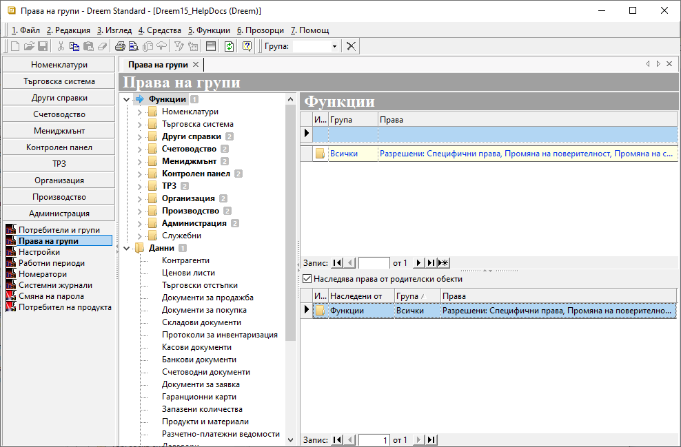
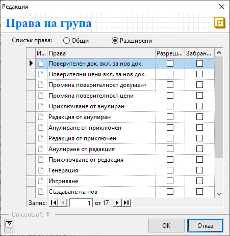
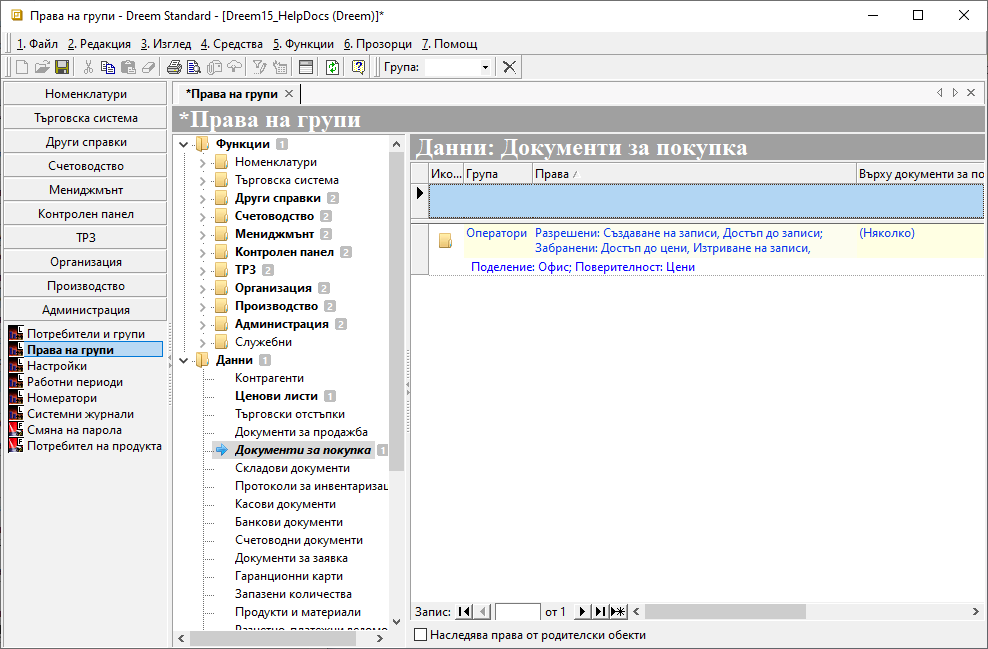
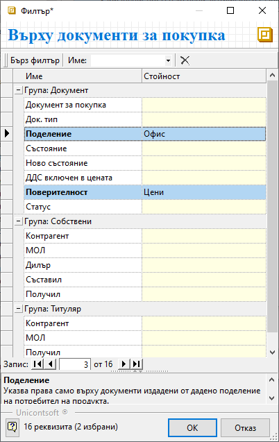

```{only} html
[Нагоре](000-index)
```

# Права на групи

Правата в **Dreem ERP** се управляват чрез меню **Администрация || Права на групи**. Настройките се организират по групи от избрани потребители. Потребителите се включват в подходящите групи спрямо необходимостта от ограничителни или разрешителни права.  

> Всеки потребител автоматично попада и в група *Всички*, която е системно настроена.

За да влязат в сила правата, от **Администрация || Настройки || Системни: Ниво за сигурност** трябва да се посочи при какви условия системата ще прилага ограниченията.  
Възможните варианти са:  

    - *0 - Няма*: при това ниво на сигурност системата не прилага никакви ограничения в правата на потребителите;  
    - *1 - Само Функции*: системата прилага настройки за права върху функционалностите и различните генерации на 
    документи;  
    - *2 - Само Данни*: при това ниво на сигурност системата ограничава достъпа до съдържащите се данни;  
    - *3 – Функции и данни*: най-високо ниво на сигурност, при което ограниченията се прилагат едновременно върху 
    достъпа до функции и съдържащите се данни;  

1) Реквизитите с настройки в **Администрация || Права на групи** са организирани в дървовидна структура с обекти на системата за сигурност и списъци с права за всеки от тях.  

2) Раздел **Функции** съдържа всички функционалности и модули на системата. Чрез него се управляват общите операции и достъпът до отделните функционалности.  

{ class=align-center }  

При избор на обект на системата за сигурност вдясно се визуализира списък с права за тази функционалност.  

- **Група** - поле за избор на група, за която се дефинират права за достъп;  
Системата предлага в падащо меню списък с всички предварително въведени групи потребители.    
- **Права** - поле за конфигуриране на разрешителни и/или забранителни права на група;  
От бутон **[...]** се отваря форма *Редакция: Права на група*. След избор на изглед *Общи* или *Разширени* системата визуализира списък с различни опции за настройка. Чрез поставяне на отметка в *Разрешени* или *Забранени* се дефинира достъпът по видове операции.  

{ class=align-center } 

- **Наследява права от родителски обекти** - настройка, която позволява за текущата функция да се активира/деактивира наследяването на ефективни права от родителски функционалности. Списък с наследени ефективни права се визуализира, когато настройката е активирана. Той включва информация за **Група**, за която са дефинирани права за достъп, и кратко описание на ефективните разрешителни и забранителни права.  

> Достъп до всички данни, валиден за всички потребители, може да се настрои чрез маркиране на раздел **Функции**. От списъка вдясно се обзавежда поле **Група** с *Всички*. В поле **Права** се отваря формата *Редакция: Права на група*, от която се разрешава достъп до всичко.  

3) В раздел **Данни** могат да се дефинират специфични настройки за избрани детайли.  
Списък с права на данни се визуализира вдясно, след като е избран обект на системата за сигурност. 

{ class=align-center } 

- **Група** - от падащия списък в полето се избира група, за която се дефинират права за достъп;  
Групите трябва да бъдат предварително въведени.  
- **Права** - поле за настройка на ефективни права върху данни;  
В полето се отваря форма *Редакция: Права на група*. Чрез поставяне на отметки се разрешава или забранява достъп по видове операции.  
- **Върху ...** - в това поле се дефинират допълнителни критерии, отнасящи се до ефективните права на данни.  
Бутон **[...]** в края на полето отваря форма за избор на детайлни критерии за правата върху данните.  
В колона *Стойност* се посочват желаните ограничения, като системата предлага за избор единствено от предварително въведени настройки.   

{ class=align-center } 

- **Наследява права от родителски обекти** - настройка, която позволява за текущата функция да се активира/деактивира наследяването на ефективни права от родителски функционалности.  
Когато наследяването е изключено, системата сигнализира чрез промяна в шрифта на избраната функционалност от тип *Данни*.    

4) **Запис** - бутон в лентата с инструменти за запаметяване на промените.    