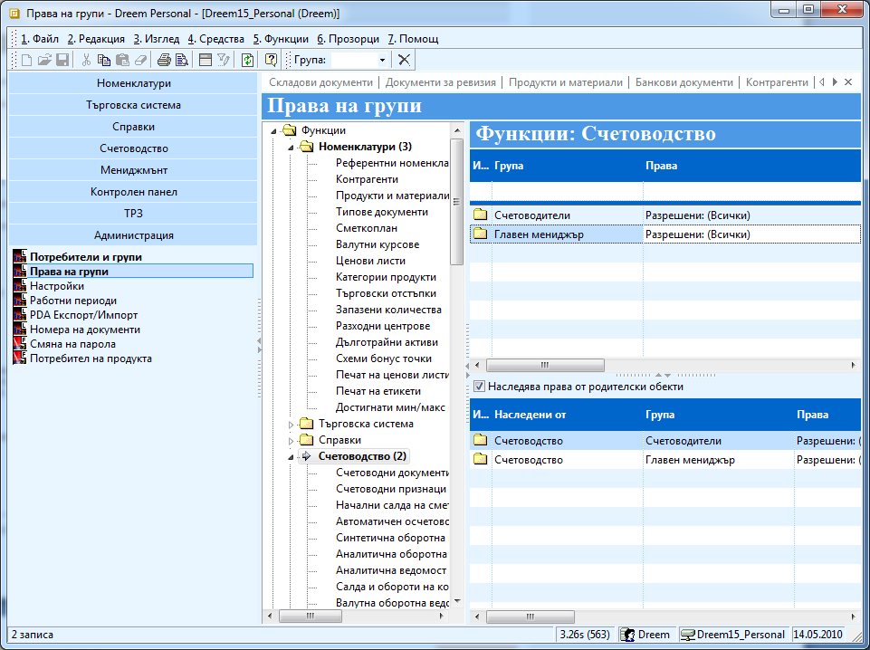

```{only} html
[Нагоре](000-index)
```

# Права на групи

Правата в **Dreem ERP** се задават общо по групи от избрани потребители. Това става в меню **Администрация**, където предварително се създават отделните потребители. Всеки един от тях се включва в съответните групи, за които се дефинират желаните ограничителни или разрешителни права.   

1. За да станат активни ограниченията, първо в **Администрация || Настройки || Системни: Ниво за сигурност** се посочва при какви условия системата ще прилага правата. Възможните варианти са:  
- *0 - Няма*: при това ниво на сигурност системата не прилага никакви ограничения в правата на потребителите;  
- *1 - Само Функции*: системата прилага настройки за права върху функционалностите и различните генерации на документи;  
- *2 - Само Данни*: при това ниво на сигурност системата ограничава достъпа до съдържащите се данни;  
- *3 – Функции и данни*: най-високо ниво на сигурност, при което ограниченията се прилагат едновременно върху достъпа до функции и съдържащите се данни;

1. Права на групите се задават от меню **Администрация \>\> Права на групи.**

{ class=align-center w=15cm }

Правата се делят на два вида: могат да се зададат права на достъп и
работа на ниво **функции** и на ниво **данни**.

 - Освен групите, към която сте посочили, че принадлежат потребителите, всички принадлежат по подразбиране към група *Всички*.

 - Към **Функциите** са включени всички модули. Можете да разрешите на всички достъп до всички данни, ако изберете **Функции** (най – високото ниво) и във формата **Функции** в **Група** изберете *Всички*, а в **права** изберете да имат достъп до всичко. Ако не дефинирате никакви права на това ниво и в настройките сте задали ниво на сигурност – 3, по подразбиране никой няма да има достъп до системата. 

 - Ако не зададете право на достъп на предното ниво, можете да дадете право на **достъп на ниво модул**. Например можете да изберете модул **Номенклатури** и в формата, която се появява в дясно да посочите на коя група какво разрешавате или забранявате.

 - **Третото ниво** на достъп е до определена форма или функция. Можете да разгърнете дървото на Номенклатури например. Можете да изберете например Контрагент и да определите права за достъп само свързани с контрагентите. 

 - На всяко едно от тези нива можете да забраните и видимостта на някои модул или функция като от права изберете **Достъп до функционалност** – *забранен*.

 - Последният начин на достъп е на **ниво Данни**. На това ниво се дават права свързани с работата с данни – създаване, модифициране, изтриване и т.н както и определяне на критерии, според които даден потребител може да достъпва точно определен набор от данни. Например можете да изберете **Контрагент** и на определен потребител да дадете достъп само до тези контрагенти, които са в категория **Клиенти**. Аналогично на **Функциите**, ако по подразбиране никои няма достъп до никакви данни и трябва да започнете да раздаваме права – или на най – горното ниво – **Данни** – всички да имат достъп до всички данни и после да забранявате някои или на най – горното ниво да не задавате нищо и да давате права за всеки отделен тип данни от дървото.
