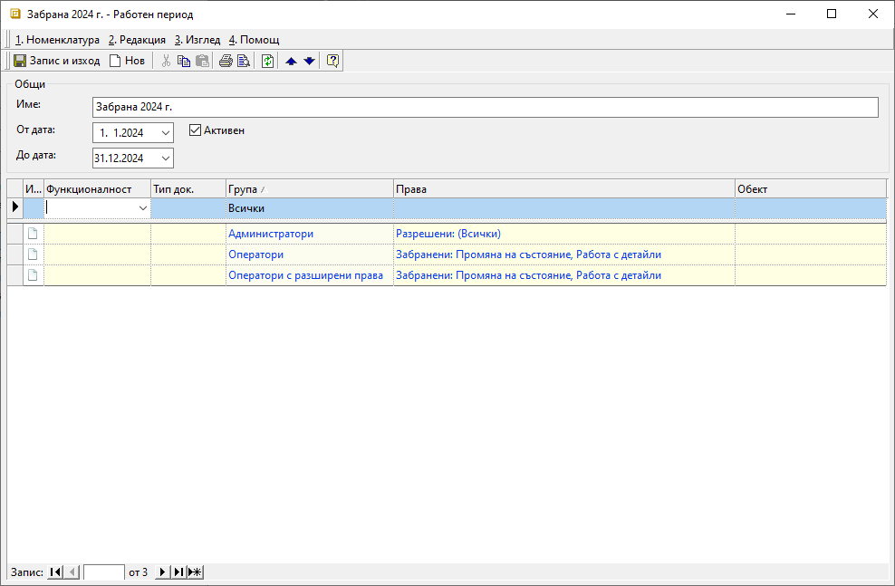
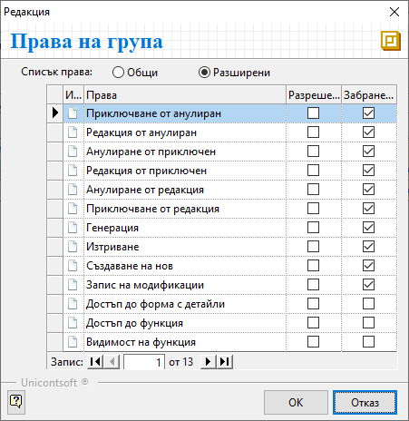

```{only} html
[Нагоре](000-index)
```

# Работни периоди

**Работни периоди** е функционалност на системата, чрез която се определя период на валидност за определени права на групи. Настройката може да бъде разрешителна, забранителна или комбинация от двете.  

> Системата изисква да има активен разрешителен период, валиден за всички потребители.  
Дефинирането на забранителни периоди е по избор.  

1) Нов работен период се създава от **Администрация || Работни периоди**. С десен бутон върху списъка вдясно се избира **Нов**, което отваря нова форма за въвеждане на данни.  

{ class=align-center }

2) Във форма **Работен период** могат да се попълват следните полета:  
- **Име** – в това поле се изписва наименование на работния период;  
- **От дата** - в това поле се избира начална дата на валидност;  
- **До дата** - в това поле се избира крайна дата на валидност;   
- **Активен** - чрез поставяне/премахване на отметка работният период се активира/деактивира;  
- **Функционалност** - в това поле на реда за добавяне на нов запис може да се избира функционалност на системата;  
Ако полето остане празно, настройките на реда се прилагат едновременно за всички фукнционалности на системата.  
- **Тип док.** - поле за избор на типа документ, за който да се реализират настройките на реда;  
Ако полето остане празно, системата прилага настройките за всеки тип документ.  
- **Група** - поле за избор на група от потребители, за които важат настройките на текущия ред;  
Системата предлага списък с групите, които са предварително въведени.  
- **Права** - поле за определяне на разрешителни и/или забранителни права на избраната група;  
От бутон **[...]** се отваря форма *Редакция: Права на група*. След избор на изглед *Общи* или *Разширени* системата визуализира списък с различни опции за настройка. Правата по видове операции се определят чрез поставяне на отметка в *Разрешени* или *Забранени*.  

{ class=align-center }

Чрез бутони **[ОК]** или **[Отказ]** избраните настройки с права се потвърждават или отхвърлят, а формата *Редакция: Права на група* се затваря.  

- **Обект** - в това поле може да се избере обект, за който важат настройките на реда;  
Обектите трябва да бъдат въведени предварително

5) **Запис и изход** - бутон, който запазва модификациите за работния период и излиза от формата.

___
Свързани статии:  

[Работа с Работни периоди ](https://docs.unicontsoft.com/blog/20240517-working-periods.html)  