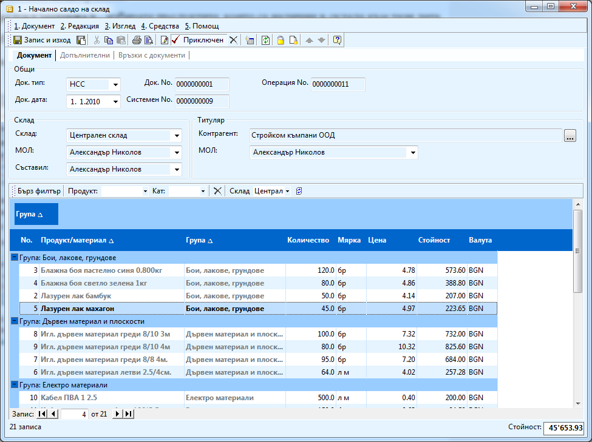

```{only} html
[Нагоре](000-index)
```

# Начално салдо на склад

За да имате коректна информация за складовите наличности е необходимо да
се въведат начални салда на складовете, с актуални количества и
стойности. Стоките се заприхождават задължително по доставни
цени без ДДС.

1. За да вкарате начално салдо в склад от **Търговска система \>\> Складови документи \>\>** с натискане на десен бутон на мишката изберете **Нов.** Отваря се форма за въвеждане и редакция на складови документи. 

1. В нея трябва да се попълни:

    В секция **Общи**:

    - **Док. тип** – трябва да изберете *НСС* – Начално салдо на склад;

    - **Док. дата** – датата на документа определя датата, към която ще се заприходят стоките;

    - **Док. No** – оставете го празно и системата ще генерира автоматично пореден номер на документ за този склад;

    В секция **Склад**:

    - **Склад** – посочете склада, за който се отнасят началните салда

    - **МОЛ** – трябва да посочите отговорника на този склад

    В секция **Титуляр**:

    - **Контрагент** – изберете вашата фирма (потребителят на продукта);

    - В редовете на документа:

    - **Продукт/материал** – избирате продуктите, които са налични в склада към тази дата. Продуктите трябва да са предварително въведени в системата.

    - **Количество** – въвеждате количеството на продуктите към датата на документа;

    { class=align-center w=15cm }

1. След въвеждане на списъка със стоки, документът трябва да бъде приключен, за да стане валиден документ. Това става чрез натискане на бутон **Приключен**, намиращ се на лента с инструменти на формата.
