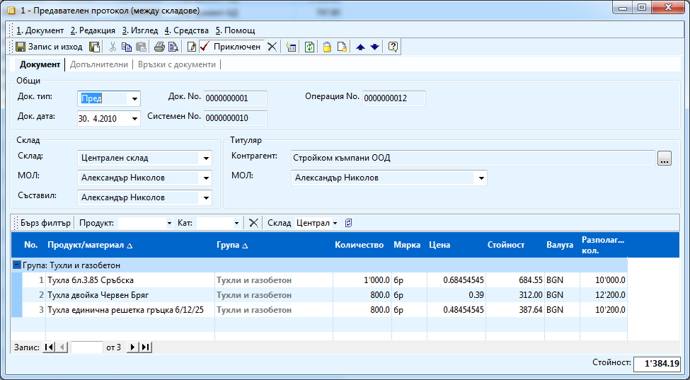
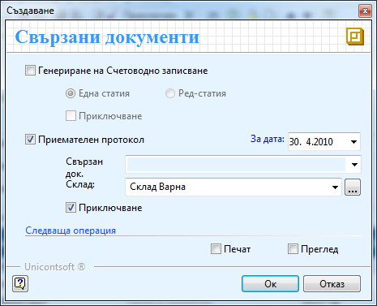

```{only} html
[Нагоре](000-index)
```

# Трансфер на материали между складове

Когато имате движение на материали, стоки и продукция от един обект в
друг, то трябва да бъде отразено и в системата, тъй като въпреки, че
не е продажба, оказва влияние на складовите наличности. За да направите
трансфер на материали от един склад в друг, трябва да създадете два
документа – предавателен и приемателен протокол. И двата документа
са вътрешно – фирмени. Процесът е следния:

1. Създавате нов складов документ от **Търговска система \>\> Складови документи \>\>** десен бутон – избирате **Нов документ**. 

1. В документа попълвате:

    - **Док. тип** – трябва да изберете *Пред;*

    - **Док. дата** – избирате деня на трансфера;

    - **Склад** – склада, от който ще изписвате продукти т.е. от кой склад ще вземете материалите

    - **Контрагент** – избирате фирмата ви (потребителят на продукта);

    В редовете да документа попълвате:

    - **Продукт/материал** - продуктите, които искате да трансферирате 

    - **Количество** – количества, които искате да преместите. Цената се взима автоматично – среднопретеглената цена за този склад.

    { class=align-center w=15cm }

1. Приключвате документа като в прозорец **Генериране** имате следните опции: 

    - **Генериране на Счетоводно записване** – ако имате отделни подсметки за всеки склад в сметкоплана си, можете маркирате тази опция, с която автоматично ще се генерира и счетоводната статия (трябва да е настроен предварително автоматичния счетоводител).

    - **Приемателен протокол –** трябва да поставите отметка пред това поле, за да се генерира автоматично и вторият документ, с който излезлите материали от първия склад, ще се заприходят във втория. Като дата трябва да посочите датата, на която продуктите ще пристигнат в приемащия склад. В поле **Склад** избирате склада, в който ще се трансферират материалите т.е. кой склад ще приеме материалите. 

1. Можете да прегледате или отпечатате документите като поставите отметки пред **Печат** и **Преглед**. Избирате приключване и натискате бутон **ОК**.

    { class=align-center }

1. По този начин генерирате едновременно двата документа – предавателен и приемателен протокол, които са свързани (виж **Връзки с документи**).

1. Можете да проверите наличността на складовете дали е правилна след операцията.

    ```{tip}
    В случая на картинката правим трансфер на тухли от Централен склад в склад Варна като не правим счетоводен запис на операцията. Предаването и получаването на стоката е в един и същи ден.
    ```
