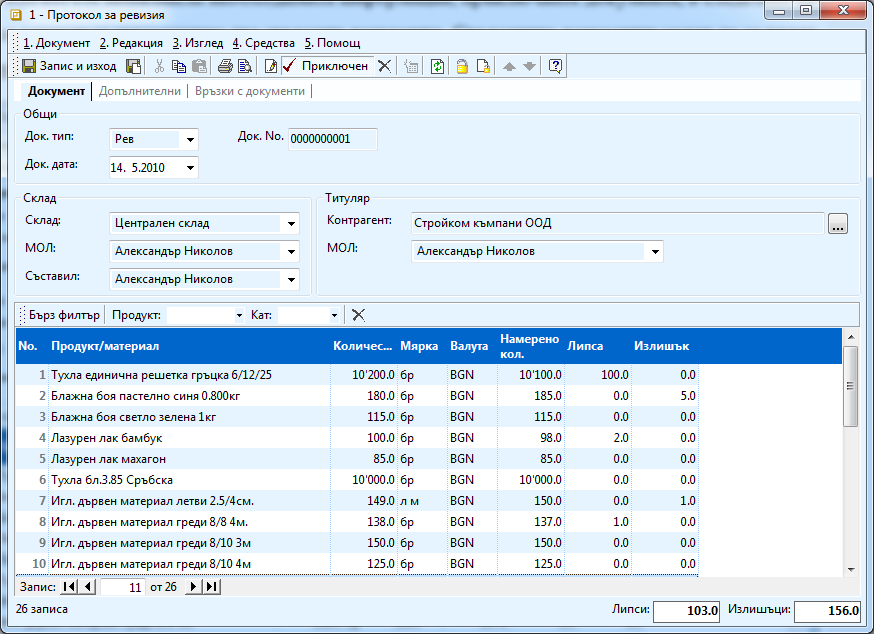
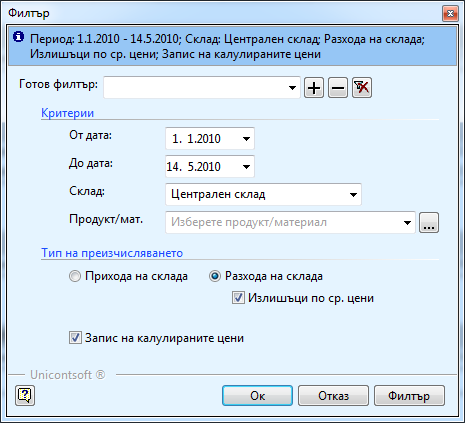

```{only} html
[Нагоре](000-index)
```

# Документи за ревизия

Документ за ревизия в системата се издава, когато след инвентаризация на
склада, се установят липси или загуби. В системата при приключване на
този документ автоматично се генерират още два свързани документа –
**Липси** и **Излишъци**. Тези два документа са складовите документи, с
които изкарвате/вкарвате материали в склада в зависимост от складовата
наличност, която сте установили след проверката. Чрез ревизията
коригирате количествата само в търговския склад. За да създадете
такъв документ трябва:

1. Отваряте от **Търговска система \>\> Документи за ревизия \>\>** с натискане на десен бутон на мишката и избирате **Нов документ**. В него попълвате:

    - **Док дата** – датата на инвентаризацията

    - **Склад** – склада, на който правите ревизия

    - **Контрагент** – избирате фирмата си (потребителят на системата);

    В редовете на документа попълвате:

    - **Количество** - натискате бутона с трите точки и избирате всички материали, в количеството на които сте открили несъответствие

    - **Намерено количество** - попълвате реално намереното количество в склада

    -  **Липса** и **Излишък** се изчисляват от системата, след като въведете стойности в предходната колона

    - **Валута** – BGN

1. Когато сте попълнили необходимата информация, приключвате документа, в следствие на което се генерират автоматично два свързани документа. Свързаните документи могат да се видят и отворят от **Връзки с документи.** 

    { align=center w=15cm }

    ```{tip}
    В примера сме открили със 100 бройки по - малко от единичните гръцки тухли, с два по – малко лака – бамбук и с една бройка по – малко Игл. дървен материал греди 8/8 4м. отколкото трябва да са според данните въведени в системата. Открити са и с 5 броя повече Блажна боя пастелно синя 0.800кг и с една бройка повече Игл. дървен материал летви 2.5/4см. от очакваното.
    ```

1. Ако имате открити излишъци в склада (при инвентаризацията сте намерили повече бройки отколкото са заведени в програмата) трябва да пуснете преизчисляване на склада – **Контролен панел \>\> Преизчисляване на склада.** Във филтъра избирате преизчисляване на разхода на склада като задължително трябва поставите отметка пред **Излишъци по ср. цени.** По този начин намерените материали взимат среднопретеглената цена за съответния склад.

    { align=center }
