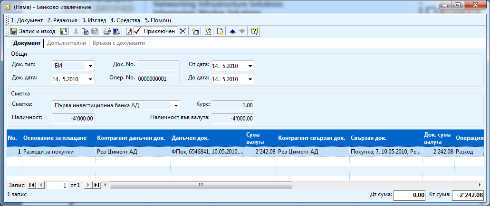

```{only} html
[Нагоре](000-index)
```

# Банково плащане

Банковите плащания в системата се отразяват чрез Банкови документи.
Можете да генерирате отделен банков документ за всяка банкова
операция, един документ за всички операции през деня или друг
начин, съобразен с начина ви на работа. Чрез банкови документи се
отразяват не само плащания, свързани с вземани и задължения по
фактури, но и при плащане на данъци, застраховки, заплати и
осигуровки, банкови трансфери. Ако искате наличността на банковата
сметка в системата да отговаря напълно на реалното банково състояние,
трябва да отразявате абсолютно всяка реална операция и в системата.
Не е необходимо при всеки документ да бъде свързан с друг документ.
Процесът на създаване на банков документ е следният:

1. Избирате от **Търговска система \>\> Банкови документи** с десен бутон върху списъка **\>\> Нов документ** и се отваря форма Банково извлечение. 

1. В него трябва да попълните:

    { class=align-center w=15cm }

    - **Док. No** - Дефинирате номер на банковото извлечение от полето**;** 

    - **Док. дата** - с датата на плащането;

    - **Банкова сметка** - от падащия прозорец избирате банкова сметка, по която има движение; 

    - **Контрагент данъчен док.** - избирате името на контрагента от бутона с трите точки в полето; 

    - **Данъчен док.** - след избор на **Фактурата за продажба** (счетоводния документ), системата ви навигира до Вътрешно-фирмения документ (Продажбата), който трябва да изберете. По този начин се покрива плащането както по вътрешно-фирмения (Продажбата/ Покупката), така и по счетоводния документ (Фактурата). 

    - **Основание за плащане** – трябва да посочите коректно основание за плащане. Основанията за плащане са предварително дефинирани в **Номенклатури \>\> Референтни номенклатури \>\> Търговска система \>\> Основания за плащане.** От избора на това основание зависи счетоводната операция, която ще се генерира при приключване на документа (ако правите счетоводен запис и автоматичният осчетоводител е коректно настроен).

1. Натискате бутон **Приключен** от лентата с инструменти. Системата ви дава възможност за генериране на счетоводно записване.

1. Коректен счетоводен запис ще се генерира, ако автоматичният счетоводител е предварително настроен.
