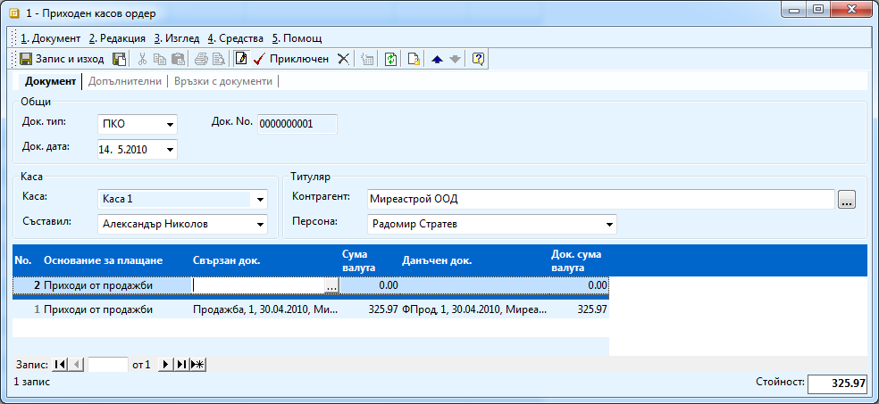
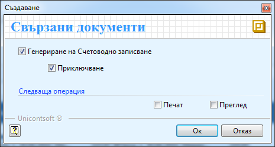

```{only} html
[Нагоре](000-index)
```

# Касово плащане

Касов документ в системата се създава, за да се отрази плащане по касов
път. За разлика от банковите документи, касовите могат да са свързани
само с един контрагент и само с един документ в търговската/
счетоводната система. Всички парични средства излезли или
постъпили в касата, трябва да бъдат отразени, за да има
съответствие на касовата наличност в системата и реалната.
Процесът на създаване на документ за касово плащане е следният:

1. Избирате от **Търговска система \>\> Касови документи \>\>** десен бутон върху списъка \>\> **Нов документ** и се отваря форма **Разходен касов ордер** за създаване на касов документ. 

    { align=center w=15cm }

1. Трябва да попълните:

    - **Док. дата** - датата, на която е извършено плащането;

    - **Каса** - от падащия прозорец трябва да изберете касата, от която е извършено плащането. Касите са предварително дефинирани в **Номенклатури \>\> Референтни номенклатури \>\> Търговска система \>\> Основания за плащане.** 

    - **Контрагент -** избирате името на контрагента от бутона с трите точки в полето. 

    - **Основание за плащане** – избирате основание от падащия списък. Основанията за плащане са предварително дефинирани в **Номенклатури \>\> Референтни номенклатури \>\> Търговска система \>\> Каси.** От избора на това основание зависи счетоводната операция, която ще се генерира при приключване на документа (ако правите счетоводен запис и автоматичният осчетоводител е коректно настроен).

    - **Данъчен док.** – след като от бутона с трите точки изберете **Фактурата за покупка/продажба** (счетоводния документ), системата ви навигира до Вътрешно-фирмения документ (Продажбата), който също избирате. По този начин се покрива плащането както по вътрешно-фирмения (Документ за покупка/продажба), така и по счетоводния документ (фактурата). 

1. Приключвате РКО като натискате бутон **Приключен** от лентата с инструменти.

1. При приключване на разходния касов ордер, системата ви дава възможност за генериране на счетоводно записване.

    { align=center }
