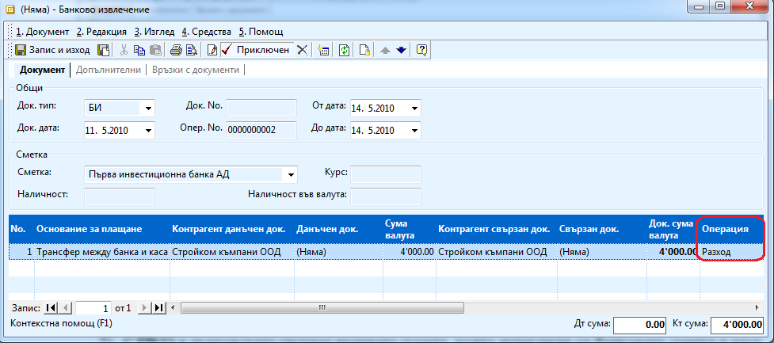
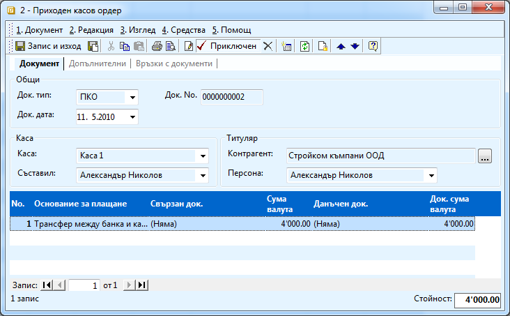

```{only} html
[Нагоре](000-index)
```

# Трансфер между банка и каса

Движението на фирмени парични средства между банка и каса също трябва да
се отразят в системата. Процесът е следният:

1. Издавате **БИ** (от **Търговската система \>\> Банкови документи**). С този документ в търговската система намалявате паричните средства в банковата сметка, а в счетоводството правим трансфер от банката към транзитна сметка. 

    В документа попълвате

    - **Сметка** - номера на банковото извлечение;

    - **Основание за плащане** – прехвърляне между банка и каса (или някакво друго, което сте създали предварително от **Референти номенклатури \>\> Търговска система \>\> Основания за плащане**;

    - **Контрагент данъчен док** – избирате фирмата си (потребителят на продукта);

    - **Сума валута** – сумата, която ще прехвърляте;

    - **Операция** - избирате *Разход*, ако прехвърляте пари от банковата сметка към касата за аналогично в обратния случай – *Приход*;

    Приключвате документа. Можете да направите счетоводно записване. За да
се генерират автоматично правилно операциите, трябва предварително да
сте настроили автоматичния осчетоводител.

    { align=center w=15cm }

    В случая правим трансфер на 4000 лв от банката към касата. В Сметка
посочвате съответната банкова сметка, от която теглим. Паричните
средства в банковата сметка намаляват, затова сме избрали операция –
Разход.

1. С **ПКО** в търговската система вкарвате сумата, която изтеглили от банковата сметка в каса. 

    { align=center w=15cm }

    Попълвате:

    - **Док. Тип** – ПКО

    - **Каса** – касата, в която искате да прехвърлите парите;

    - **Контрагент** – избирате фирмата си (потребителят на продукта);

    - **Основание за плащане** – прехвърляне между банка и каса (или друго основание, което предварително сте въвели);

    ```{tip}
    В документ тип избираме ПКО, защото парите излезли от банковата сметка трябва да постъпят в касата. На Каса сме избрали Каса 1, което означава че наличността на тази  каса ще нарасне с 4000 лв.
    ```