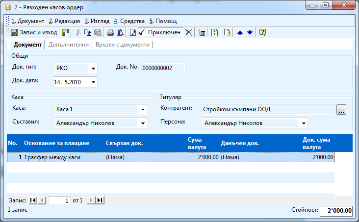
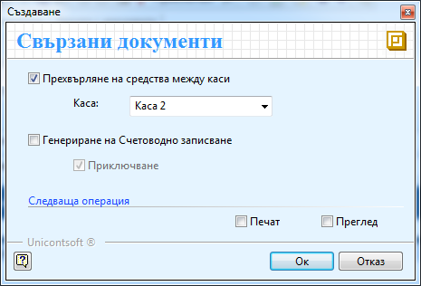
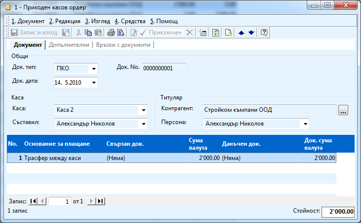

```{only} html
[Нагоре](000-index)
```

# Трансфер между каси

Всички движенията на парични средства от една каса в друга трябва да
бъдат отразени в системата. За целта се използват касови документи.
Процесът е следният:

1. От **Търговска система \>\> Касови документи** създавате нов документ. 

1. В него трябва да се попълни:

    - **Док. тип** – РКО;

    - **Каса -** попълвате касата, от която ще прехвърляте парични средства;

    - **Контрагент** – избирате фирмата потребител на продукта;

    - **Основание за плащане** – избирате съответното основание от падащия списък. Предварително трябва да създадете основание за плащане – *трансфер между каси* и да настроите автоматичния осчетоводител да работи с това основание.

    - **Сума валута** - попълвате сумата, която ще прехвърляте;

    { align=center w=15cm }

1. След като попълните задължителните полета приключваме документа. Появява се следната форма:

    { align=center }

1. Трябва да изберете опция **Прехвърляне на средства между каси**. В **Каса** трябва да изберете от падащия списък касата, към която ще правите трансфера (в която ще влязат парите).
    ```{tip}
    В примера прехвърляме 2000 лв от Каса 1 в Каса 2.
    ```
1. Ако имате отделни подсметки в сметкоплана си за отделните каси, можете да генерирате счетоводно записване. За да се получи правилен счетоводен запис, трябва предварително да настроите автоматичния осчетоводител. 

1. Натискате **ОК** и автоматично се генерира още един документ – ПКО за касата, към която сте направили трансфера, който е вече приключен.

    { align=center w=15cm }
