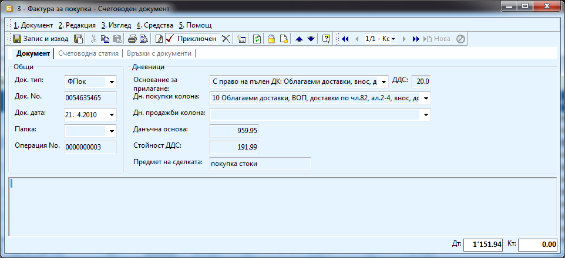
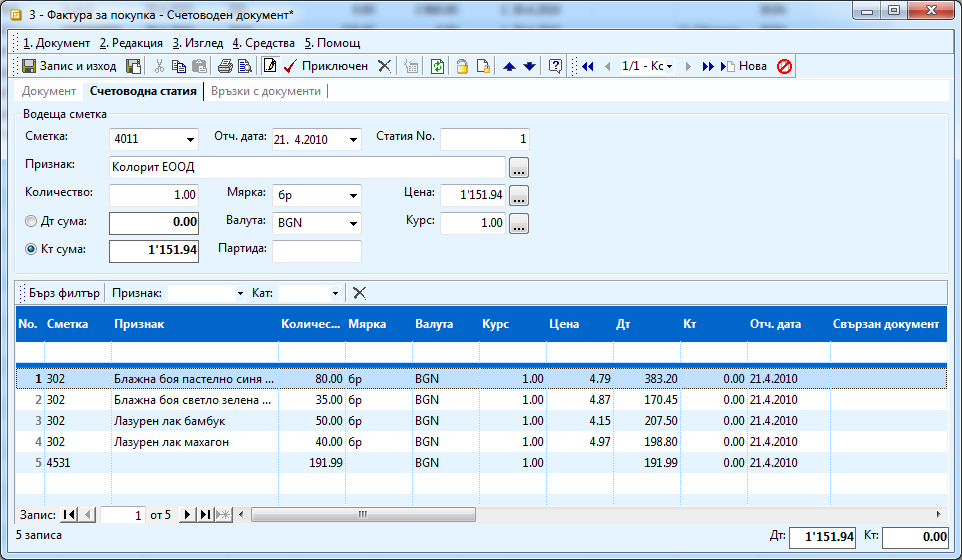

```{only} html
[Нагоре](000-index)
```

# Създаване на счетоводен документ 

Тъй като системата се състои условно от два главни модула – Търговска и
Счетоводна система, можете да създавате документи не само от
Търговската система и да им правите счетоводни записи, но и
да създавате счетоводни документи директно без те да имат връзка с
вътрешно-фирмени документи. В счетоводната система можете да
създавате и осчетоводявате документи от всякакъв тип като ръчно
(без помощта на автоматичния осчетоводител) избирате счетоводните
сметки.

Счетоводният документ в системата се състои от три секции – Документ,
Счетоводна статия и Връзки с документи. В първата секция се въвеждат
основните реквизити на документа – тип, дата, номер, информация за
дневниците по ЗДДС и други. Втората представлява самата счетоводна
статия, в която се въвеждат счетоводните операции – посочват се
сметките, признаците, количествата, цени, дебит и кредит. С
терминът „Водеща сметка” в системата се обозначава сметката, която
се въвежда в горната част на секцията, а в редовете на статията се
въвеждат нейните една или повече кореспонденции. Водещата сметка
може да е както по кредита, така и по дебита. Тъй като понякога се
налага въвеждането на няколко счетоводни статии в един документ, в
системата е предвидена опция във всеки документ да могат да се
създават множество статии. Това може да направите като от лентата
с инструменти в документа натиснете бутон „Нова” толкова пъти колкото
статии искате да създадете. В третата секция на документи можете да
видите връзките с други счетоводни документи – с документа за плащане
например.
```{tip}
В следващия пример ще създадем счетоводна фактура за покупка на
материали от фирма Колорит ЕООД. Общата стойност на фактурата е
1151,94, 959,59 – данъчна основа и 191,99 – ДДС. Счетоводните записи,
които трябва да се генерират са 302/4011 и 4531/4011.
```
{ align=center w=15cm }

{ align=center w=15cm }

- Можете да създадете нов счетоводен документ като от **Счетоводство \>\>
Счетоводни документи \>\>** с натискане на десен бутон на мишката и
изберете **Нов документ**. Трябва да попълните следната информация:

    В секция **Документ**:

    - **Док тип -** избирате типа на документа – обикновено ФПок (фактура за покупка), ФПрод (фактура за продажба) или МО (мемориален ордер). Типовете документи са предварително дефинирани в **Номенклатури \>\> Типове документи**.

    - **Док номер –** попълвате номера на документа

    - **Док дата –** датата на документа

    - **Основание за прилагане –** избира се съответното основание – дали ще се начислява ДДС и какъв процент

    -  **Дн. покупки колона/ дн. продажби колона –** ако документът, който вкарвате е фактура, избирате съответния дневник. В противен случай ги оставяте празни

    - **Данъчна основа –** попълва се данъчната основа по документа, която трябва да влезе в дневниците

    - **Стойност ДДС –** попълва се ДДС-то от документа, което трябва да влезе в дневниците

    В секция **Счетоводна статия**:

    В заглавната част:

    - **Сметка** – попълвате водещата сметка

    - **Отч. дата –** попълва се отчетната дата на документа

    -  **Признак –** избира се в зависимост от сметката (ако е 401 или 411 – контрагента, ако е 701 – продукцията).

    - **Количество** - 1

    - **Мярка** – съответната мярка (обикновено – брой) 

    - **Цена** – сумата от цялата статия (т.е сбора на количество\*цена от всички редове)

    В редовете на статията се избират материалите и стоките със съответните
им сметки, количества и цени.

    За улеснение на работата ви можете да ползвате готовата функционалност
на системата за автоматично начисляване на ДДС на статията от меню
**Средства** в лентата с инструменти в документа, трябва да изберете
**Начисляване на ДДС**.

    Ако генерирате няколко идентични статии в един документ, можете да ги
копирате като от меню **Средства** изберете **Копиране на статия.**

    Полетата **Дебит/Кредит** най – долу във формата включват дебита и
кредита сумирани от всички статии в документа.
