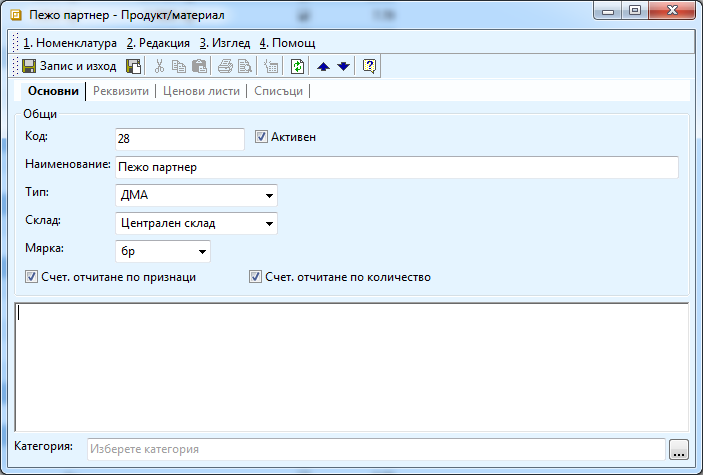
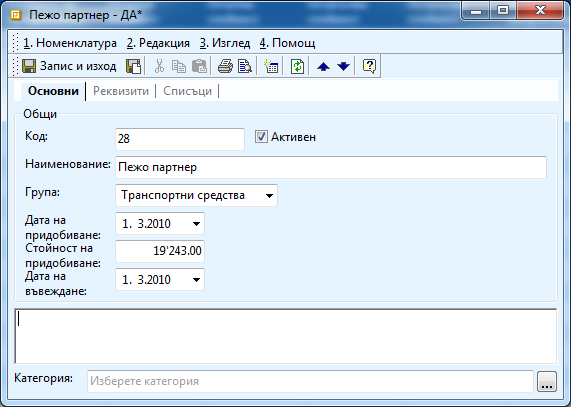
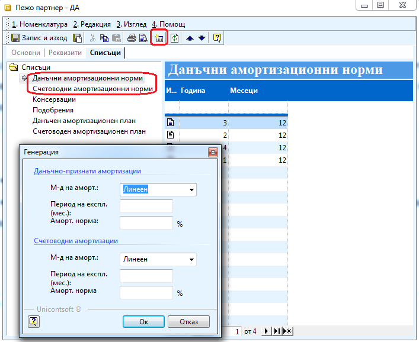
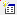

```{only} html
[Нагоре](000-index)
```

# Създаване на ДМА

Системата поддържа функционалност, която подпомага ефективното
управление на дълготрайните активи на фирмата. В системата
можете да заведете всички дълготрайни активи, да осчетоводявате
автоматично амортизациите им и да генерирате данъчен и счетоводен
амортизационен план.

Преди да започнете работа с въвеждането им, трябва да въведете групите
ДА, с които ще работите от **Номенклатури \>\> Референтни номенклатури
\>\> Дълготрайни активи \>\> Групи ДА**. Добра практика е да ги
настроите според сметките в сметкоплана ви. По същия начин
трябва да настроите и типовете продукти в **Номенклатури \>\>
Референтни номенклатури \>\> Търговска система \>\> Типове
продукти** и да настроите автоматичния осчетоводител да работи
коректно с тях.

Процедурата на заприхождаване на дълготраен актив е следната:

1. Създавате нов документ за закупуване на дълготраен актив (документ за покупка).

1. Попълвате заглавната част на документа с данните от фактурата, която са ви издали.

1. В редовете на документа в колона **Продукт/материал** избирате бутона с трите точки и след натискане десен бутон, избирате **нов продукт**. Попълвате името, съответния тип и го записвате.

Ще разгледаме пример, в който сме закупили автомобил Пежо партнер, което
трябва да заведем като дълготраен актив. Искаме да започнем да го
амортизираме от 1.3.2010. Закупили сме го на стойност 19 243 и ще
се амортизира 3 години по линейния метод.

{ align=center }

1. Маркирате новосъздадения материал, натискате десен бутон и избирате **Редакция на ДА**.

1. Отваря се нова форма на дълготрайния актив, в която трябва да попълните следните полета:

    В секция **Общи**:

    { align=center }

    - **Код** и **Име** – попълват се автоматично като се копират от тези на материала. Ако искате можете ръчно да ги коригирате.

    - **Група** - избирате от падащия списък съответната категория, която предварително сте въвели

    - **Дата на въвеждане и Датата на придобиване** – попълват се с датата на въвеждане на актива (Датата на фактурата)

    - **Стойност на придобиване** – попълва се стойността на ДА (Амортизируема стойност)

    Секция **Реквизити**

    { align=center }

    Реквизитите в група **Основни** се отнасят за отписването на актива и не
са задължителни.

    - **Дата на извеждане** – попълва се само в случай, че след време продадете актива или той се амортизира напълно

    - **Макс. процент** – попълва се, ако искате да окажете минималния амортизационен праг, под който амортизацията на актива спира и го извеждате от употреба

    - **Активът остава с балансова стойност** - поставя се отметка, ако в секция **Допълнителни** сте посочили балансова стойност на актива. След като се достигне, амортизацията спира и активът се извежда от употреба.

    - **Амортизира актива при оставащ процент** – поставя се отметка, ако сте попълнили **Макс. процент** и искате да работите с този процент

    **История на актива се попълва**, ако въвеждате активи, които са
закупени преди време и амортизацията им трябва да се продължи.
Например активите, които прехвърляте от предишни програми.

    - **Натупана амортизация (дап/сап)** - въвеждате признатата амортизация към дадена година (1.1.2008 например).

    - **Крайна дата на предишна амортизация** - въвеждате последния ден, до който е протичала амортизацията 

    В **Данъчно признати амортизации** попълвате:

    - **Отчетната стойност –** стойността, по която даден дълготраен материален актив се записва в счетоводните сметки и/или в инвентарната книга на предприятието при неговото придобиване или преоценяване. Тя може да бъде цена на придобиване, себестойност, справедлива цена или преоценена стойност. **Задължително се попълва.**

    - **Остатъчна стойност –** нетната сума, която предприятието очаква да получи от един дълготраен материален актив в края на неговия полезен живот, намалена с предполагаемите разходи за ликвидацията.

    - **Начало начисление –** първия ден от месеца, следващ месеца на въвеждане на актива. **Задължително се попълва.**

    Аналогично в **Счетоводно признати амортизации** се попълват съответните
полета.

    Секция **Списъци**

    { align=center w=15cm }

    Задължително трябва да се попълни **Данъчни амортизационни норми** и
**Счетоводни амортизационни норми**, за да се дефинира срока на
амортизация и амортизационната норма на съответния актив.

    За да попълните тази секция, натиснете бутон
. Появява се форма **Генерация**. В нея
се попълва:

    - **М-д на аморт** – избита се метода, по който се амортизират активите;

    - **Период на експл**. – попълвате предполагаемият срок (в месеци) за практическо използване на актива

    - **Аморт норма** – съотношение между амортизационната сума, приета за сто, и полезния срок за ползване на актива в брой години.

    \*попълва се или периода или нормата\!

    Секции **Консервации и Подобрения**

    Попълват се, ако сте правили някакви подобрения на актива или ако
временно сте спрели да го използвате поради определени причини.

    Секции **Данъчен амортизационен план** и **Счетоводен амортизационен
план**

    Попълват се автоматично, след като се попълни амортизационния период и
норма.
