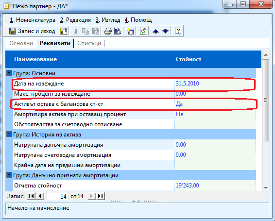

```{only} html
[Нагоре](000-index)
```

# Продажба на ДМА

В случай че продадете дълготраен актив трябва да извършите следните
действия:

1. Правите продажба, с която продавате актива

1. От **Номенклатури \>\> Дълготрайни активи** избирате актива и го отваряте, за да го редактирате. В секция **Реквизити** попълвате:

    - **Дата на извеждане** – първия ден от месеца, следващ месеца на продажбата

    - **Активът остава с балансова ст-ст** – избираме *Да*

    - **Обстоятелства за счетоводно отписване** – можете да попълните причините, поради които е изписан актива.


Налага се да продадем автомобила, който сме закупили три месеца по -
късно. Отписваме го на 31.5.2010 като актива остава с балансова
стойност.

{ class=align-center }
