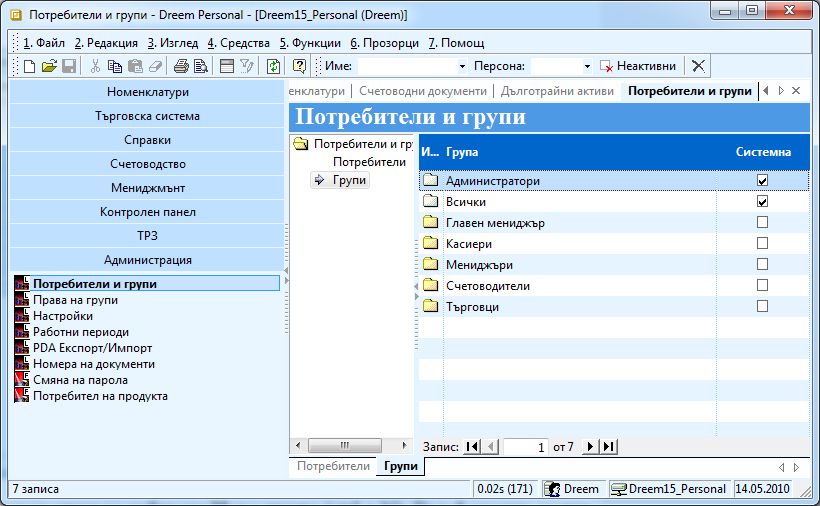
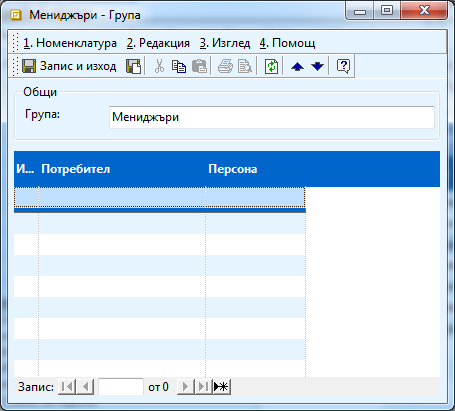
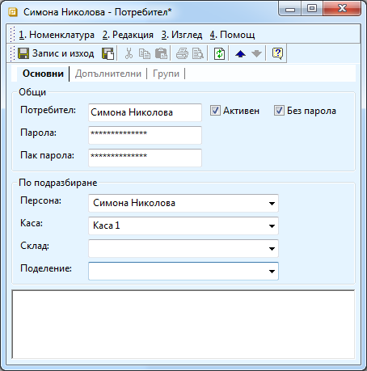
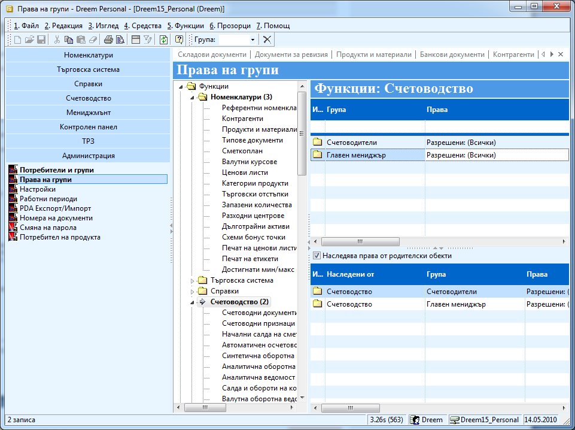

```{only} html
[Нагоре](000-index)
```

# Права

Правата в Dreem се задават от меню **Администрация \>\> Права на
групи**. Правата се задават по групи, които дефинираме
предварително.

1. За да станат активни ограниченията трябва първо от **Администрация \>\> Настройки \>\> Ниво за сигурност** да се вдигне нивото на сигурност. Най добре да се избере - *3 – Функции и данни*.

1. Трябва да дефинирате потребителските групи от **Администрация \>\> Потребителски групи \>\> Групи.** 

{ class=align-center w=15cm }

С натискане на десен бутон от списъка избирате **Нова група** (ctrl +
N). Във формата, която се появява в поле **Група** пишете наименованието
на групата. Ако имате вече създадени потребители, които искате да
присъедините към тази група, можете да ги изберете чрез бутона с
трите точки или директно да изпишете името в поле **Потребител**.
Натискате бутон **Запис и изход**, за да запазите модификациите.

{ class=align-center }

1. Създавате нови потребители от **Администрация \>\> Потребителски групи \>\> Потребители.** С натискане на десен бутон от списъка избирате **Нов потребител** (ctrl + N). 

{ class=align-center }

Във формата, която се появява попълвате:

 - **Потребител –** името на потребителя

 - **Активен –** поставяте отметка, ако искате потребителят да достъпва системата

 - **Без парола –** поставяте отметка, ако искате потребителят да достъпва системата без парола

 - **Парола и Пак парола –** попълвате паролата на потребителя. При първото му влизане системата ще има възможност да я смени. Това поле е активно, в случай че не сте сложили отметка пред поле **Без парола**.

В секция По подразбиране можете да въведете някои данни, които ще се
попълват по подразбиране в документите, с които работи потребителят.
Служат за улеснение на работата.

 - **Персона –** в документи за продажба и покупка в поле Персона ще се появява името, което сте избрали в това поле.

 - **Каса –** по подразбиране при касови плащания на съответния потребител ще му се появява избраната каса.

 - **Склад –** във всички документи свързани със склад системата ще предлага материалите да се изписват от посочения склад.

 - В секция **Групи** трябва да посочите към кои групи искате да присъедините потребителя, тъй като правата в системата се задават на групата, а не на даден потребител.

Натискате бутон **Запис и изход**, за да запазите модификациите.

1. Права на групите се задават от меню **Администрация \>\> Права на групи.**

{ class=align-center w=15cm }

Правата се делят на два вида: могат да се зададат права на достъп и
работа на ниво **функции** и на ниво **данни**.

 - Освен групите, към която сте посочили, че принадлежат потребителите, всички принадлежат по подразбиране към група *Всички*.

 - Към **Функциите** са включени всички модули. Можете да разрешите на всички достъп до всички данни, ако изберете **Функции** (най – високото ниво) и във формата **Функции** в **Група** изберете *Всички*, а в **права** изберете да имат достъп до всичко. Ако не дефинирате никакви права на това ниво и в настройките сте задали ниво на сигурност – 3, по подразбиране никой няма да има достъп до системата. 

 - Ако не зададете право на достъп на предното ниво, можете да дадете право на **достъп на ниво модул**. Например можете да изберете модул **Номенклатури** и в формата, която се появява в дясно да посочите на коя група какво разрешавате или забранявате.

 - **Третото ниво** на достъп е до определена форма или функция. Можете да разгърнете дървото на Номенклатури например. Можете да изберете например Контрагент и да определите права за достъп само свързани с контрагентите. 

 - На всяко едно от тези нива можете да забраните и видимостта на някои модул или функция като от права изберете **Достъп до функционалност** – *забранен*.

 - Последният начин на достъп е на **ниво Данни**. На това ниво се дават права свързани с работата с данни – създаване, модифициране, изтриване и т.н както и определяне на критерии, според които даден потребител може да достъпва точно определен набор от данни. Например можете да изберете **Контрагент** и на определен потребител да дадете достъп само до тези контрагенти, които са в категория **Клиенти**. Аналогично на **Функциите**, ако по подразбиране никои няма достъп до никакви данни и трябва да започнете да раздаваме права – или на най – горното ниво – **Данни** – всички да имат достъп до всички данни и после да забранявате някои или на най – горното ниво да не задавате нищо и да давате права за всеки отделен тип данни от дървото.
