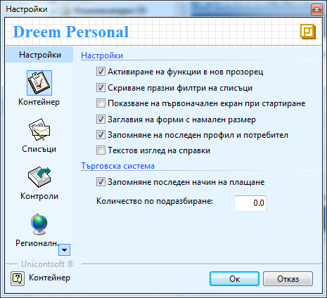
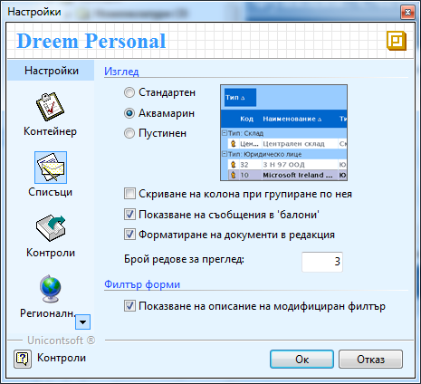
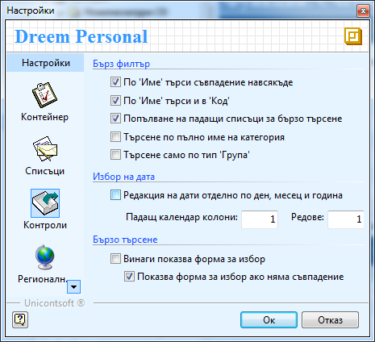

```{only} html
[Нагоре](000-index)
```

# Настройки

Общите настройки в Дрийм може да промените от лентата с инструменти
**Средства \>\> Настройки** или чрез клавишна комбинация Alt + P.

В секция **Контейнер** можете да поставите отметка, за да активирате:

{ align=center }

 - **Активиране на функции в нов прозорец** – ако искате, когато отваряте някоя от функциите на Дрийм, например *Документи за покупка, Продукти, Картон на контрагент* и т.н, да не се отваря в текущия прозорец и да не можете да видите двата заедно, а в нов. Ако не е поставена отметка, например ако сте отворили *Документи за покупка* и после отворите *Складови документи*, няма да можете да ги виждате едновременно. Препоръчително е да поставите отметка в това поле.

 - **Показване на първоначален екран при стартиране** – махнете тази отметка, ако не искате да виждате при стартиране на програмата началния екран.

 -  **Запомняне на последен профил и потребител** – изберете тази опция, ако искате при следващото влизане в системата, тя да предлага последно влезлия потребител във форма **Установяване на самоличност**.

 - **Текстов изглед на справки** – ако се постави отметка в това поле във всички справки ще се появи още един тип на справката – Текстов изглед. По подразбиране са два - *Графичен изглед* и *Списък с данни*.

 - **Запомняне на последен начин на плащане** – избирате тази опция, ако искате системата да запомни последния начин на плащане, който сте избрали *по банков път* или *в брой*. По този начин следващия път, когато създадете документ, в полето Начин на плащане, ще се появи автоматично това, което сме избрали предния път.

В секция **Списъци** можете да поставите отметка, за да активирате:

{ align=center }

 - **Изглед –** има три типа на изглед: стандартен, аквамарин и пустинен. Изберете едно от тях и ще се промени изгледа в цялата програма. В прозорчето отстрани можете да видите предварително как ще изглежда програмата.

 - **Скриване на колона при групиране по нея –** сложете отметка тук, ако искате когато групирате някакъв изглед по дадена колона, тя автоматично да се скрива и изгледа не се претрупва излишно.

В секция **Списъци** можете да поставите отметка, за да активирате:

{ align=center }

 - **По Име търси съвпадение навсякъде –** ако няма отметка в поле **Име** в различните форми, когато търсите продукт, склад и т.н и напишете първите няколко букви, системата търси съвпадение само на думи, започващи с тази буква, сричка или дума. Ако има отметка, търси навсякъде в думата. 

Например ако няма отметка и напишем „ви”, ще се покажат винт, винетка и
други, започващи със тази сричка. Ако има отметка обаче ще се появят и
клавиатура, консумативи.

 - **По Име търси в Код** – ако има отметка тук, когато попълвате даден документ за покупка например, в поле **Продукт** можем да въведем името или кода на продукта и системата автоматично ще го подмени с името му т.е. ако ви е по – лесно да работите с кодовете, а не с продуктите, поставяте отметка тук.

 - **Търсене по пълно име на категория –** ако сте сложили отметка тук и в поле категория напишете ръчно само първите няколко букви от името на категорията, няма да се покаже нищо. Препоръчително е да няма отметка тук.

 - **Винаги показва форма за избор –** ако сте поставили отметка тук, в полетата, където имаме да попълваме име на продукт, склад, контрагент и т.н, дори и да напишете правилно ръчно цялото име, пак ще ни се появи формата за избор.

 - **Показва форма за избор ако няма съвпадение –** става активно, ако не сте поставили отметка в предходната опция. Ако напишете ръчно име и има съвпадение на съществуващо такова в базата, не се показва форма за избор. Показва се само, ако нямате съвпадение.

В секция **Регионални настройки**, в поле **Кратка дата** можете да
промените начина, по който се визуализира датата.
