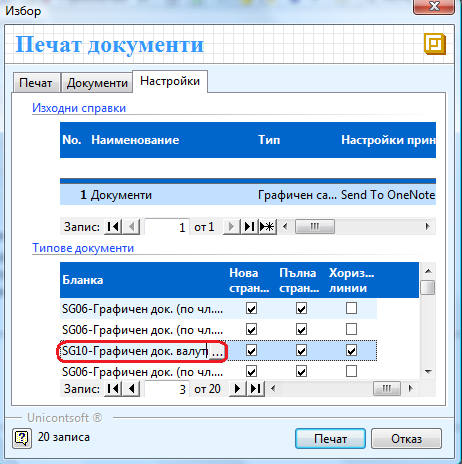

```{only} html
[Нагоре](000-index)
```

# Настройки при печат на фактури

След като приключите дадена фактура и искате да я разпечатате, натискате
бутона за печат. Появява се следния прозорец, който ви предоставя
следните опции:

{ align=center }

В **Изходни справки** можете да се избере **тип** на справката –
графичен или текстови и **настройки принтер** – тук посочвате на
кой принтер ще извършите печата.

В **Типове документи** избираме типа на **Бланката.** Ако искате да
отпечатате фактура на английски, избирате тип на бланката – SG10 –
Графичен док. валута фактура.
