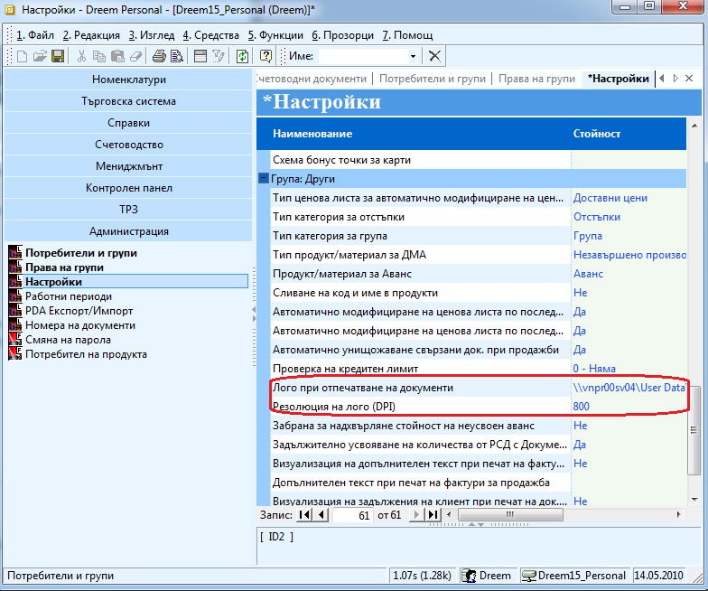

```{only} html
[Нагоре](000-index)
```

# Фирмено лого

Лого за фирмата за фактура се поставя от меню **Администрация \>\>
Настройки** и от група други на **Лого при отпечатване на
документ** зададете стойност логото на фирмата. Чрез бутон
можете да изберете изображението или ръчно да напишете пътя.
Размерът на логото можете да променяте като промените стойността
на поле **Резолюция на лого** (DPI).

{ align=center w=15cm }

При печат на фактура, се появява и логото.
