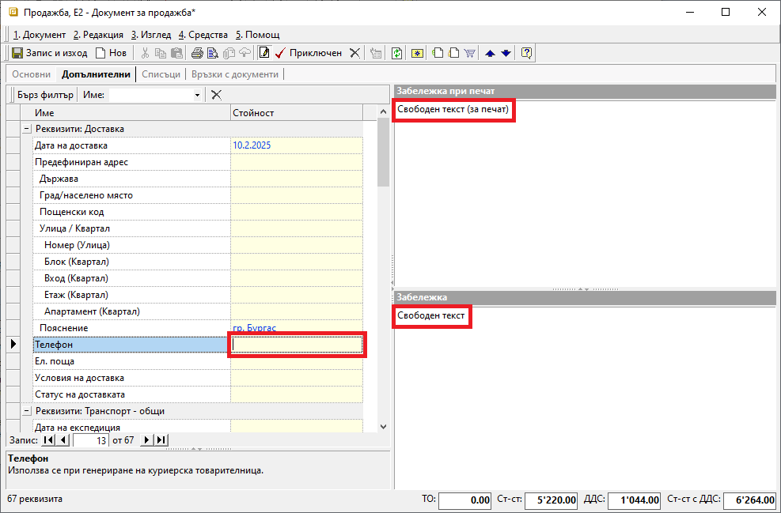
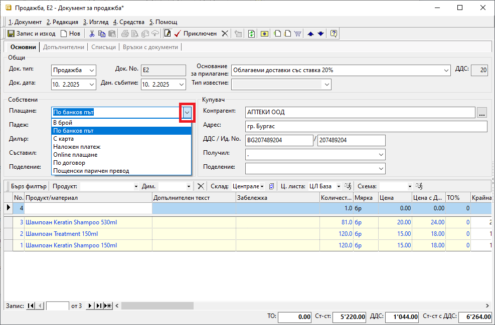
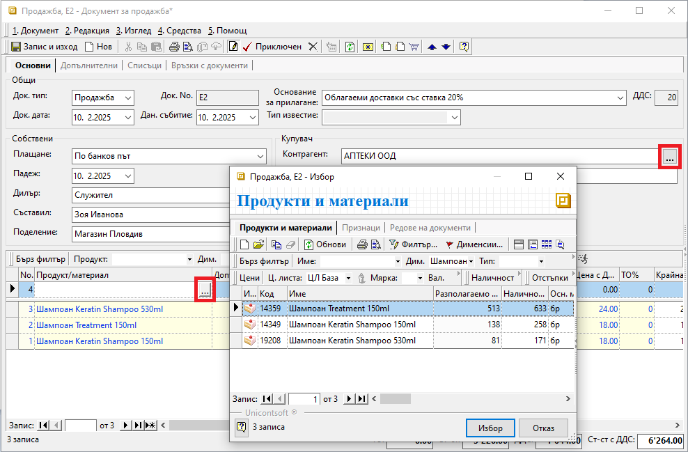
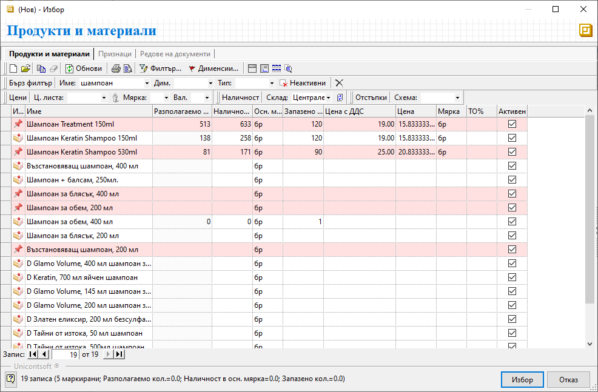

```{only} html
[Нагоре](../000-index)
```

# Работа със списъци

Въвеждането на данни в системата става на два етапа - дефиниране на настройки и последващо попълване на данни в документи чрез формите за редакция.  
Създаването на номенклатури е представено в раздел [Настройки](https://docs.unicontsoft.com/manual/001-ref/000-index.html). След въвеждането им те могат да бъдат използвани при попълване на документите в системата.  

Въвеждането на данни в системата става по няколко начина:  
- чрез въвеждането на свободен текст;  
- чрез избор от падащ списък;  
- чрез избор от форма със списък номенклатури или списък с документи;  

1) Въвеждане на свободен текст  

Този начин за попълване на данни се използва при създаване на номенклатури, но също и при създаване на документи.  
Във форма за редакция на документ се среща например при полета от колони *Количество*, *Забележка*, *Допълнителен текст* в списък продукти, в *Забележка при печат / Забележка*, в избрани полета от раздел **Допълнителни** и др.  

Характерното при полета за въвеждане на свободен текст е, че липсва бутон за отваряне на списък.  

{ class=align-center }

2) Избор от падащ списък  

Тези списъци са набор от предварително настроени варианти, представени под формата на падащи менюта.  
Такива падащи списъци се различават чрез бутона със стрелка и могат да бъдат срещнати при полета за избор на дата, начин на плащане, мерна единица и подобни.  

{ class=align-center }


3) Избор от форма със списък  

При такъв тип въвеждане на данни се отваря списък с номенклатури (напр. *Продукти и материали*, *Контрагенти*) или списък с документи (напр. *Покупки*, *Продажби* и др.). 
Тези списъци са достъпни чрез бутона с три точки, стоящ в края на полето за въвеждане на данни.  

{ class=align-center }

Ако желаните данни липсват в списъка, тяхното добавяне може да стане и текущо чрез отваряне на форма **Нов**.   

Записите от списъци с номенклатури и документи могат да бъдат маркирани чрез стандартни клавишни комбинации - например Ctrl+A - (всички), Ctrl и ляв бутон на мишката (избрани редове), със задържан ляв бутон и маркиране на поредни редове и др. При маркирани по този начин записи маркировката се разваля, когато се приложи друго действие по списъка.   

В системата има вграден инструмент за перманентно маркиране на редове, което се премахва след изрично размаркиране. По този начин в списъка могат да се извършват и други действия, без да се наруши маркировката.  

Това се постига като с ляв бутон на мишката се застане върху реда и чрез бутони *Insert* или шпация (клавиш за интервал) се постави пин. Маркираните редове са оцветени в розово. Размаркирането става чрез повторно позициониране върху реда и бутон *Insert* или клавиш за интервал.   

{ class=align-center }


___  
Свързани статии:  

[Работа със списъци](https://docs.unicontsoft.com/blog/20241112-lists-configuration.html)  
[Описание и функционалности на контейнера](https://www.unicontsoft.com/cms/node/253)  
[Работа с колони на списъци](https://www.unicontsoft.com/cms/node/254)  

