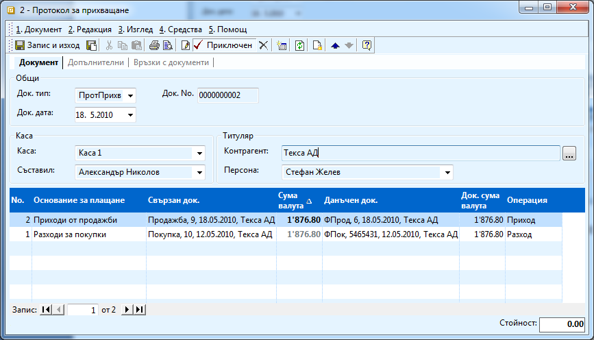

```{only} html
[Нагоре](000-index)
```

# Прихващания

Често в практиката се оказва, че някой контрагенти са ви едновременно
доставчици и клиенти. След което се появяват случаи, в които трябва
да прихванете плащания – имате задължения ви вземания от клиента
едновременно. В такива случаи се издава протокол за прихващане и
се доплаща остатъкът.

В системата е разработен специален вид документ **ПротПрихв** (Протокол
за прихващания). В него трябва да изберете двата документа – Покупката
и Продажбата, за да прихванете дължимите суми по тях.

Процесът е следния:

1. Създавате документ за покупка, попълвате го и го приключвате по стандартния начин.

1. Създавате документ за продажба към същия контрагент, попълвате и приключвате и него.

По този начин в системата се завеждат вземанията и задълженията към
контрагента. За да ги приспаднете трябва да създадете документ за
прихващане.

1. От **Търговска система \>\> Касови документи \>\>** с натискане на десен бутон на мишката върху списъка с документи, изберете **Нов документ**. 

В него трябва да попълните:

 - **Док. тип** – задължително трябва да изберете *ПротПрихв;*

 - **Док. дата** – датата на прихващането;

 - **Контрагент** – контрагента, на който ще издавате протокола;

 - **Свързан док** - изберете покупката и продажбата и данъчните им документи (чрез натискане на бутона с трите точки и навигиране с бутон **Напред**);

 - **Основание за плащане** – на покупката изберете *Разходи за покупки*, а на продажбата – *Приходи от продажби;*

**Операция** – на покупката трябва да се е попълнило *Разход*, а на
продажбата – *Приход;*

В примера сме закупили материали на стойност 1 876,80лв от Текса АД и
сме продали на същата фирма стоки на стойност 2 116,03лв. Искаме да
прихванем двата документа, така че да остане да се изплаща само
разликата в стойностите им.

{ class=align-center w=15cm }

 - **Сума валута** – и на двата реда сумата трябва да е еднаква т.е. трябва да вземете по – малката от двете суми и да я въведете и в реда с по – голямата. Сумата на документа накрая винаги трябва да е равна на нула.

В примера тъй като сумата по документа за покупка е по – малката,
коригираме и дали на продажбата със същата стойност.

{ class=align-center w=15cm }

1. Можете да приключите документа. От формата за генериране на свързани документи можете да изберете да генерирате счетоводен запис. Счетоводната операция ще се попълни автоматично, само ако сте настроили правилно предварително за това автоматичния осчетоводител.

1. Проверете двата документа. Ако са били на различна стойност единият трябва да е напълно платен, а вторият частично.
