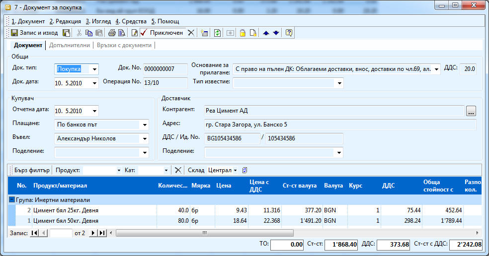
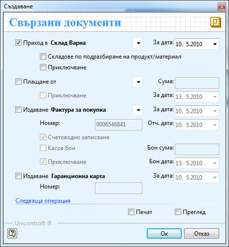
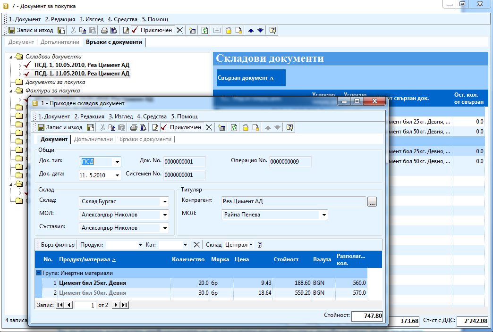

```{only} html
[Нагоре](000-index)
```

# Създаване на фактура с няколко разходни документа

В случай че имате фактура за покупка или продажба, в която някои от
продуктите са за един склад, а други за друг, трябва да издадете
няколко разходни документи – по един за всеки склад, в който ще
влизат материалите. Това можете да осъществите като:

1. Създадете документ за покупка/ продажба и го попълните.

    { class=align-center w=15cm }

1. Приключите документа като поставяте отметка в поле **Генериране на Складови документи**. Попълвате датата, избирате склада и не маркирате поле **Приключване**.

    { class=align-center }

1. Отваряте складовия документ и изтривате от него всички материали, които не трябва да влизат в този склад. Приключвате документа.

1. Повтаряте точки 2 и 3 докато издадете документ за всеки склад, в който трябва да влязат материалите. Във всеки следващ разходен документ влизат само тези продукти, които не са заприходени в склад т.е. последния складов документ можете да не го пускате в редакция, а направо да го приключите.

```{tip}
В случая на картинката сме закупили 40 бр - Цимент бял 25кг. Девня и 80
бр. - Цимент бял 50 кг. Девня и получаваме фактура за тях. Искаме да
заприходим обаче 20 бр от Цимент бял 25кг. Девня и 50 бр от Цимент
бял 50 кг. Девня в склад Варна, а останалите в склад Бургас. От
формата за създаване на свързани документи избираме да генерираме
складов документ като не поставяме отметка да се приключи. Отваряме
документа, който е в редакция и променяме количеството съответно на
20 и 50 бройки и го приключваме. От същата форма за създаване на
документи генерираме втори разходен документ, но този път
избираме складът да е Бургас. Този път поставяме отметка да се
приключи документа. Във втория складов документ влизат останалите
незаприходени съответно 20 и 30 бройки цимент.
```

{ class=align-center w=15cm }