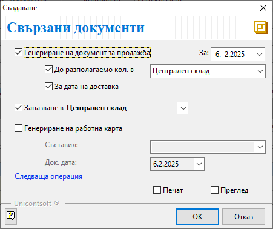

```{only} html
[Нагоре](000-index)
```

# Документи за заявка към доставчик/от клиент

От меню **Търговска система || Документи за заявка** в системата се регистрират поръчките към доставчик - чрез **Заявки към доставчик**, и тези от клиент - чрез **Заявки от клиент**.  

Тези документи осигуряват контрол на логистиката и етапите на изпълнение на поръчките.  
Системата дават възможност за автоматично създаване на необходимите свързани документи - покупки, продажби и др.  

1) От списъка с **Документи за заявка** чрез десен бутон на мишката се избира **Нов документ**. Отваря се форма за въвеждане и редакция на нов документ.  

2)  В раздел **Основни** се въвеждат: 

- **Док. Тип** – поле с опционално меню за избор на тип документ;  
Избира се **ЗК**-*Заявка от клиент*, когато се регистрира поръчка от клиент.  
Тип **ЗД**-*Заявка към доставчик* се избира, когато се въвежда направена заявка от **Потребител на продукта** към доставчик.  

- **Док. No** - полето се попълва с номер на документа;  
Системата автоматично попълва пореден номер за текущия тип заявка при приключване на документа.    

- **Док. дата** - в полето се избира дата, за която се отнася текущата заявка;  

- **Дилър** - в това поле може да се избере служител, който пряко отговаря за взаимоотношенията с текущия контрагент;  
Данните в полето се попълват автоматично, когато за избрания контрагент е настроен дилър по подразбиране.  

- **Съставил** - полето се обзавежда от падащо меню с предварително настроен списък служители;  
Данните в полето се попълват автоматично с настройките на текущия потребител.  

- **Поделение** - в полето може да се посочи поделение от предварително настроените в контрагент **Потребител на продукта**;  

- **Контрагент** – в полето се отваря форма **Контрагенти**  за избор на клиент/доставчик;  
Ако търсеният контрагент не фигурира в съществуващия списък, системата позволява въвеждането му в момента чрез десен бутон и **Нов контрагент**.  
Останалите полета в секция **Титуляр** се обзавеждат с настроените реквизити за избрания контраген.  

{ class=align-center }

- **Продукт/материал** – от реда за нов запис се въвежда списък с всички заявени продукти;  
Ако продуктите не са предварително въведени, системата позволява това да се направи в момента чрез десен бутон и **Нов продукт**.   

- **Количество** - в колоната се въвеждат заявените количества по продукти;  

- **Мярка** - системата дава възможност в полетата на тази колона да се избере мерна единица, различна от настройките по подразбиране;  

- **Цена** и **Цена с ДДС** - в тези полета автоматично се попълват цените от ценовата листа, настроена за текущия контрагент;  
Системата позволява прилагане на различна ценова листа. Това става от лентата с *Бърз филтър* над списъка с продукти.  

3) В раздел **Допълнителни** могат да се настроят реквизити за доставка, транспорт, плащане и други.  

4) Чрез бутон **Приключен** от лентата с инструменти се отваря форма за генерация на свързани документи. Системата дава възможност за автоматично създаване на различни свързани документи спрямо типа на заявката.   

При въвеждане на **ЗК**-*Заявка от клиент**:  

- **Генериране на документ за продажба** - при поставянето на отметка системата ще генерира свързан документ за продажба;     
    - **За** (дата) - избира се дата, която системата да попълни като **Док. дата** в продажбата;  
    - **До разполагаемо кол. в** - при активиране на опцията системата сравнява заявените количества с наличностите в избран склад;   
    От опционалното меню се избира склад, който системата да използва при проверка на наличностите.  
    В документа за продажба ще се обзаведе списък с продукти, за които има разполагаеми количества.  
    - **За дата на доставка** - чрез тази опция системата копира **Дата на доставка** от заявката в **Док. дата** на продажбата;  

- **Запазване в** - поле за избор на склад, в който да бъдат резервирани количествата от заявката;  
Списък складове трябва да се настрои предварително от **Номенклатури || Контрагенти**.     

- **Печат** и **Преглед** - опциите се активират чрез поставяне на отметка и позволяват преглед на документа на екран или директното му отпечатване (след избор на шаблон);   

{ class=align-center }

При въвеждане на **ЗД**-*Заявка към доставчик**:  

- **Издаване на** - от опционалното меню се избира тип **Документ за покупка**;  
При активиране на опцията чрез отметка системата генерира свързан документ за покупка. 
    - **За** (дата) - поле за избор на дата, която системата да попълни като **Док. дата** в покупката;  

- **Печат** и **Преглед** - опциите се активират чрез поставяне на отметка и позволяват преглед на документа на екран или директното му отпечатване (след избор на шаблон);  

{ class=align-center }

5) **Запис и Изход** — бутон в лентата с инструменти, който записва документа и излиза от формата.

___  
Свързани статии:  

[Как да въведем Заявка от клиент](https://www.unicontsoft.com/cms/node/41)  
[Как да създадем Заявка към доставчик](https://www.unicontsoft.com/cms/node/56)  
[Как да създадем Заявка към доставчик за дозареждане](https://www.unicontsoft.com/cms/node/107)  
[Как автоматично да запазим количества](https://www.unicontsoft.com/cms/node/72)  
[Как да валидираме количества с баркод скенер в документи за заявка](https://www.unicontsoft.com/cms/node/182)