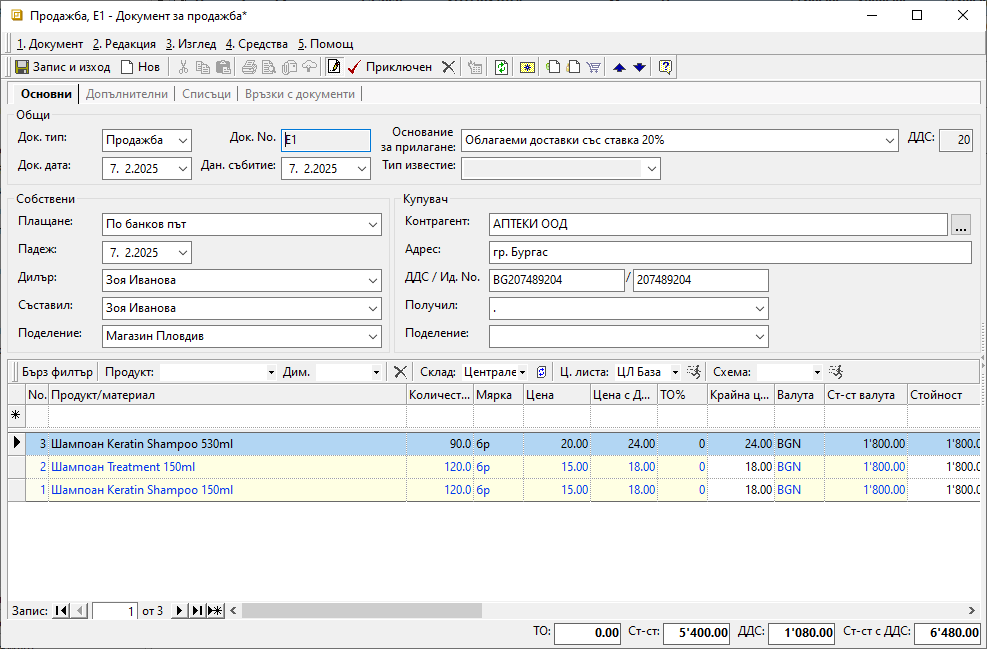
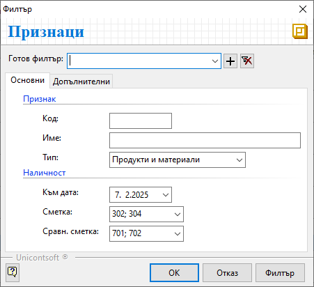
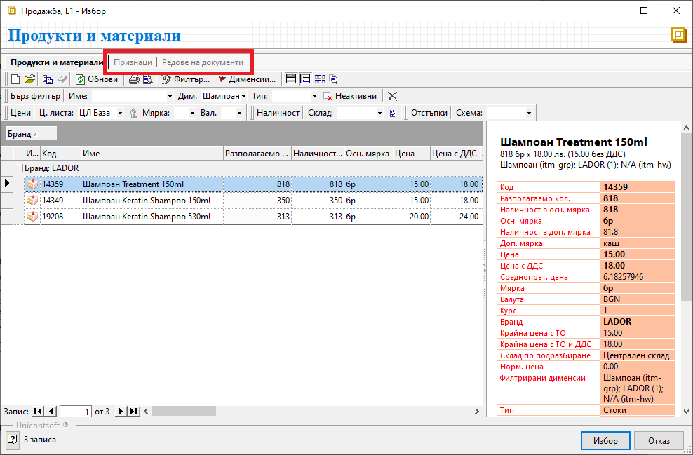

```{only} html
[Нагоре](000-index)
```

# Създаване на документ за продажба

Договорката между контрагент **Потребител на продукта** и клиент се регистрира в системата чрез вътрешнофирмен документ **Продажба**. В него се описва стоката и договорените условия на сделката. 

С валидирането на документа възниква вземане от клиента.  
Системата дава възможност за генерирация и на останалите документи по сделката - складови, касови, данъчни и други. Това може да стане в момента на приключване или допълнително. Тези операции могат да бъдат извършени от един потребител или от различни отдели в организацията.  

Процесът по създаване на продажба е следният:

1) От **Търговска система || Документи за продажба** чрез десен бутон на мишката върху списъка с документи се избира **Нов документ**. Отваря се празна форма за въвеждане на данни.  

2)  В раздел **Основни** се въвеждат: 

- **Док. Тип** – поле с опционално меню за избор на тип документ;  
В полето се попълва **Продажба** - системата предлага този тип по подразбиране;

- **Док. No** - полето се попълва с номер на документа;  
Ако полето бъде оставено празно, при приключване на продажбата системата ще го обзаведе с пореден номер за избраното поделение.       

- **Док. дата** - в полето се избира дата, за която се отнася текущата продажба;  

- **Плащане** - поле за избор на типа плащане, договорено с клиента;  
Системата обзавежда полето, когато за клиента има настроено плащане по подразбиране от **Номенклатури || Контрагенти**.  

- **Падеж** - в полето се попълва дата за падеж на плащане;  
При направени настройки на текущия контрагент системата изчислява дата на падежа и попълва автоматично полето.  

- **Дилър** - поле с персона, която отговаря за бизнес отношенията с текущия контрагент;  
Системата обзавежда полето автоматично, когато за контрагента са направени съответните настройки.  

- **Съставил** - полето се обзавежда от падащо меню с предварително настроен списък служители;  
Данните в полето се попълват автоматично с настройките на текущия потребител.  
  
- **Поделение** - тук се избира поделение от предварително настроен списък за **Потребител на продукта**;  
Полето се обзавежда автоматично според настройките на текущия потребител в системата.  

> Този реквизит е водещ при номериране на документите за продажба.  
> Настройката се дефинира в **Администрация || Номератори** и е различна за всяко поделение.   

- **Основание за прилагане** – в полето се избира вид на сделката;  
Системата обзавежда полето с настроено по подразбиране основание. Промяна се прави чрез падащо меню със списък с основания за прилагане.  
Този списък трябва да бъде предварително настроен от **Номенклатури || Референтни номенклатури || Счетоводство: Основания на прилагане**.  

- **Контрагент** — в полето се избира клиент, като се отваря форма за избор **Контрагенти**;  
Ако търсеният контрагент не фигурира в съществуващия списък, системата позволява въвеждането му в момента чрез десен бутон и **Нов контрагент**.  
Останалите полета в секция **Купувач** се обзавеждат с настроените за избрания клиент реквизити. 

{ class=align-center }

- **Продукт/материал** — поле за избор на продукти от реда за нов запис;  
Отваря се форма за избор с всички въведени **Продукти и материали**. 
В колони **Разполагаемо кол.** и **Наличност в осн. мярка** могат да се проследят свободните за продажба количества и физическите наличностите в склад. За целта от лентата *Бърз филтър* се избира **Склад**.  

   - от секция **Признаци** в колона **Салдо** се вижда разполагаемото количество на продукти в счетоводния склад. В колона **Разполагаемо** се вижда разликата между наличното количество и фактурираното, но все още не изписано количество.  
   Данните се визуализират след филтриране на списъка по следния начин:  

    { class=align-center }

   - секция **Редове на документи** могат да се видят всички продажби на този клиент (с продукти, количествата, цени и други).  

    { class=align-center }

   - бутон **Избор** добавя всички маркирани продукти в продажбата;  

- **Количество** — полето съдържа продаденото на клиента количество;  

- **Мярка** - системата дава възможност за промяна на мерните единици от това поле;  
Опционалното меню в полето се обзавежда с различни настройки за всеки продукт. Списъкът съдържа основна мерна единица за продукта и настроените му фасети на мерки.   

- **Цена** и **Цена с ДДС** — тези полета съдържат единичната цена без/с ДДС;  
Достатъчно е да се попълни една от цените, при което системата автоматично изчислява другата.  
Тези полета се обзавеждат автоматично, когато за текущия клиент има настроена ценова листа по подразбиране.  
Ценовата листа в документа може да се променя ръчно или чрез прилагане на ЦЛ. Това става от поле **Ц. листа** (в лентата *Бърз филтър*) и бутона вдясно *Прилагане ценова листа*.   

- **ТО%** - в полето може да се попълни търговска отстъпка на реда;  
Процентите с отстъпки се обзавеждат автоматично, когато за текущия клиент има настроена схема с отстъпка по подразбиране.  
Отстъпката в документа може да се променя ръчно или чрез прилагане на схема с ТО. Това става от поле **Схема** (в лентата *Бърз филтър*) и бутона вдясно *Прилагане схема отстъпки*.   

3) За валидиране на продажбата се избира бутон **Приключен** от лентата с инструменти.  
Това извежда форма **Свързани документи**, чрез която могат да се извършат останалите операции: 

- **Изписване от** (склад) — в полето се поставя отметка, ако стоката е изпратена от склада и трябва бъде намалена от складовите наличности;  
    - *Док. тип* - поле за избор на тип складов документ;  
    Системата предлага по подразбиране **РСД**-*Разходен складов документ*.    
    - *Складове по подразбиране на продукт/материал* - чрез избор на тази опция се вземат предвид настройките на всеки продукт за склад по подразбиране;  
    Системата ще генерира отделни складови документи, като групира продуктите по складове.  
    - *За дата* - избира се дата, която системата да попълни като **Док. дата** в складовия документ; 
    - *Счетоводно записване* - при поставянето на отметка системата автоматично  ще осчетоводи складовия документ;  
    За да се обзаведе коректно счетоводната статия, **Автоматичен счетоводител** трябва да е предварително настроен.  
    - *Вид запис* - поле с опционално меню за форма на счетоводния документ;  
    При избор на вариант *Една статия* системата създава счетоводен документ с една статия, включваща продуктите (признаците) в общ списък;  
    При *Ред-статия* системата генерира счетоводен документ с множество статии - за всеки продукт се създава отделна счетоводна статия;
    - *Приключване* - при поставена отметка системата генерира складов документ и автоматично го приключва;  
    Ако не бъде поставена отметка, системата генерира складов документ, но той остава в състояние на редакция.  
    - *Запазване* - чрез тази опция складовият документ се генерира в редакция и продуктите в продажбата се резервират в избрания склад;  

- **Депозит от** (склад) - опция за избор на склад и създаване на депозитна разписка, съдържаща настроен амбалаж за продукти;  
    - *За дата* - избира се дата, която системата да попълни като **Док. дата** в депозитната разписка;  
    - *Приключване* - при поставена отметка системата генерира депозитна разписка и автоматично я приключва;  
    Ако не бъде поставена отметка, системата генерира свързания документ, който остава в състояние на редакция.

- **Плащане в** (каса) — чрез тази опцията се избира каса и се създава приходен касов ордер; 
Използва се, когато има плащане в брой.    
    - *Сума* - в полето се записва фактически получената сума по продажбата;  
    - *Основание* - от опционално меню се посочва основанието за плащане, което системата да обзаведе в касовия документ;  
    - *За дата* - избира се дата, с която системата попълва **Док. дата** в касовия документ;  
    - *Счетоводно записване* - при поставянето на отметка системата автоматично ще осчетоводи касовия документ;  
    За да се обзаведе коректно счетоводната статия, **Автоматичен счетоводител** трябва да е предварително настроен.  
    - *Приключване* - при поставена отметка системата генерира касов документ и автоматично го приключва;  
    Ако не бъде поставена отметка, системата генерира свързания документ, който остава в състояние на редакция. 

- **Издаване** (данъчен документ) — опцията се маркира при издаване на данъчен документ към продажбата;  
От опционалното меню се избира тип на данъчния документ. Системата обзавежда полето автоматично, ако за клиента има настройки по подразбиране.  
 
    - *Номер* - полето остава празно и системата дава пореден номер на данъчния документ;  
    Настройките на автоматичната номерация се дефинират в **Администрация || Номератори** по типове документи и поделения.  
    - *За дата* - с тази дата системата попълва **Док. дата** в данъчния документ;  

    > При издаване на нов данъчен документ датата не трябва да се променя с по-ранна от тази на последно валидирания. Това е от съществено значение за хронологията на данъчните документи.  

    - *Счетоводно записване* - при поставянето на отметка системата ще осчетоводи данъчния документ;  
    - *Касов бон* - опция за генерация на счетоводен запис за касовия бон при плащане в брой;  

    > Ако за опцията **Плащане в** *(каса)* вече е маркирано *Счетоводно записване*, тук опцията *Касов бон* не трябва да се активира.  

    - *Бон сума* - полето се обзавежда със сума на касовия бон;  
    - *Бон дата* - дата на касовия бон;  
    - *Приключване* - при поставена отметка системата създава данъчния документ и автоматично го приключва;  
    Ако не бъде поставена отметка, системата генерира свързания документ, но той остава в състояние на редакция.  

- **Печат** и **Преглед** - опциите се активират чрез поставяне на отметка и позволяват преглед на документа на екран или директното му отпечатване (след избор на шаблон);  

- **Ок** - бутонът потвърждава маркираните опции;  
Системата генерира избраните свързани документи и валидира покупката.    

{ class=align-center }

4) Чрез бутон **Запис и изход** от лентата с инструменти документът се записва и формата се затваря.  

___  
Свързани статии:  

[Как да създадем Документ/Фактура за Продажба](https://www.unicontsoft.com/cms/node/26)  
[Как да отпечатаме Документ за продажба](https://www.unicontsoft.com/cms/node/27)  
[Продажба с наложен платеж](https://www.unicontsoft.com/cms/node/226)  
[Как да въведем Продажба със серийни номера на партиди](https://www.unicontsoft.com/cms/node/235)  
[Как да генерираме Документ за Продажба от Покупки](https://www.unicontsoft.com/cms/node/183)  

