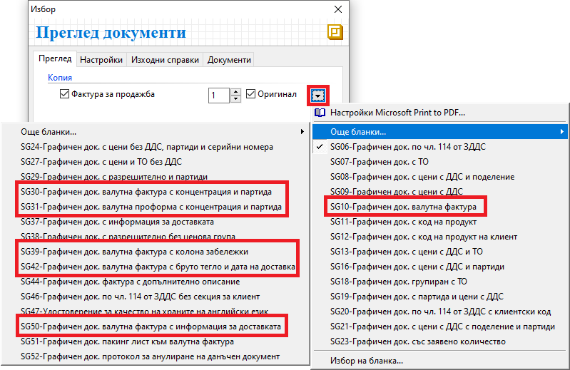

```{only} html
[Нагоре](000-index)
```

# Създаване и печат на документи в чуждестранна валута

При сделки с чуждестранни лица документите, които се обработват в системата, пораждат вземания или задължения във валута.

Валутните сделки се въвеждат в системата като стандартни покупки или продажби. Единствените реквизити, които се различават, са данните в полета:  

- *Валута* и *Курс* в раздел **Допълнителни**;  
- *Валута* и *Курс* в раздел **Основни**;  
- *Основание за прилагане* в **Основни**;  

1) Създаване на валутна продажба  

- Реквизити в раздел **Допълнителни**:  
Промяната на валута на документа се извършва от форма за редакция на документ в раздел **Допълнителни || Реквизити: Плащане**.  
Попълват се полета:  
    - **Валута** - поле с падащ списък за избор на валута на документа;  
Списък с валути трябва да се настрои предварително в **Номенклатури || Референтни номенклатури**.  
    - **Курс** - поле за въвеждане на валутен курс за избраната валута;  
Полето се попълва автоматично от системата, когато за избраната валута има настройки в **Номенклатури || Валутни курсове**.  

> Валутният курс за евро (EUR) е системно въведен, като се допуска ръчно коригиране.  

{ class=align-center w=15cm }

Системата предлага автоматично копиране на тези настройки и в редовете на документа в раздел **Основни**.  

- Реквизити в раздел **Основни**:  
    - **Основание за прилагане** се променя чрез избор на подходящо основание от падащото меню. Списъкът с основания трябва да бъде въведен предварително от **Номенклатури || Референтни номенклатури**.  
    - **Валута** - от това поле може да се променя валута по редовете на документа;  
Системата може да обзаведе това поле автоматично. Предварително трябва да е изпълнена стъпката с настройки в раздел **Допълнителни**.  
    - **Курс** - от това поле може да се променя валутен курс според избраната на реда валута;  
Системата може да обзаведе това поле автоматично. Предварително трябва да е изпълнена стъпката с настройки в раздел **Допълнителни**.  

{ class=align-center }

Останалата част от обработката на документа се извършва стандартно.  

> При осчетоводяването на валутни документи вземането/задължението ще се отрази едновременно с валутна и левова стойност.  
> Продадени/закупените стоки и услуги, ще се осчетоводят единствено с техните левови стойности.

2) Печат на валутна продажба  

При издаване на валутен документ в системата трябва да се направи чуждоезиков превод на участващите реквизити.  
Това става от списъка със съответната настройка чрез бутон **Преведи**. 

За разпечатването на документа са предвидени подходящи шаблони с изглед за валутна фактура.  
Промяната на шаблон за печат става от форма *Печат документи*, която се отваря чрез бутон **Печат** или *Преглед документи* - чрез бутон **Преглед**.  

{ class=align-center }

___  
Свързани статии:  

[Как да въведем ВОД](https://www.unicontsoft.com/cms/node/134)  
[Как да създадем Продажба във валута](https://www.unicontsoft.com/cms/node/185)  
[Как да отпечатаме външнотърговска фактура](https://www.unicontsoft.com/cms/node/135)  
[Как да въведем ВОП и Протокол за самооблагане](https://www.unicontsoft.com/cms/node/76)  
[Как да въведем Покупка във валута](https://www.unicontsoft.com/cms/node/77)  