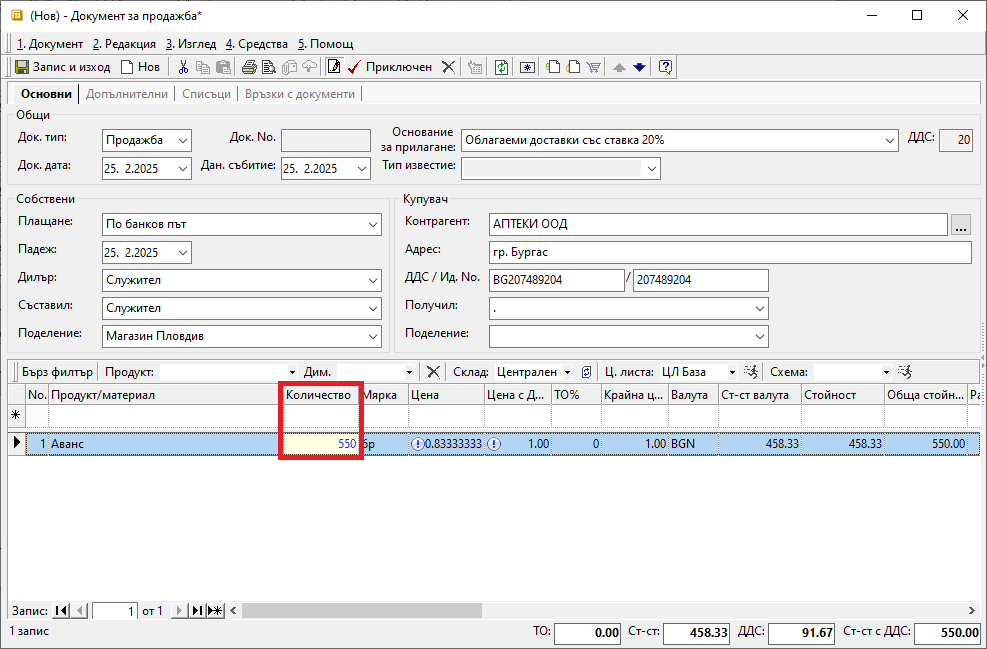
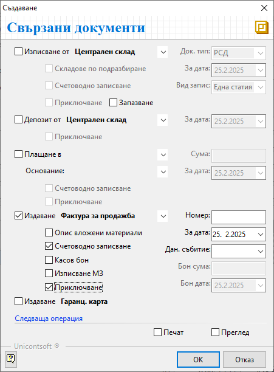
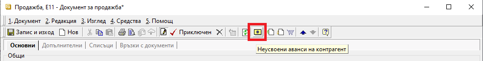
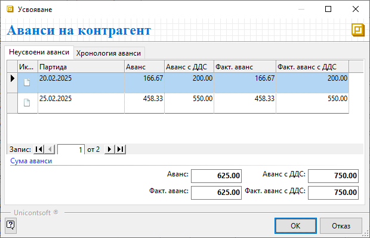
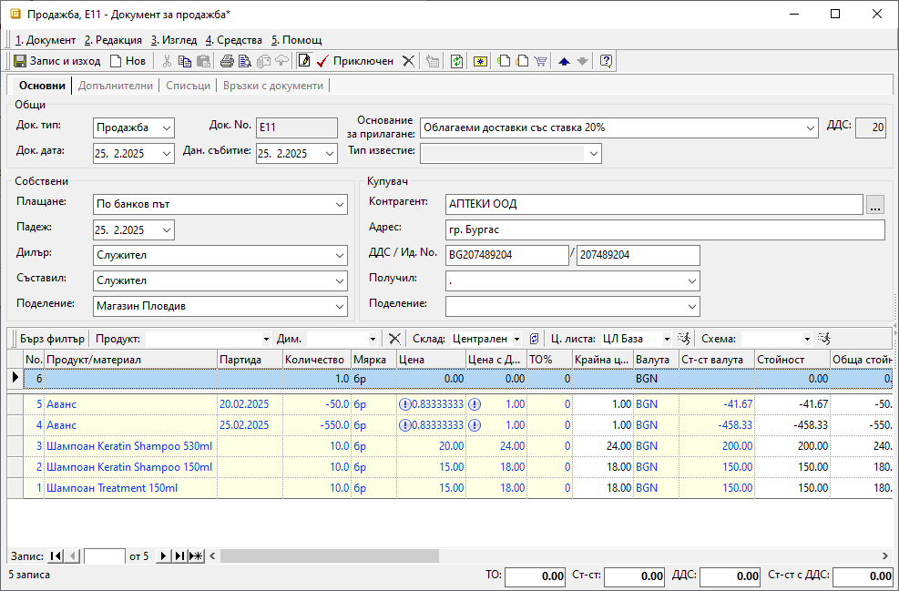
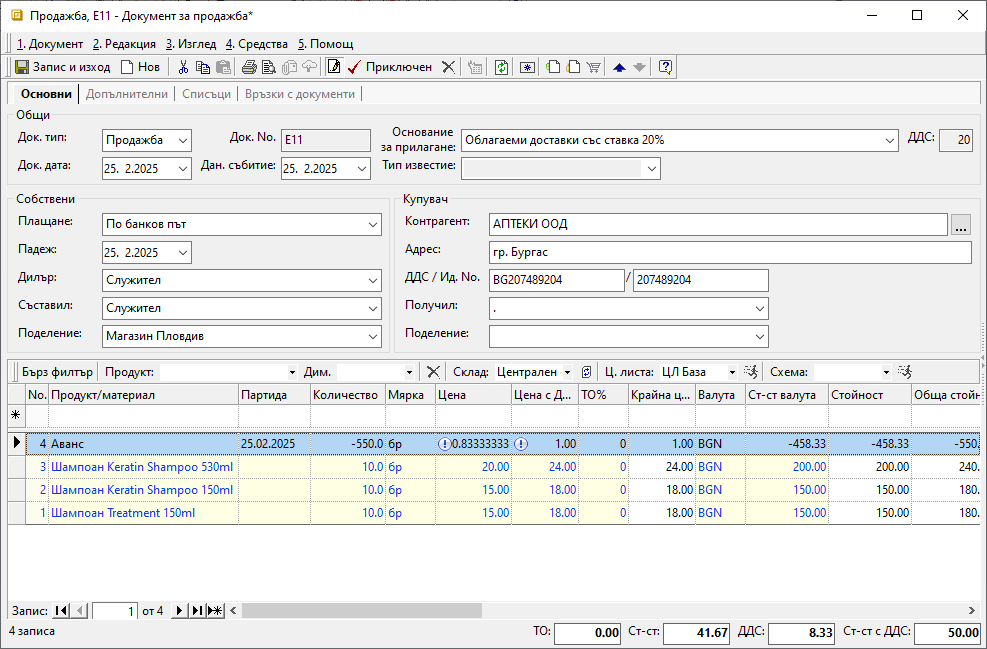

```{only} html
[Нагоре](000-index)
```

# Работа с аванси

Програмата разполага със схема за работа с аванси, която включва регистрирането и автоматичното им усвояване по партиди. Хронология на авансите - платени, усвоени и неусвоени, може да бъде проследявана по клиенти и доставчици от **Други справки || Аванси по контрагенти**.  

Платен аванс от клиент/към доставчик се регистрира в системата чрез тип документ **Продажба**/**Покупка**. Следват се стъпките за създаване на стандартните документи. Единствената особеност е използването на продукт **Аванс**.  

> Продукт **Аванс** е системно въведен и настроен и не се редактира/изтрива.  
Той е със заложена цена от 1.00 лв. (с ДДС), затова сумата на аванса с ДДС се въвежда и променя чрез **Количество**.   

Схемата за работа с аванси, получени от клиенти и платени към доставчици, е идентична.  

Процесът по регистриране на аванс от клиент е следният:

1) От **Търговска система || Документи за продажба** чрез десен бутон на мишката върху списъка с документи се избира **Нов документ**. Отваря се празна форма за въвеждане на данни.  

2)  В раздел **Основни** се въвеждат: 

- **Док. Тип** – поле с опционално меню за избор на тип документ;  
В полето се попълва **Продажба** - системата предлага този тип по подразбиране;

- **Док. No** - полето се попълва с номер на документа;  
Ако полето бъде оставено празно, при приключване на продажбата системата ще го обзаведе с пореден номер за избраното поделение.       

- **Док. дата** - в полето се избира дата, на която е получен авансът;

- **Плащане** - - поле за избор на типа плащане, по който е получен авансът от клиент;  
Системата обзавежда полето, когато за клиента има настроено плащане по подразбиране от **Номенклатури || Контрагенти**.  

- **Контрагент** — в полето се избира клиент, като се отваря форма за избор **Контрагенти**;  
Ако търсеният контрагент не фигурира в съществуващия списък, системата позволява въвеждането му в момента чрез десен бутон и **Нов контрагент**.  
Останалите полета в секция **Купувач** се обзавеждат с настроените за избрания клиент реквизити. 

{ class=align-center }

- **Продукт/материал** - в полето задължително се избира продукт **Аванс**;  
Той е системно настроен с цена 1.00 лв с ДДС

- **Количество** - в полето се попълва сумата на получения аванс (с ДДС);  

- **Мярка** - полето се обзавежда според настройките на продукт **Аванс**;  
По подразбиране мерната единица е **бр** (брой) и не се променя.     

- **Цена** и **Цена с ДДС** — тези полета съдържат системно настроената цена без/с ДДС за продукт **Аванс**;  
Цените не трябва да се коригират.  

- **Партида** - чрез това поле за аванса може да се попълни партида;  
Системата може да следи всеки аванс отделно, когато те са регистрирани като отделни партиди. В противен случай ги обединява и следи общо получената сума.  

3)  **Приключен**- бутон в лентата с инструменти, който валидира продажбата и извежда форма **Свързани документи**;  
От тук могат да се извършат останалите операции: 

- **Плащане в** (каса) — чрез тази опцията се избира каса и се създава приходен касов ордер; 
Използва се, когато авансът е получен в брой.    
    - *Сума* - в полето се записва фактически получената сума на аванса;  
    - *Основание* - от опционално меню се посочва основанието за плащане, което системата да обзаведе в касовия документ;  
    - *За дата* - избира се дата, с която системата попълва **Док. дата** в касовия документ;  
    - *Счетоводно записване* - при поставянето на отметка системата автоматично ще осчетоводи касовия документ;  
    За да се обзаведе коректно счетоводната статия, **Автоматичен счетоводител** трябва да е предварително настроен.  
    - *Приключване* - при поставена отметка системата генерира касов документ и автоматично го приключва;  
    Ако не бъде поставена отметка, системата генерира свързания документ, който остава в състояние на редакция. 

- **Издаване** (данъчен документ) — опцията се маркира при издаване на данъчен документ за получен аванс от клиент;  
От опционалното меню се избира тип на данъчния документ.  
 
    - *Номер* - полето остава празно и системата дава пореден номер на данъчния документ според избраното поделение;   
    - *За дата* - с тази дата системата попълва **Док. дата** в данъчния документ;    
    - *Счетоводно записване* - при поставянето на отметка системата ще осчетоводи данъчния документ;  
    - *Касов бон* - опция за генерация на счетоводен запис за касовия бон при плащане в брой;  

    > Ако за опцията **Плащане в** *(каса)* вече е маркирано *Счетоводно записване*, тук опцията *Касов бон* не трябва да се активира.  

    - *Бон сума* - полето се обзавежда със сума на касовия бон;  
    - *Бон дата* - дата на касовия бон;  
    - *Приключване* - при поставена отметка системата създава данъчния документ и автоматично го приключва;  
    Ако не бъде поставена отметка, системата генерира свързания документ, но той остава в състояние на редакция.  

- **Печат** и **Преглед** - опциите се активират чрез поставяне на отметка и позволяват преглед на документа на екран или директното му отпечатване (след избор на шаблон);  

 { class=align-center }

4) Чрез бутон **Запис и изход** от лентата с инструменти документът се записва и формата се затваря.  


5) **Усвояване на аванс** - осъществява се при последващите продажби на стока за контрагента.  
В нов документ **Продажба** се попълват всички данни и се избира бутон **Неусвоени аванси на контрагент** от лентата с инструменти. Това отваря форма със списък аванси от контрагента.   

{ class=align-center } 

В раздел **Неусвоени аванси** се визуализират всички получени аванси по партиди, които до момента не са усвоени.  

Раздел **Хронология аванси** дава детайлна информация в списък с документи, с които са регистрирани получените аванси.  

Маркира се ред от неусвоените аванси. Могат да бъдат избрани няколко аванса за усвояване в една продажба.   
Изборът се потвърждава чрез бутон **ОК** и системата добавя ред за аванс в продажбата с отрицателен знак.   

{ class=align-center }

**Частично усвояване** - когато сумата на получения аванс е по–голяма от стойността на продажбата;  

Системата автоматично приравнява сума на аванса към стойност на продажбата.  
В този случай стойността на документа става **0.00**.

Остатъкът от аванса по партидата на клиента ще може да се усвои при друга продажба.  

{ class=align-center }

**Пълно усвояване** - когато сумата на аванса за усвояване е по-малка от стойността на продажбата;  

Разликата между стойност на продажбата и усвоения аванс формира стойността на текущия документ.  

Партидата на избрания аванс се "закрива" след валидиране на продажбата с неговото усвояване.  

{ class=align-center }

___  
Свързани статии:  
[Как да работим с aванси от клиенти](https://www.unicontsoft.com/cms/node/40)  
[Как да работим с аванси към доставчици](https://www.unicontsoft.com/cms/node/86)  