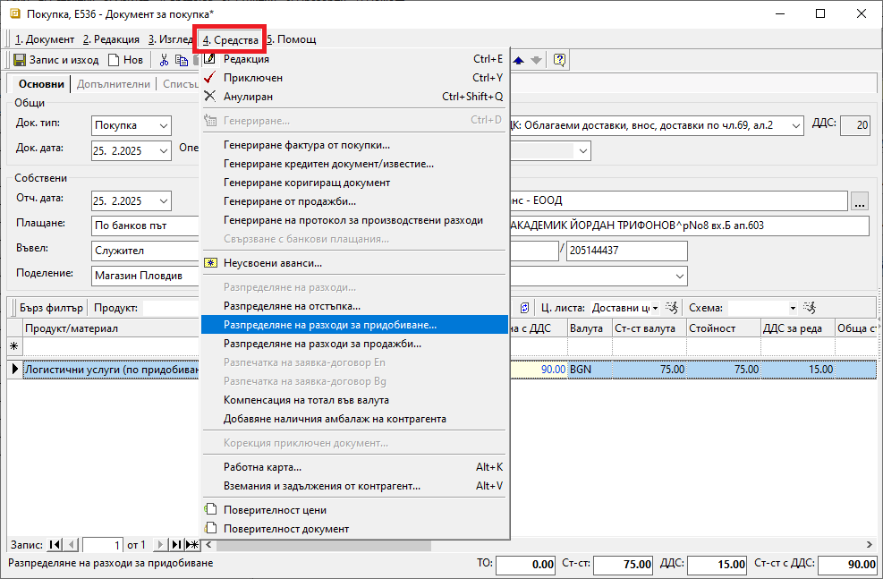
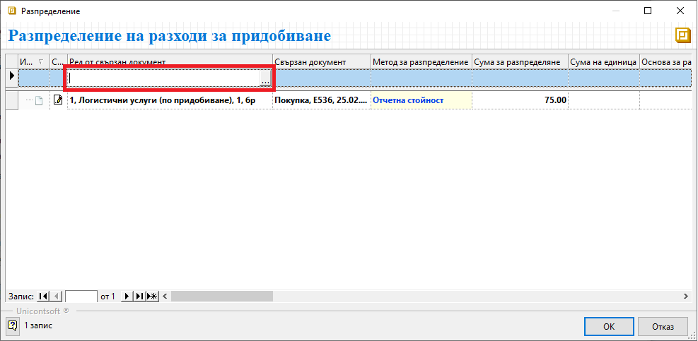
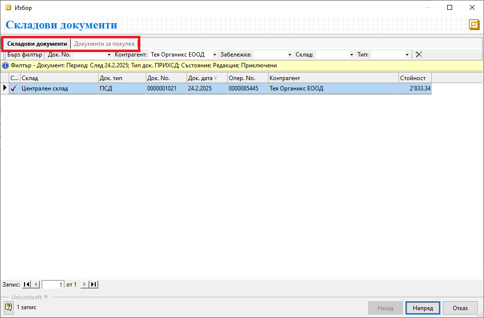
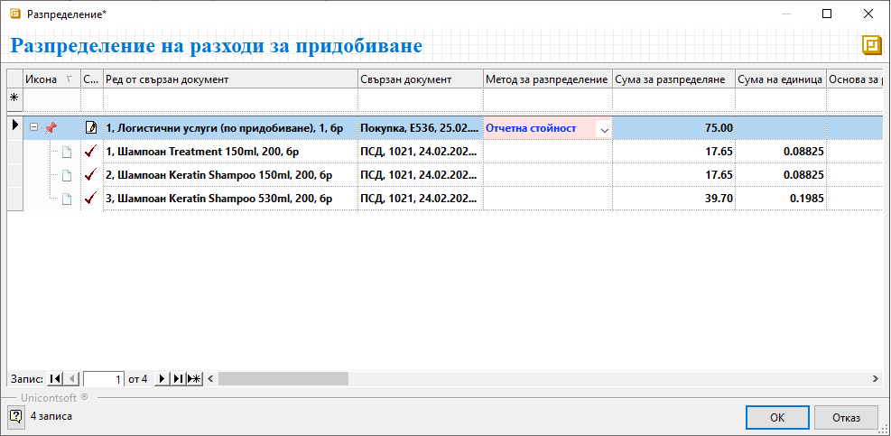

```{only} html
[Нагоре](000-index)
```

# Разпределяне на разходи при покупка

Системата разполага с инструмент за разпределяне на разходи по покупки (за транспорт, за опаковка и др.) и следене на реалната себестойност на продукти и материали.

Процесът по разпределяне на разходи по покупка е следният:  

1) Предварително в системата трябва да се валидират вътрешнофирмените документи за покупката на стоки: **Покупка** и свързан **ПСД**-Приходен складов документ.

2) Въвежда се нов документ за покупка, който включва направените разходи.  
За различните разходи се създават отделни продукти от тип услуга в **Номенклатури || Продукти и материали**.  

3) От меню **Средства || Разпределение на разходи за придобиване** се отваря форма за избор на свързани документи.  

{ class=align-center }

4) На този етап форма **Разпределение на разходи за придобиване** съдържа единствено ред с разходите за разпределяне от текущата покупка.  

> Сума на разходите за разпределяне е винаги без ДДС.

В колона **Ред от свързан документ** трябва да се добави списък с продукти, върху чиято стойност се разпределя сумата на разходите.   

{ class=align-center }

- **Ред от свързан документ** - от реда за нов запис в това поле се отварят списъци със складови документи и документи за покупка;  
По избор се работи в един от двата списъка.  
Трябва да се посочи или документ за покупката на стоки, или приходният складов документ, към който се отнасят текущите разходи.  
    - **Напред** - маркира се един или няколко документа **ПСД**/**Покупка** и с бутон **Напред** се продължава към следваща стъпка;  
    - **Избор** - маркира се един, няколко или всички продукти, върху които да се разпределят разходите и бутон **Избор** ги добавя в списъка на формата за разпределение;    

{ class=align-center }

- **Свързан документ** - полетата в тази колона се обзавеждат автоматично с тип, номер и дата на документ, в който участва продуктът на текущия ред;  

- **Метод за разпределение** - полето се обзавежда автоматично с метод **Отчетна стойност**;  
С него системата автоматично разпределя общата сума на разхода спрямо единичната цена на продуктите.  
Методът за разпределение може да бъде променен чрез падащия списък в полето.  

- **Сума за разпределяне** - данните в тези полета се обзавеждат автоматично спрямо избрания метод за разпределение;  

> Единствено при избран метод **Ръчно** в колона **Сума за разпределяне** се допуска редакция на стойностите.  

- **Сума на единица** - тези полета се попълват автоматично от системата със сумите на разпределените разходи за единица продукт;  

{ class=align-center }

___   
Свързани статии:  
[Как да разпределим разходи по покупка](https://www.unicontsoft.com/cms/node/148)  
[Разпределение на разходи за придобиване](https://docs.unicontsoft.com/blog/20240411-allocate-acquisition-costs.html)