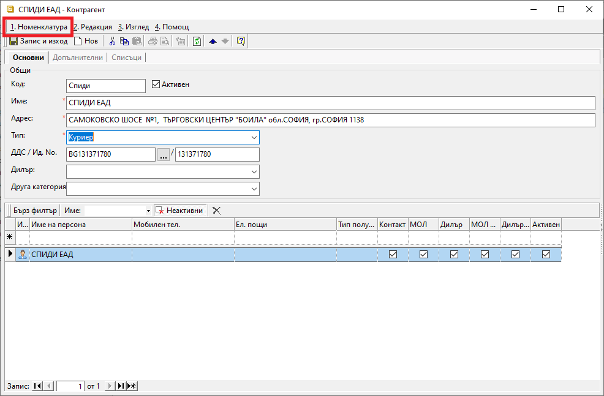
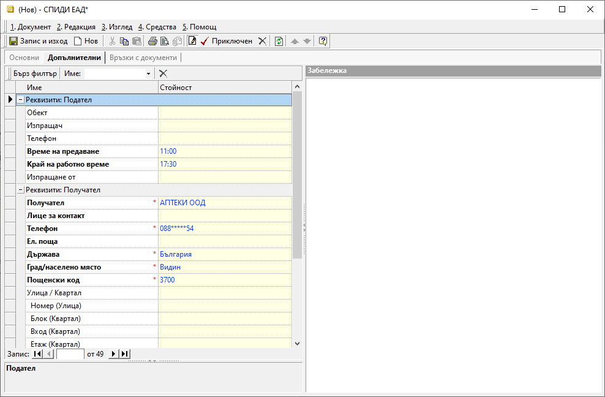

```{only} html
[Нагоре](000-index)
```

# Куриерски товарителници

Системата разполага с инструмент за генерация на куриерски товарителници. За да работи коректно тази функционалност, са необходими предварителни настройки, които се конфигурират еднократно.  
При интеграция с куриерска услуга се осигурява бърза генерация на товарителници, като системата автоматично попълва необходимите данни в документа. За целта предварително се дефинират стойности по подразбиране - данни за изпращача, опции за преглед, тест, отказ и други. Системата позволява последваща промяна на тези данни в товарителницата.  

Процесът по създаване на товарителница е следният:

1) От **Номенклатури || Контрагенти** еднократно се въвежда нова номенклатура за куриерска фирма.  
За тип на контрагента трябва да бъде избран **Куриер**.  

{ class=align-center }

2) Във формата за редакция на избрания куриер от меню **Номенклатура** се отваря форма **Настройки на куриерска услугa**.  
Попълват се съответните реквизити за интеграция с web услугата на куриерската фирма.  
В тази форма могат да бъдат дефинирани и стойности по подразбиране, свързани с данни за изпращача, опции за преглед, тест, отказ и други. Системата ги прилага при генерация на товарителници, като при необходимост данните могат да бъдат коригирани.  

{ class=align-center }

3) От **Търговска система || Куриерски товарителници** чрез десен бутон на мишката върху списъка с документи се избира **Нов документ**. Отваря се празна форма за въвеждане на данни.  

4)  В раздел **Основни** се попълват:  

- **Док. No** - полето ще се попълни автоматично с номер при валидиране на товарителницата;  

- **Док. дата** - в полето се избира дата, за която се генерира текущата товарителница;  

- **Дата на дост.** - в полето се избира дата, на която да се осъществи доставката от куриер;  

- **Съставил** - в полето се отваря падащ списък за избор от предварително настроените служители;    
  
- **Поделение** - в полето се отваря падащ списък за избор на поделение от предварително настроените в **Потребител на продукта**;  

- **Контрагент** — в полето се избира клиент, като се отваря форма за избор **Контрагенти**;  
Ако търсеният контрагент не фигурира в съществуващия списък, системата позволява въвеждането му в момента чрез десен бутон и **Нов контрагент**.  

- **Куриер** - поле за избор на куриер от предварително настроения в **Контрагенти** списък; 

{ class=align-center }

5)  От раздел **Допълнителни** могат да се попълнят:  

- **Реквизити: Подател**:  
    - **Обект** - в полето се посочва обект, от който куриерът събира подготвената за изпращане пратка;  
    - **Изпращач** - посочва се лице за контакт;  
    Ако полето остане празно, системата подава данните от поле **Съставил** в раздел **Основни**.  
    - **Телефон** - в полето се попълва телефон на подателя;  
    Ако полето остане празно, системата подава данните, настроени за персоната в поле **Съставил**.  
    - **Време за предаване** - от падащия списък се избира час, в който изпращачът желае пратката да бъде взета от куриера;  
    - **Край на работно време** - от списъка се посочва краят на работното време за обекта-изпращач;  
    - **Изпращане от** - полето се попълва, когато пратката се изпраща от офис на куриерската фирма;  

- **Реквизити: Получател**:  
    - **Получател** - полето съдържа контрагента, за когото е адресирана пратката;  
    - **Лице за контакт** - в полето се попълват имената на получателя;  
    Полето се обзавежда автоматично с настроената персона за избрания контрагент.  
    - **Телефон** - попълва се телефонен номер за контакт с получателя (вкл. за SMS известия);  
    - **Ел. поща** - в полето може да се попълни ел. поща за контакт с получателя;  ;  
    - **Държава** - от падащия списък се избира държава за доставка;  
    - **Грда/ населено място** - в полето се избира град за доставка;  
    - **Пощенски код** - полето се обзавежда автоматично с пощ. код на избрания за доставка град;  
    - **Улица / Квартал, Номер, Блок, Вход, Етаж, Апартамент** - в тези полета се попълват всички детайли за адреса на доставка;  
    - **Пояснение** - в това поле може да се въведе разясняващ текст, свързан с доставката;  
    - **До поискване от** - в полето може да се избере офис на куриер, в който да се остави пратката, когато е до поискване от получателя;  

{ class=align-center }

- **Реквизити: Информация**:  
    - **Вид услуга** - в полето се посочва вид на услугата, която се използва за доставка на текущата пратка;  
    - **Услуга** - в полето се избира услуга на куриера, която се използва за изпращане на текущата пратка;  
    - **За сметка на** - от полето се посочва кой следва да заплати куриерската такса по доставка на пратката;  
    - **Ценова листа** - от падащия списък в полето се избира по чия ценова листа се изчислява стойността на куриерската услуга;  
    - **Съдържание** - в полето се посочва какво съдържа пратката;  
    - **Пакетиране** - описание на вида, в който е опакована пратката;  
    По подразбиране се обзавежда с *Пакет*.  
    - **Брой колети** - от бутон [**...**] в полето се отваря форма за въвеждане на брой и размери на колетите;  
    - **Бруто тегло - кг** - в полето се въвежда бруто тегло на пратката (вкл. опаковката);  
    - **Референция** - в полето може да се въведе текст, който да се отпечата на товарителницата;  

- **Допълнителни услуги**:  
    - **Фиксирано време** - от полето може да се избере точен час, в който куриер да извърши доставката на адрес;  
    - **Сума наложен платеж** - когато се дължи наложен платеж, в полето се попълва неговата стойност;  
    - **Сума застраховка** - в полето може да се попълни сума на застрахователна стойност (обявена стойност);  
    - **Обратна разписка** - в полето се посочва дали към пратката има обратна разписка;  
    - **Обратни документи** - в полето се посочва дали към пратката има документи за обратна доставка;  
    - **Съботен разнос** - в полето се избира дали пратката да бъде включена в съботен разнос на куриера;  
    - **Чупливо** - с **Да/ Не** настройка в полето се посочва дали пратката е с чупливо съдържание;  
    - **Документи** - в полето се избира дали пратката съдържа единствено документи;  
    - **Отвори преди плащане** - в полето се избира дали се допуска преглед на пратката преди плащане;  
    - **Тествай преди плащане** - в полето се избира дали е позволено тестване преди плащане на пратката;  
    - **Пощенски паричен превод** - чрез **Да/ Не** настройка в полето се посочва дали плащането ще се извърши като ППП;  
    - **Клиентска фактура по ППП** - попълват се номер и дата на клиентска фактура, които се подават на куриера при плащане с договор за ППП;  
    - **Ваучери за връщане** - чрез опциите **Да/ Не** в полето се посочва дали да се генерира ваучер за връщане на стока;  
    - **Втори телефон за SMS известяване** - в полето се попълва телефонен номер на подателя, когато се активира углугата за SMS известяване при успешно доставена на получател пратка;  

- **Реквизити: При отказ от плащане**:  
    - **Услуга за връщане** - в полето се избира вид услуга, която куриерската фирма извършва при връщане на отказана пратка;  
    - **За сметка на** - в полето се посочва за чия сметка е куриерската услуга по връщане на отказана пратка;  

- **Реквизити: Обратна пратка**:  
     - **Услуга за обратна пратка** - в полето се избира вид услуга, която куриерската фирма извършва за обратната пратка;  
     - **Брой колети** - брой колети на обратната пратка;  

- **Реквизити: Тотали**:  
    - **Обща стойност с ДДС** - полето показва тотал с дължимата на куриера сума;  

6) **Приключен** - бутон в лентата с инструменти, който валидира документа. По този начин системата се свързва с web услугата на куриерската фирма и получава пореден номер на товарителницата.  

7) Чрез бутон **Запис и изход** от лентата с инструменти документът се записва и формата се затваря.