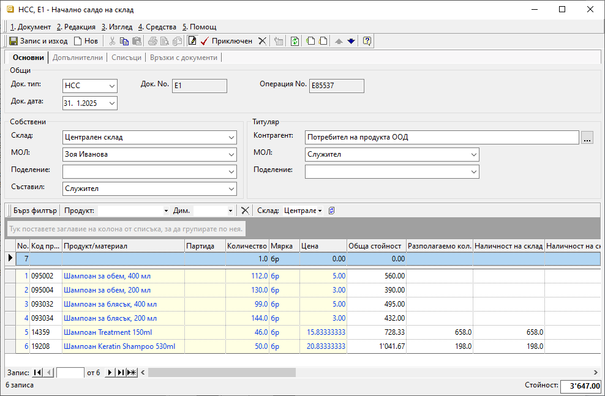

```{only} html
[Нагоре](000-index)
```

# Начално салдо на склад

С документ **Началното салдо на склад** се отразяват количествата на наличните стоки към определен момент. Това обикновено е при внедряването на Dreem ERP или в началото на отчетен период.  
Точното въвеждане на началното салдо е критично за управлението на складовите операции.  

За да се гарантира коректност на справките е необходимо да се въведат начални салда отделно за всеки настроен склад. Те трябва да съдържат, освен актуални количества, и стойности - доставни цени без ДДС.  

Процесът по въвеждане на документ **Началното салдо на склад** е следният:  

1) От **Търговска система || Складови документи** чрез десен бутон на мишката се избира **Нов документ**. Отваря се форма за въвеждане и редакция на складов документ.  

2)  В раздел **Основни** се въвеждат:
    - **Док. тип** – избира се тип на документа да бъде **НСС** – Начално салдо на склад;  
    - **Док. дата** – поле за избор на дата, към която количествата на продуктите ще се отразят в наличността на склада;  
    - **Док. No** – поле за избор на номер за документа;  
    Ако полето остане празно, системата ще генерира пореден номер на документ за текущия склад;  
    - **Склад** – поле за избор на склад, за който се отнасят началните салда;  
    - **МОЛ** – избира се материално отговорното лице за текущия склад;  
    Полето се обзавежда автоматично, ако складът има настроен МОЛ по подразбиране.  
    - **Поделение** - в полето може да се посочи поделение от предварително настроените в контрагент **Потребител на продукта**;  
    - **Съставил** - избира се персона, съставила документа;  
    Полето се обзавежда автоматично с настроените данни за текущия потребител на системата.  
    - **Контрагент** – данните за контрагент се обзавеждат автоматично при избиране на тип документ **НСС**;  
    - **Продукт/материал** – въвежда се списък с всички продуктите, които са налични в склада към избраната в документа дата;  
    Продуктите трябва да са предварително въведени в системата.  
    - **Партида** - в тази колона могат да се попълват партиди на продукти;  
    Ако един продукт участва с няколко партиди, се въвежда отделен ред за всяка от тях.  
    - **Количество** – в колоната се въвеждат наличните количества по продукти към датата на документа;   
    - **Мярка** - колоната трябва да съдържа основните мерни единици за всеки един продукт;  
   В складови документи продуктите се отразяват с настроените им основни мерни единици. Обикновено това е най-малката мярка, в която продуктът съществува в системата.   
    - **Цена** - в колоната се попълват единични цени без ДДС;  
    Обикновено се използва среднопретеглена цена за текущия склад.  

    { class=align-center w=15cm }

3) **Приключен** - бутон в лентата с инструменти на формата;  
След обзавеждане на реквизитите в **НСС**, документът трябва да бъде приключен. Това валидира данните от документа и те са видими в справките.  
