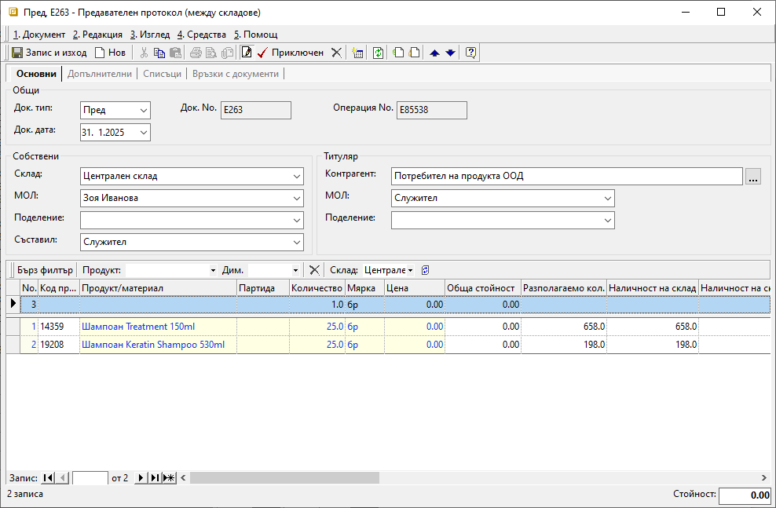
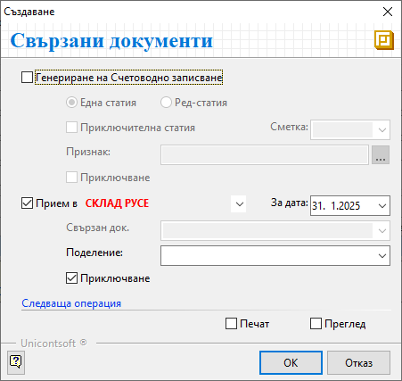

```{only} html
[Нагоре](000-index)
```

# Трансфер на продукти между складове

Всяко движение на материали, стоки и продукция от един склад/обект към друг, трябва да бъде отразено в системата. Тази операция оказва влияние на складовите наличности едновременно в няколко склада. В тази връзка в съответните складове се създават два типа складови документи – предавателен и приемателен протокол. Във всеки от тях системата автоматично попълва среднопретеглената цена от предаващия склад. 

Процесът по въвеждане на **Предавателен протокол** и **Приемателен протокол** е следният:

1) От **Търговска система || Складови документи** чрез десен бутон на мишката се избира **Нов документ**. Отваря се форма за въвеждане и редакция на складов документ. 

2)  В раздел **Основни** се въвеждат:  

    - **Док. тип** – избира се тип на документа **Пред** – **Предавателен протокол (между складове)**;  
    - **Док. дата** – поле за избор на дата, за която количествата на продуктите трябва да се намалят от наличността на текущия склад;  
    - **Док. No** – поле с номер за документа;  
    Ако полето остане празно, системата ще генерира пореден номер за типа документ в текущия склад;  
    - **Склад** – поле за избор на склад, от който излизат материалите, стоките и/или продукцията;  
    - **МОЛ** – избира се материално отговорното лице за текущия склад;  
    Полето се обзавежда автоматично, ако складът има настроен МОЛ по подразбиране.  
    - **Поделение** - в полето може да се посочи поделение от предварително настроените в контрагент **Потребител на продукта**;  
    - **Съставил** - избира се персона, съставила документа;  
    Полето се обзавежда автоматично с настроените данни за текущия потребител на системата.  
    - **Контрагент** – данните за контрагент се обзавеждат автоматично при избиране на тип документ **Пред**;  
    - **Продукт/материал** – въвежда се списък с продуктите, които се прехвърлят между складове;  
    Продуктите трябва да са предварително въведени в системата.  
    - **Партида** - в тази колона могат да се избират партиди на продукти;  
    Ако се прави трансфер на няколко партиди от един продукт, всяка от тях се въвежда на отделен ред.  
    - **Количество** – в колоната се въвеждат количествата по продукти, които се прехвърлят;   
    - **Мярка** - колоната трябва да съдържа основните мерни единици за всеки един продукт;  
   В складови документи продуктите се отразяват с настроените им основни мерни единици. Обикновено това е най-малката мярка, в която продуктът съществува в системата.   
    - **Цена** - среднопретеглена цена (без ДДС) за текущия склад;  
    Системата попълва полетата в тази колона автоматично при приключването на документа. 

   { class=align-center }

3) **Приключен** - бутон в лентата с инструменти на формата, който приключва документа;  
След обзавеждане на реквизитите в **Предавателен протокол (между складове)**, документът трябва да бъде валидиран.  
Следващата стъпка е генерирането на свързан **Приемателен протокол (между складове)**.    

4) **Свързани документи** - с приключване на предавателния протокол системата предлага автоматична генерация на счетоводно записване и на приемателен протокол.  

Чрез форма **Свързани документи** са достъпни следните опции:

- **Генериране на Счетоводно записване** – с поставянето на отметка системата генерира свързан счетоводен документ;  
За да се обзаведе коректно счетоводната статия, **Автоматичен счетоводител** трябва да е предварително настроен.  
    - *Една статия* - при избор на тази опция системата създава счетоводен документ с една статия, включваща продуктите (признаците) в общ списък;  
    - *Ред-статия* - с тази опция системата генерира счетоводен документ с множество статии - за всеки продукт от протокола се създава отделна счетоводна статия;   
    - *Приключителна статия* - при тази опция, след избор на приключителна сметка и по желание *Признак*, системата ще генерира и приключителна статия в счетоводния документ;  
    - *Приключване* - при поставена отметка системата генерира счетоводния документ и автоматично го приключва;  
    Ако не бъде поставена отметка, системата генерира счетоводен документ, който остава в състояние на редакция.  

- **Прием в** - за да се генерира автоматично **Приемателен протокол (между складове)**, трябва да се постави отметка и от падащото меню да се избере склад, приемащ продуктите;  
    - *За дата* - поле за избор на дата, с която ще се генерира свързаният приемателен протокол;  
    Това е датата, на която продуктите физически са пристигнали в приемащия склад.
    - *Поделение* - в това поле може да се избере поделение от настроените в **Потребител на продукта**, с което ще се обзаведе приемателният протокол;  
    - *Приключване* - при поставена отметка системата генерира **Приемателен протокол (между складове)** и автоматично го приключва;  
    Ако не бъде поставена отметка, системата генерира свързания документ, който остава в състояние на редакция.

- **Печат** и **Преглед** - опциите се активират чрез поставяне на отметка и позволяват преглед на документите на екран или директното им отпечатване (след избор на шаблон);   

    { class=align-center }

5) Бутон **ОК** потвърждава избраните опции и валидира данните от двата протокола. Наличностите в участващите складове ще бъдат актуализирани. За склада, посочен в **Предавателен протокол (между складове)**, количествата по продукти са вече намалени. Същите количества са вече добавени към наличностите в склада, избран като приемащ.   

