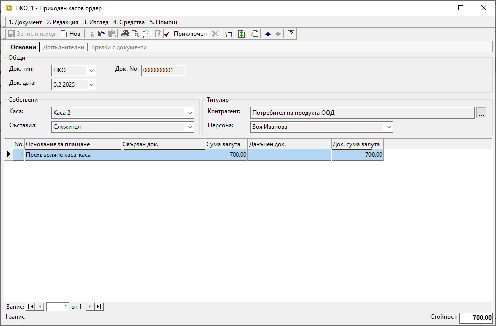

```{only} html
[Нагоре](000-index)
```

# Прехвърляне на средства между каси

Всички движенията на парични средства от една каса в друга трябва да бъдат отразени в системата. За целта се използват документи, които се въвеждат в **Търговска система || Касови документи**.  

Когато се осъществява паричен трансфер между каси, посоката на движение на средствата се определя от тип на касовия документ.  
В касата, която предава средствата и наличността ѝ намалява, се създава **РКО**-*Разходен касов ордер*.   
Приходът в насрещната каса се отразява чрез въвеждане на **ПКО**-*Приходен касов ордер*.  

Процесът по въвеждане на документи за трансфер на средства е следният:

1) От **Търговска система || Касови документи** чрез десен бутон на мишката върху списъка се избира **Нов документ**. Отваря се нова форма за въвеждане на данни.  

В раздел **Основни** се попълват:

- **Док. Тип** – поле с опционално меню за избор на тип документ;   
Избира се тип **РКО** - *Разходен касов ордер*, с което се регистрира разходът на средства от текущата каса.  

- **Док. No** - полето се попълва с номер на документа;  
Системата автоматично попълва пореден номер за избраната каса при приключване на документа.    

- **Док. дата** - в полето се избира дата, за която се отнася разходът на избраната каса; 

- **Каса** – поле с опционално меню за избор на каса, от която се прехвърлят средствата;  
Списъкът с каси се настройва предварително от **Номенклатури || Референтни номенклатури**.  

- **Съставил** - полето се обзавежда от падащо меню с предварително настроен списък служители;  
Данните в полето се попълват автоматично с настройките на текущия потребител.  

- **Контрагент** – в полето се избира контрагент **Потребител на продукта**; 

{ class=align-center }

- **Основание за плащане** – в полето се избира настроеното основание за трансфер на средства между каси;  
Основанията трябва да са предварително дефинирани в **Номенклатури || Референтни номенклатури || Търговска система: Основания за плащане**.  
Избраното основание определя счетоводната операция, която се генерира при приключване на документа. Необходимо е предварително да бъдат направени настроийки за това от **Счетоводство || Автоматичен осчетоводител**.  

- **Сума валута** и **Док. сума валута** - в тези полета се посочва стойността на парични трансфер;  

2) Чрез бутон **Приключен** от лентата с инструменти се отваря форма за генерация на свързани документи.   
Системата дава възможност за автоматично създаване на следните документи:  

    - Чрез опция **Прехвърляне на средства между каси** системата ще генерира свързан **ПКО**-*Приходен касов ордер* за избрана каса, приемаща паричните средства;  
    - **Каса** - в полето се избира касата, която приема прехвърлените седства;  
    - **Генериране на Счетоводно записване** е опция за автоматична генерация на свързан счетоводен документ;  
    Когато за тази опция липсва отметка, системата не генерира счетоводен запис към касовия ордер.  
    - **Приключване** - при липса на отметка, системата генерира счетоводния документ в редакция, а при поставена отметка - в състояние *Приключен*;  
    - **OK** - бутонът потвърждава избраните във формата опции;  

{ class=align-center }

3) От раздел **Връзки с документи** могат да бъдат разгледани генерираните свързани документи.  
Приходният касов ордер в в приемащата каса е автоматично валидиран. С това наличността на тази каса е увеличена със сумата на паричния трансфер.  

{ class=align-center }

___  
Свързани статии:  

[Как да прехвърлим средства между портфейли](https://www.unicontsoft.com/cms/node/58)  
[Как да настроим Сметкоплан](https://www.unicontsoft.com/cms/node/36)  
[Как да настроим Автоматичен осчетоводител](https://www.unicontsoft.com/cms/node/257)  