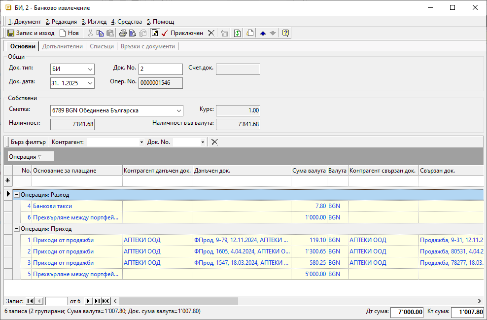

```{only} html
[Нагоре](000-index)
```

# Банкови документи

Движенията по банкови сметки се регистрират в системата чрез въвеждане на банкови документи. Системата позволява както ръчно въвеждане на банковите извлечения, така и импорт на данните. Импортът е възможен, когато има наличен файл с извлечение от банката.  

Извлеченията се въвеждат с отделни записи за всяка една банкова сметка. Сметките трябва да бъдат настроени предварително в **Потребител на продукта** от **Номенклатури || Контрагенти**. 

Процесът по ръчно въвеждане на банков документ е следният:

1) От **Търговска система || Банкови документи** чрез десен бутон на мишката върху списъка се отваря **Нов документ**. Активира се форма за въвеждане на данни **Банково извлечение**.  

2)  В раздел **Основни** се въвеждат:

- **Док. No** - в полето се попълва номер на банковото извлечение;  
Ако полето е празно, системата не попълва пореден номер на документа при приключване на извлечението.  

- **Док. дата** - в полето се избира датата, за която се отнасят движенията по текуща банкова сметка;  

- **Банкова сметка** - от опционално меню се избира банковата сметка, за която се отнасят плащанията;   
Банкови сметки се настройват предварително в **Потребител на продукта**.  

> Останалите полета в секция **Общи** се попълват автоматично от системата.  

{ class=align-center }

- **Основание за плащане** – от опционалното меню в полето се избира предназначение на плащането;  
Основанията трябва да са предварително дефинирани в **Номенклатури || Референтни номенклатури || Търговска система: Основания за плащане**.  
Избраното основание определя счетоводната операция, която се генерира при приключване на документа. Необходимо е предварително да бъдат направени настроийки за това от **Счетоводство || Автоматичен осчетоводител**.  

- **Контрагент данъчен док.** - в това поле се избира контрагент;  
Полето се обзавежда автоматично, ако преди това са избрани свързани документи на реда.   

- **Данъчен док.** - в полето се отваря форма за избор **Данъчни документи за покупка и продажба**;  
От списъка с данъчни документи се маркират един или множество записи с покупки и/или продажби. За да се попълнят автоматично и свързаните с тях вътрешнофирмени документи, се използва бутон **[Напред]**.  
По този начин ще се закрият остатъците за плащане по вътрешнофирмения и по данъчния документ.   

- **Сума валута** и **Док. сума валута** - полета за попълване на сума, отговаряща на извършеното плащане;  
Полетата се обзавеждат автоматично след избор на свързани документи. При частично плащане сумите трябва да се редактират.   

- **Валута** - поле за избор на валута от предварително настроен в **Референтни номенклатури** списък;  
Полето се обзавежда автоматично след избор на свързани документи.  

- **Контрагент свързан док.** - поле за избор на контрагент;  
Полето се обзавежда автоматично, ако преди това са избрани свързани документи на реда.  

- **Свързан док.** - в полето се отваря форма за избор **Документи за покупка и продажба**;  
Полето се попълва автоматично, ако преди това е изпълнена стъпката с обзавеждане на **Данъчен док.**.  

- **Операция** - данните в полето указват каква е операцията на реда - **Приход** или **Разход**;  

> Системата допуска приключване на банково извлечение и без цитиране на свързани данъчни и вътрешнофирмени документи.  

3) Чрез бутон **Приключен** от лентата с инструменти банковото извлечение се валидира. Тук системата дава възможност за генериране на счетоводно записване.  
 
    - **Генериране на Счетоводно записване** - опция за автоматична генерация на свързан счетоводен документ;  
    Когато за тази опция липсва отметка, системата не генерира счетоводен запис за банковото извлечение.  
    - **Приключване** - ако липсва отметка за тази опция, системата генерира счетоводния документ в редакция, а при поставена отметка - в състояние *Приключен*;  
    - **OK** - бутон, с който се потвърждават избраните във формата опции;  

{ class=align-center }

> За да се генерира коректен счетоводен запис, **Автоматичен счетоводител** трябва да е предварително настроен.  

От раздел **Връзки с документи** може да се види и отвори свързан счетоводен докумен.  
___
Свързани статии:  

[Как да въведем банкови сметки на контрагент](https://www.unicontsoft.com/cms/node/143)  
[Как да въведем Начално салдо на банкова сметка](https://www.unicontsoft.com/cms/node/178)  
[Как да въведем Банково извлечение](https://www.unicontsoft.com/cms/node/38)  
[Как да въведем Групово плащане](https://www.unicontsoft.com/cms/node/139)  
[Как да импортираме банкови извлечения](https://docs.unicontsoft.com/blog/20241121-bank-statement-import.html)  
[Как да импортираме документи по опис](https://www.unicontsoft.com/cms/node/255)  